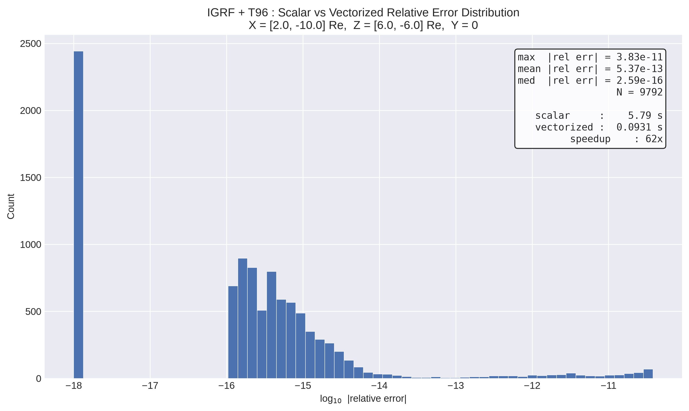
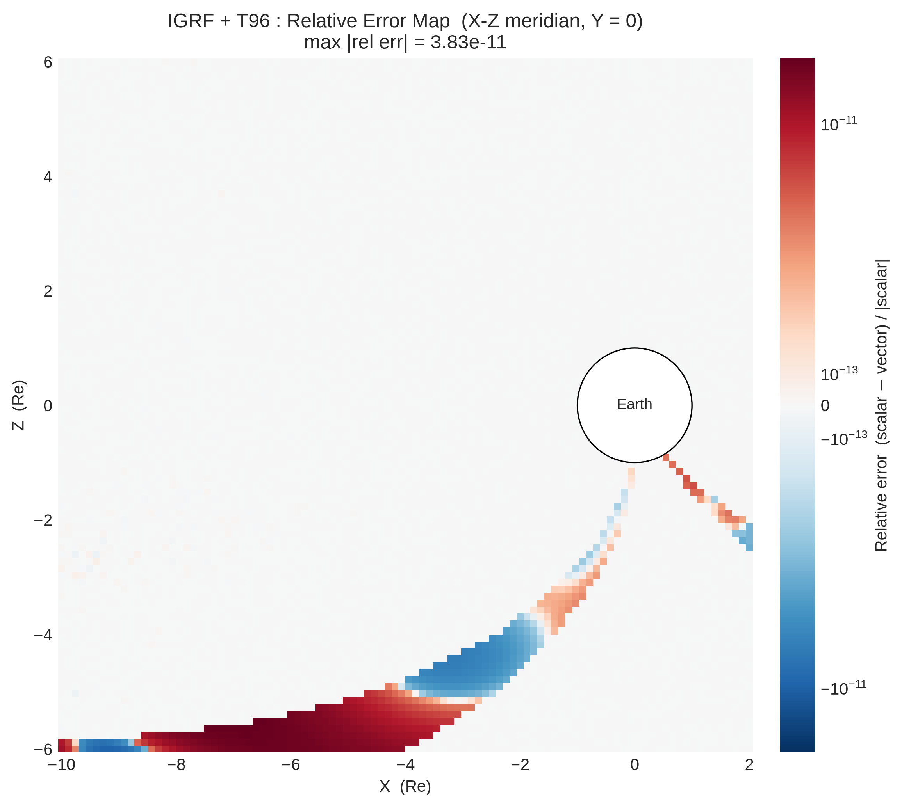

# Mageometry

A magnetic field line geometry toolkit built on a vectorized implementation of the Python [geopack](https://github.com/tsssss/geopack) library, covering the Tsyganenko magnetospheric field models (T89, T96, T01, T04), IGRF, field line tracing, and Frenet-Serret geometry of field lines.

> **⚠️ Project status:** Mageometry is a hard fork of [geopack-vectorize](https://github.com/Butadiene/geopack-vectorize) under heavy development. It is **not published on PyPI**, breaking changes land without deprecation cycles, and no backward compatibility with geopack-vectorize is guaranteed. If you need a stable package, use [geopack-vectorize](https://pypi.org/project/geopack-vectorize/) instead.

## Overview

This project builds upon the Python geopack library, which provides faithful implementations of the Tsyganenko magnetospheric field models (T89, T96, T01, T04) and the IGRF geomagnetic field model, originally developed in Fortran by N.A. Tsyganenko.

On top of that foundation it provides:

- **Vectorized Field Models**: NumPy-based implementations of all Tsyganenko models (T89, T96, T01, T04) that process arrays of points simultaneously (20-150x speedup)
- **Vectorized Field Line Tracing**: Parallel tracing of multiple field lines with improved boundary interpolation
- **Vectorized Coordinate Transforms**: Array-based transformations between all coordinate systems
- **Field Line Geometry (`mageometry.geometry`)**: Frenet-Serret frames, curvature, torsion, and directional derivatives along field lines — the main focus of ongoing development
- **Comprehensive Validation**: Extensive test suite ensuring < 10⁻¹¹ relative error vs original implementations

## Installation

### Requirements
- Python 3.7+
- NumPy
- SciPy

### Install from Source

Mageometry is not distributed on PyPI. Install it directly from this repository:

```bash
git clone https://github.com/Butadiene/Mageometry.git
cd Mageometry
pip install -e .
```

## Usage Examples

All vectorized functions accept both scalars and NumPy arrays. Call `geopack.recalc(ut)` once before using any model or transform. See [`examples/readme_examples.py`](examples/readme_examples.py) for a runnable version of the code below. For detailed function descriptions, please also refer to the [upstream geopack README](https://github.com/tsssss/geopack).

```python
from mageometry import geopack
import numpy as np

ut = 100  # Unix timestamp (seconds since 1970-01-01)
ps = geopack.recalc(ut)
```

### Coordinate Transformations
```python
from mageometry.geopack import geogsm_vectorized

# Convert multiple GEO points to GSM (j=1: GEO→GSM, j=-1: GSM→GEO)
x_geo = np.array([1.0, 2.0, 3.0])
y_geo = np.array([0.5, 1.0, 1.5])
z_geo = np.array([0.0, 0.0, 0.0])

x_gsm, y_gsm, z_gsm = geogsm_vectorized(x_geo, y_geo, z_geo, j=1)
```

### Internal Field (IGRF and Dipole)
```python
from mageometry.geopack import igrf_gsm_vectorized

# IGRF magnetic field at multiple GSM positions (Earth radii)
x = np.array([2.0, 3.0, 4.0, 5.0])
y = np.zeros(4)
z = np.zeros(4)

bx, by, bz = igrf_gsm_vectorized(x, y, z)  # returns nT

# Dipole field at the same positions (accepts scalars or arrays)
dx, dy, dz = geopack.dip(x, y, z)
```

### Tsyganenko External Field Models
```python
from mageometry.geopack import t96_vectorized

# T96 parameters: [Pdyn, Dst, ByIMF, BzIMF, 0, 0, 0, 0, 0, 0]
parmod = np.array([2.0, -20.0, 0.0, -5.0, 0, 0, 0, 0, 0, 0])

x = np.array([5.0, 6.0, 7.0, 8.0, 9.0])  # GSM coordinates (Re)
y = np.zeros(5)
z = np.zeros(5)

bx, by, bz = t96_vectorized(parmod, ps, x, y, z)  # GSM components (nT)

# Tsyganenko models give only the external (magnetospheric) field.
# Add an internal field to get the total magnetic field:
bx_int, by_int, bz_int = geopack.dip(x, y, z)
bx_total = bx + bx_int
by_total = by + by_int
bz_total = bz + bz_int
```

### Field Line Tracing
`trace_field_lines` traces field lines through any `field(x, y, z)` callable — the same Tsyganenko fields and simulation-data fields used by the geometry API — so a traced line can be fed straight back into the geometry functions.

```python
from mageometry import geopack, geopack_field, trace_field_lines, field_line_curvature

ps = geopack.recalc(100)
field = geopack_field("t96", "dip", parmod, ps)

# Trace both directions from four equatorial seeds down to the r = 1 Re sphere
tr = trace_field_lines(field, [5.0, 6.0, 7.0, 8.0], [0, 0, 0, 0], [0, 0, 0, 0],
                       direction="both", ds=0.1, r0=1.0, rlim=30.0)
tr.status            # per line: 0 inner sphere, 1 outer sphere/box, 2 max steps,
                     #           3 field undefined (e.g. left the data domain), 4 custom stop
x, y, z = tr.path(0)             # one line's points (NaN-padded 2D arrays in tr.x, tr.y, tr.z)
s = tr.arc_length(0)             # arc length, 0 at the seed (tr.start_index[0])
kappa = field_line_curvature(field, x, y, z)   # curvature along the traced line
```

Units are the field's own (Re for geopack fields, grid units for simulation data). For interpolated fields pass `bounds=grid.bounds` to have lines stop cleanly on the data box; a `stop(x, y, z)` callable adds custom termination. The geopack engine's bitwise-faithful port of the scalar `geopack.trace` remains available as `mageometry.geopack.trace_vectorized` (see [Vectorized Components](#field-line-tracing-1)).

### Field Line Geometry (Frenet-Serret Frame)

The geometry functions take the magnetic field as a callable `field(x, y, z) -> (bx, by, bz)`. `geopack_field` wraps the geopack models into that form; any custom callable (e.g. interpolated simulation output) works the same way.

```python
from mageometry import geopack_field, field_line_curvature, field_line_frenet_frame

# Total field: dipole (internal) + T96 (external)
field = geopack_field(external='t96', internal='dip', parmod=parmod, ps=ps)

# Curvature at several points along the noon meridian
x = np.array([5.0, 6.0, 7.0, 8.0])
y = np.zeros(4)
z = np.zeros(4)

kappa = field_line_curvature(field, x, y, z, delta=1e-3)
# kappa: field line curvature [1/Re]

# Full Frenet-Serret frame (tangent, normal, binormal) + curvature
tx, ty, tz, nx, ny, nz, bx, by, bz, curvature = \
    field_line_frenet_frame(field, x, y, z, delta=1e-3)
# curvature [1/Re]; tangent, normal, binormal are unit vectors (dimensionless)
```

Undefined or unreliable quantities are returned as **NaN** — the tangent where |B| is zero or non-finite (magnetic nulls, points outside a simulation grid), the normal/binormal on straight field lines or where the finite difference does not resolve the curvature — so a single `np.isfinite` mask covers every case. The normal is the component of dT/ds perpendicular to T, making the frame orthonormal by construction at any `delta`. `field_line_frame_quality(field, x, y, z, delta)` returns the consistency diagnostic cos θ = |T·dT/ds|/|dT/ds| (grows as δ²); frames with cos θ above `orthogonality_tol` (default 0.1) are reported as NaN, which is the cue to reduce `delta`.

### Field Line Directional Derivatives
```python
from mageometry import field_line_directional_derivatives

# All 9 directional derivatives (same field callable as above)
derivs = field_line_directional_derivatives(
    field, x, y, z, delta=1e-3
)
# All derivative values are in units of [1/Re]

# Tangential derivatives (∂/∂T)
# derivs['dT_dT_n']  (∂T/∂T)·n = κ (curvature)
# derivs['dT_dT_b']  (∂T/∂T)·b = 0 (identity)
# derivs['dn_dT_b']  (∂n/∂T)·b = τ (torsion)

# Normal derivatives (∂/∂n)
# derivs['dT_dn_n']  (∂T/∂n)·n
# derivs['dT_dn_b']  (∂T/∂n)·b
# derivs['dn_dn_b']  (∂n/∂n)·b

# Binormal derivatives (∂/∂b)
# derivs['dn_db_b']  (∂n/∂b)·b
# derivs['dn_db_T']  (∂n/∂b)·T
# derivs['db_db_T']  (∂b/∂b)·T
```

### Visualization (`mageometry.viz`)

Plots are built from the same objects as the analysis: a field callable, a `FieldLineTrace`, coordinates. Requires matplotlib (`pip install matplotlib` or `pip install -e .[viz]`); import explicitly with `from mageometry import viz`.

```python
from mageometry import viz

earth = lambda x, y, z: x**2 + y**2 + z**2 < 1          # blank the planet
mesh = viz.plot_geometry_map(field, "curvature", plane="xz", extent=(-15, 5, -8, 8),
                             mask=earth, arrows=True, unit="Re")     # any quantity: 'torsion',
                                                                     # 'bmag', 'dT_dn_n', ..., or a callable
tr = trace_field_lines(field, [-5, -7, -9], [0, 0, 0], [0, 0, 0], direction="both", ds=0.1, r0=1.0)
viz.plot_field_lines(tr, plane="xz", color="curvature", field=field)   # or ax=<3D axes>
viz.plot_line_profiles(tr, field, ("curvature", "torsion"))            # vs arc length
viz.plot_frenet_frame(field, -6.0, 0.0, 1.0, length=1.5)               # T / n / b arrows
```

Colour scales follow each quantity's convention (log for curvature and |B|, symmetric diverging for signed quantities); undefined (NaN) values are left blank. All functions accept an existing `ax` and return the matplotlib artists. See `examples/notebooks/09_visualization.ipynb`.

### Simulation Data (`mageometry.io`)

Gridded magnetic fields from simulation output plug into the same geometry API. `GriddedField` holds a rectilinear grid plus the three field components and builds an interpolating `field(x, y, z)` callable; readers for specific file formats are thin adapters that construct a `GriddedField`. Currently provided: `load_xdmf` (XDMF-described uniform grids with HDF5 heavy data, as written by many MHD codes), `load_xdmf_series` (time series of such grids), and `load_hdf5` (plain HDF5 datasets with caller-supplied grid geometry). All require the optional `h5py` dependency (`pip install h5py`).

```python
from mageometry import load_xdmf, field_line_curvature, trace_field_lines

grid = load_xdmf("run000.xmf")        # uniform grid + BX/BY/BZ heavy data
field = grid.field(method="linear")   # field(x, y, z) -> (bx, by, bz)

dx = grid.x[1] - grid.x[0]
kappa = field_line_curvature(field, x, y, z, delta=dx)  # [1/grid-unit]

# Field lines through the data, stopping on the grid box
tr = trace_field_lines(field, x, y, z, direction="both", ds=dx, bounds=grid.bounds)
```

Positions and results are in the simulation's own grid units (curvature in 1/grid-unit); rescale the axes or field arrays when constructing the `GriddedField` if you need physical units. For any other format, build the arrays yourself and call `GriddedField(x, y, z, bx, by, bz)` directly.

Large runs: every reader takes `region=((xmin, xmax), (ymin, ymax), (zmin, zmax))` and `stride` to read only a sub-box or a coarsened grid (as an HDF5 hyperslab, so the full array never enters memory); `GriddedField.subvolume` does the same in memory. Node- and cell-centered attributes are both accepted. Time series — XDMF temporal collections or ParaView `.xmf.series` indexes — open lazily with `load_xdmf_series(path)`: `series.times`, `series[i]`, `series.at(t)`, or iterate one step at a time.

**Your own format.** Most simulation output is not XDMF, and that is fine: the only contract is `GriddedField(x, y, z, bx, by, bz)`. [`docs/simulation_data_formats.md`](docs/simulation_data_formats.md) is a hands-on guide to getting there from raw binaries (C/Fortran order, endianness, headers), Fortran unformatted dumps (`mageometry.io.read_fortran_records`), per-rank chunk files, VTK/NetCDF/HDF5 with your own layout, cell-centered and staggered grids, non-uniform axes, unit and coordinate conversions, and per-step files as a lazy series (`FieldSeries.from_files`). `GriddedField.divergence()` catches the classic mistakes (transposed axes, permuted or sign-flipped components) before you analyze anything.

The exact accepted formats and the guide to adapting your own data are in [`docs/simulation_data_formats.md`](docs/simulation_data_formats.md). A complete analysis workflow (center detection, curvature profile vs. the dipole 3/r law, Frenet frame quality) is in [`examples/python_code_samples/mhd_gridded_field_example.py`](examples/python_code_samples/mhd_gridded_field_example.py).

> **Note:** The field line geometry modules live in `mageometry.geometry`. Use the plain top-level names shown above (e.g. `field_line_curvature`); the legacy `*_vectorized` aliases for these functions (e.g. `field_line_curvature_vectorized`) and deep-path imports from the old location (e.g. `from geopack.vectorized.field_line_geometry import ...`) have been removed.

## Vectorized Components

### Coordinate Transformations

All vectorized transforms accept scalar or NumPy array inputs. Each pairwise transform uses a direction flag `j`: `j=1` for the forward direction, `j=-1` for the inverse. All coordinate values are in Earth radii (Re); angles in radians. See [SPENVIS Coordinate Transformations](https://www.spenvis.oma.be/help/background/coortran/coortran.html) for coordinate system definitions.

| Function | Arguments | Forward (j=1) | Inverse (j=-1) |
|----------|-----------|---------------|-----------------|
| `geogsm_vectorized` | `(x, y, z, j)` | GEO → GSM | GSM → GEO |
| `geomag_vectorized` | `(x, y, z, j)` | GEO → MAG | MAG → GEO |
| `geigeo_vectorized` | `(x, y, z, j)` | GEI → GEO | GEO → GEI |
| `gsmgse_vectorized` | `(x, y, z, j)` | GSM → GSE | GSE → GSM |
| `smgsm_vectorized` | `(x, y, z, j)` | SM → GSM | GSM → SM |
| `magsm_vectorized` | `(x, y, z, j)` | MAG → SM | SM → MAG |
| `gswgsm_vectorized` | `(x, y, z, j)` | GSW → GSM | GSM → GSW |

Spherical/Cartesian and field-vector transforms:
- `sphcar_vectorized(r, theta, phi, j)` — Spherical ↔ Cartesian (j=1: Sph→Cart, j=-1: Cart→Sph)
- `bspcar_vectorized(theta, phi, br, btheta, bphi)` — B-field components: Spherical → Cartesian
- `bcarsp_vectorized(x, y, z, bx, by, bz)` — B-field components: Cartesian → Spherical

### Internal Field (IGRF and Dipole)

Vectorized IGRF and dipole field functions. All return magnetic field components in nanotesla (nT). IGRF covers years 1900–2025 with extrapolation beyond.

- `igrf_geo_vectorized(r, theta, phi)` — IGRF in spherical GEO coordinates (r in Re, angles in radians); returns `(br, btheta, bphi)`
- `igrf_gsm_vectorized(x, y, z)` — IGRF in GSM Cartesian coordinates (Re); returns `(bx, by, bz)`
- `igrf_gsw_vectorized(x, y, z)` — IGRF in GSW Cartesian coordinates (Re); returns `(bx, by, bz)`
- `dip(x, y, z)` — Dipole field in GSM coordinates (Re); natively array-compatible via NumPy operations

### External Field Models (Tsyganenko)

Tsyganenko magnetospheric field models. All take positions in **GSM coordinates** (Re) and return `(bx, by, bz)` in nanotesla (nT, GSM). `ps` is the dipole tilt angle (radians) returned by `recalc()`.

- `t89_vectorized(iopt, ps, x, y, z)` — T89 model; `iopt` is the Kp index (1–7)
- `t96_vectorized(parmod, ps, x, y, z)` — T96 model; `parmod = [Pdyn, Dst, ByIMF, BzIMF, 0, 0, 0, 0, 0, 0]`
- `t01_vectorized(parmod, ps, x, y, z)` — T01 model; `parmod = [Pdyn, Dst, ByIMF, BzIMF, G1, G2, 0, 0, 0, 0]`
- `t04_vectorized(parmod, ps, x, y, z)` — T04 model; `parmod = [Pdyn, Dst, ByIMF, BzIMF, W1, W2, W3, W4, W5, W6]`

For detailed parameter descriptions, see the [upstream geopack README](https://github.com/tsssss/geopack).

**Note:** Tsyganenko models provide only the *external* (magnetospheric) contribution. To obtain the total magnetic field, add an internal field (IGRF or dipole):

```python
# Total field = internal (dipole) + external (T96)
bx_int, by_int, bz_int = geopack.dip(x, y, z)
bx_ext, by_ext, bz_ext = t96_vectorized(parmod, ps, x, y, z)

bx_total = bx_int + bx_ext
by_total = by_int + by_ext
bz_total = bz_int + bz_ext
```

### Field Line Tracing

`trace_vectorized` is the geopack engine's port of the scalar `geopack.trace()`, kept bitwise-faithful to it (including its Earth-specific step control and stopping rules) as a validation reference. For general use — any field callable, both directions, arc length along the path — prefer the top-level `mageometry.trace_field_lines` shown in [Usage Examples](#field-line-tracing).

```python
trace_vectorized(xi, yi, zi, dir, rlim, r0, parmod, exname, inname, ...)
```

| Parameter | Type | Default | Description |
|-----------|------|---------|-------------|
| `xi, yi, zi` | float or array | *(required)* | Starting positions in GSM coordinates (Re) |
| `dir` | float | `1.0` | Tracing direction: `+1` antiparallel to **B**, `-1` parallel to **B** |
| `rlim` | float | `10.0` | Outer boundary radius (Re); tracing stops when r >= rlim |
| `r0` | float | `1.0` | Inner boundary sphere radius (Re); tracing stops when r <= r0 |
| `parmod` | array | `2` | Model parameters (scalar Kp for T89; 10-element array for T96/T01/T04) |
| `exname` | str | `"t89"` | External field model: `"t89"`, `"t96"`, `"t01"`, or `"t04"` |
| `inname` | str | `"igrf"` | Internal field model: `"igrf"` or `"dip"` |
| `maxloop` | int | `1000` | Maximum number of integration steps per trace |
| `return_full_path` | bool | `False` | If `True`, returns full field line trajectories as masked arrays |
| `strict_scalar_models` | bool | `True` | If `True`, evaluates field models point-by-point for bitwise match with scalar `trace()` |
| `return_nsteps` | bool | `False` | If `True`, also returns the number of integration steps per trace |

**Returns:** `(xf, yf, zf, status)` — final positions (Re, GSM) and integer status codes:
- `0` — reached inner boundary (r <= r0)
- `1` — reached outer boundary (r >= rlim)
- `2` — exceeded maximum integration steps

Optional returns (appended when the corresponding flag is `True`):
- `xx, yy, zz` — full path arrays (`return_full_path`)
- `nsteps` — per-trace step counts (`return_nsteps`)

Related functions for field line analysis:
- Field line geometry (curvature, torsion, Frenet-Serret frame) — see [Usage Examples](#field-line-geometry-frenet-serret-frame)
- Directional derivatives along field lines — see [Usage Examples](#field-line-directional-derivatives)

## Documentation and Examples

Example notebooks are available in `examples/notebooks/` (index: [`examples/notebooks/README.md`](examples/notebooks/README.md)). Install the example dependencies to run them: `pip install -e .[examples]` (matplotlib, jupyter, pandas) plus `h5py` for notebook 08.

### Tutorial Notebooks
Start with the analysis library:
- `07_fieldline_geometry_and_derivatives` — Field line geometry with Mageometry: field callables, Frenet-Serret frame, the nine directional derivatives, validity/NaN conventions, choosing δ, geometry along traced lines, maps
- `08_simulation_data_geometry` — Simulation data pipeline: write a compatible XDMF/HDF5 file, load it, interpolate, compute curvature, trace through the data, Frenet frame and directional derivatives on gridded data vs the model
- `09_visualization` — `mageometry.viz`: geometry maps on planes, field lines coloured by a quantity (2D/3D), profiles along lines, Frenet frames, custom quantities, the same plots on gridded data

The geopack field engine:
- `01_coordinate_transformations_guide` — Coordinate system transforms
- `02_magnetic_field_models_guide` — Field model usage (T89, T96, T01, T04)
- `03_performance_comparison` — Scalar vs vectorized benchmarks
- `04_accuracy_validation` — Numerical accuracy verification
- `05_field_line_tracing_guide` — Engine tracer tutorial (+ `trace_field_lines` section)
- `06_field_line_tracing_validation` — Tracing accuracy validation

### Advanced Examples (`examples/notebooks/directional_derivatives_maps/`)
- `dipole_field_directional_derivatives` — Dipole field directional derivative maps
- `t96_field_directional_derivatives` — T96 model directional derivative and FAC maps

## Performance Benchmarks

Regenerate this table with [`benchmark/readme_benchmarks.py`](benchmark/readme_benchmarks.py) (`--plain` for plain text output).

| Component | Scalar (100 pts) [s] | Vectorized [s] | Speedup |
|-----------|--------------------:|---------------------:|--------:|
| Coordinate Transforms (subset) | 0.000 | 0.000 | **6.3x** |
| IGRF (GSW) | 0.006 | 0.002 | **3.2x** |
| T89 Model | 0.005 | 0.000 | **22.1x** |
| T96 Model | 0.127 | 0.023 | **5.6x** |
| T01 Model | 0.205 | 0.027 | **7.5x** |
| T04 Model | 0.200 | 0.025 | **7.9x** |
| Field Line Tracing (vectorized field models) [scalar extrap from 50] | 2.343 | 2.225 | **1.1x** |

| Component | Scalar (1000 pts) [s] | Vectorized [s] | Speedup |
|-----------|---------------------:|---------------------:|--------:|
| Coordinate Transforms (subset) | 0.004 | 0.000 | **48.9x** |
| IGRF (GSW) | 0.068 | 0.006 | **11.3x** |
| T89 Model | 0.045 | 0.000 | **116x** |
| T96 Model | 1.046 | 0.036 | **29.2x** |
| T01 Model | 1.815 | 0.039 | **46.0x** |
| T04 Model | 1.820 | 0.042 | **43.5x** |
| Field Line Tracing (vectorized field models) [scalar extrap from 50] | 21.607 | 3.050 | **7.1x** |

### Where Does the Speedup Come From?

The speedup is not simply a function-call-count effect. Modeling the time of one vectorized call on an n-element array as `t_vec(n) ≈ a + b·n` separates a fixed per-call overhead `a` from the marginal cost per point `b`:

| Component | Overhead a [ms/call] | Marginal b [µs/point] | Scalar [µs/point] | Per-point ratio | Break-even n* |
|-----------|---------------------:|----------------------:|------------------:|----------------:|--------------:|
| T89 | 0.26 | 0.57 | 46.9 | **82x** | 2 |
| T96 | 11 | 8.9 | 1090 | **123x** | 14 |
| T01 | 16 | 21.2 | 1828 | **86x** | 10 |
| T04 | 15 | 29.1 | 1870 | **64x** | 8 |
| IGRF (GSW) | 1.3 | 3.6 | 57.9 | **16x** | 42 |

- **A vectorized call with n = 1 is slower than a scalar call** (the fixed overhead `a` is paid on every call), so the gain does not come from merely reducing the number of function calls. Below the break-even size n\* the scalar functions are faster.
- **The overhead `a` scales with model complexity** (T89 ≪ T96/T01/T04): it is the accumulated per-array-operation cost (NumPy dispatch, temporaries, both branches of `np.where`), not a constant per-call cost.
- **The per-point cost ratio far exceeds the SIMD width** for float64 (4 lanes AVX2 / 8 lanes AVX-512), so SIMD alone cannot explain it. The dominant mechanism is amortizing the Python interpreter's per-operation overhead across array elements in NumPy's compiled loops.

Regenerate this table with [`benchmark/readme_overhead_decomposition.py`](benchmark/readme_overhead_decomposition.py) (`--plain` for plain text output). A step-by-step version with figures is in [`examples/notebooks/03_performance_comparison.ipynb`](examples/notebooks/03_performance_comparison.ipynb), Section 3c.

## Accuracy Validation

The vectorized implementations are validated against the original scalar functions across a 100 × 100 grid in the X-Z meridian plane (Y = 0, X: 2 to −10 Re, Z: 6 to −6 Re) using the combined IGRF + T96 total field. Relative error is defined as (B_scalar − B_vector) / |B_scalar|.

Regenerate these figures with [`benchmark/readme_validation.py`](benchmark/readme_validation.py).

| Metric | Value |
|--------|------:|
| Points evaluated | 9,792 |
| Max \|relative error\| | 9.56 × 10⁻¹² |
| Mean \|relative error\| | 6.72 × 10⁻¹⁴ |
| Median \|relative error\| | 2.54 × 10⁻¹⁶ |
| Scalar computation | 23.72 s |
| Vectorized computation | 0.21 s |
| Speedup | **116x** |

The median error is near double-precision machine epsilon (~1.1 × 10⁻¹⁶), confirming that the vectorized path reproduces the scalar results to floating-point precision.

**Error distribution** — Most points cluster below 10⁻¹⁵; the tail extends to ~10⁻¹¹.



**Spatial error map** — The largest errors concentrate near the magnetopause/cusp boundary where T96 current-sheet gradients are steepest, but remain negligible everywhere.



## Technical Details

### Vectorization Approach
- Full NumPy broadcasting support
- Elimination of all Python loops
- Optimized conditional logic using `np.where`
- Safe numerical operations with proper edge case handling
- Memory-efficient implementations

### Accuracy Guarantees
- Maximum relative error < 10⁻¹¹ vs scalar implementations (IGRF + T96 total field)
- Median relative error at machine epsilon (~10⁻¹⁶)
- Validated across 9,792 grid points in the X-Z meridian plane
- Comprehensive test suite with configurable tolerances
- Proper handling of boundary conditions

### Performance Optimization
- Batch processing capabilities for millions of points
- Linear memory scaling with input size
- GPU-ready array operations
- Minimal Python overhead

## Attribution and Acknowledgments

This project extends the excellent Python [geopack](https://github.com/tsssss/geopack) implementation by Sheng Tian, which has been invaluable to the space physics community. The original geopack provides a robust, well-tested foundation that faithfully reproduces the Fortran implementations.

The original Fortran GEOPACK code and Tsyganenko models were developed by N.A. Tsyganenko and are available at:
- https://geo.phys.spbu.ru/~tsyganenko/modeling.html
- https://ccmc.gsfc.nasa.gov/models/

We are grateful to both Sheng Tian for the Python implementation and N.A. Tsyganenko for the original models that have been fundamental to magnetospheric physics research for decades.

## License

This project maintains the MIT License from the original geopack implementation.

## References

- Tian, S., Frissell, N., w2ruf, Lewis, J. & Lei Cai, Ph. D. tsssss/geopack: v1.0.12. Zenodo https://doi.org/10.5281/zenodo.15110787 (2025).

- Tsyganenko, N. A. (1995), "Modeling the Earth's magnetospheric magnetic field", J. Geophys. Res.
- Tsyganenko, N. A. (2002), "A model of the near magnetosphere with a dawn-dusk asymmetry", J. Geophys. Res.
- Tsyganenko, N. A. and M. I. Sitnov (2005), "Modeling the dynamics of the inner magnetosphere during strong geomagnetic storms", J. Geophys. Res.
- International Geomagnetic Reference Field: https://www.ngdc.noaa.gov/IAGA/vmod/igrf.html