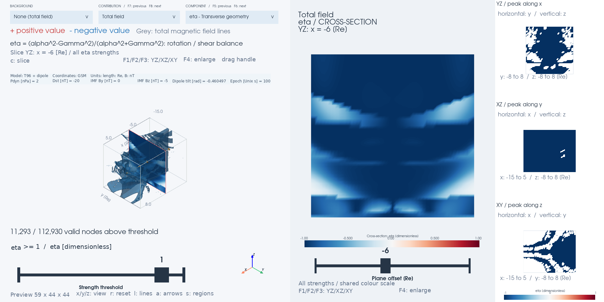
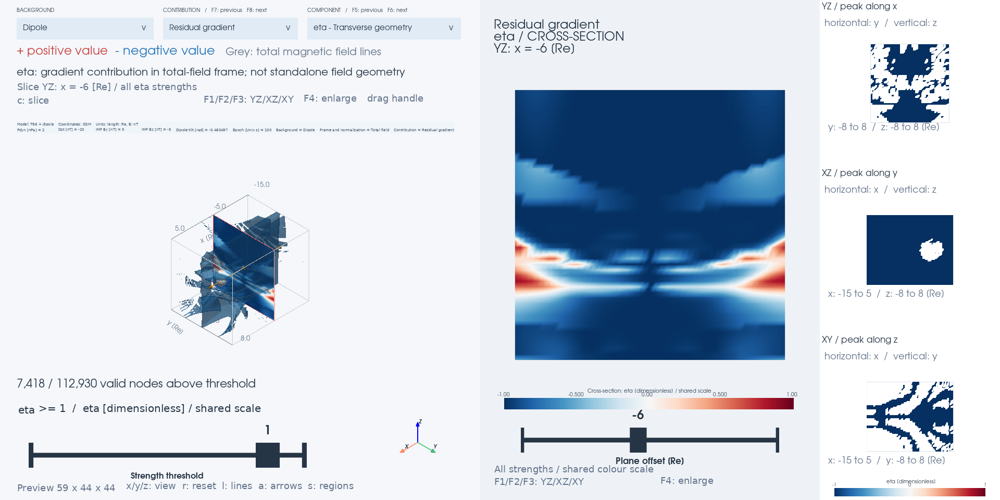
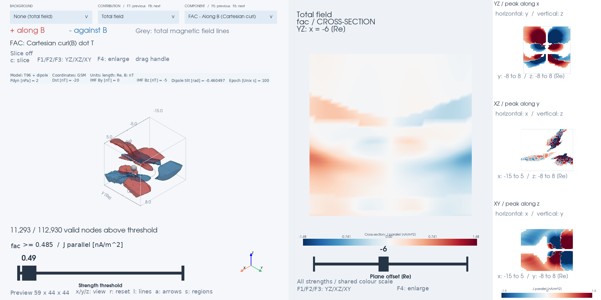

# Mageometry

A magnetic field line geometry toolkit built on a vectorized implementation of the Python [geopack](https://github.com/tsssss/geopack) library, covering the Tsyganenko magnetospheric field models (T89, T96, T01, T04), IGRF, field line tracing, and Frenet-Serret geometry of field lines.

> **Project status:** Mageometry is a hard fork of [geopack-vectorize](https://github.com/Butadiene/geopack-vectorize) under heavy development. It is **not published on PyPI**, breaking changes land without deprecation cycles, and no backward compatibility with geopack-vectorize is guaranteed.

## Overview

This project builds upon the Python geopack library, which implements the Tsyganenko magnetospheric field models (T89, T96, T01, T04), GEOPACK coordinate transforms, and evaluation of the IGRF geomagnetic field.

On top of that foundation it provides:

- **Field Line Geometry (`mageometry.geometry`)**: Frenet-Serret frames, curvature, torsion, directional derivatives, |B| gradients, current-density decomposition, and transverse rotation/shear diagnostics — the primary analysis API
- **Vectorized Field Models**: NumPy implementations of T89, T96, T01, T04, and IGRF; speedup depends on model and batch size (see [benchmarks](#performance-benchmarks))
- **Field Line Tracing**: Batch tracing through any field callable with boundary interpolation, plus a separate tracer that follows the scalar geopack algorithm
- **Coordinate Transforms**: Array-based transformations between GEI, GEO, GSM, GSE, SM, MAG, and GSW, plus spherical/Cartesian conversions
- **Simulation Data and Visualization**: Rectilinear field grids, XDMF/HDF5 and VTK readers, optional Matplotlib plots and PyVista viewers
- **Validation**: Scalar/vectorized comparisons and analytic geometry tests with explicit numerical tolerances

## Installation

### Requirements

- Python 3.9+
- NumPy >= 1.16.0
- SciPy >= 1.0.0

### Install from Source

Mageometry is not distributed on PyPI. Install it directly from this repository:

```bash
git clone https://github.com/Butadiene/Mageometry.git
cd Mageometry
python -m pip install -e .
```

Choose optional dependencies for the features you use (run from the repository):

| Feature | Install command |
| --- | --- |
| XDMF/HDF5 input (`h5py`) | `python -m pip install -e '.[io]'` |
| 2D plots (`matplotlib`) | `python -m pip install -e '.[viz]'` |
| 3D viewers and VTK input (`pyvista >= 0.44`) | `python -m pip install -e '.[viz3d]'` |
| XDMF/HDF5 in the 3D viewers | `python -m pip install -e '.[io,viz3d]'` |
| Tutorial notebooks and benchmarks | `python -m pip install -e '.[examples]'` |
| Tests and optional plotting/input dependencies | `python -m pip install -e '.[dev]'` |

The `examples` extra includes Matplotlib, Jupyter, pandas, psutil, and h5py;
add `viz3d` for 3D examples. Importing `mageometry` uses bundled IGRF
coefficients and does not access the network.

## Usage Examples

The model examples through transverse geometry below share their setup and
can be run in order. [`examples/readme_examples.py`](examples/readme_examples.py)
runs those numerical examples without plotting or simulation files.
Field and geometry functions accept scalar coordinates or NumPy arrays.
Call `geopack.recalc(ut)` before using geopack's internal fields and
epoch-dependent transforms; repeat it when the epoch or solar-wind direction
changes. Custom and simulation-data field callables do not need `recalc`.

```python
from mageometry import geopack
import numpy as np

ut = 100  # Unix timestamp (seconds since 1970-01-01)
ps = geopack.recalc(ut)
```

### Coordinate Transformations

```python
from mageometry.geopack import geogsm_vectorized

# Convert multiple GEO points to GSM (j=1: GEO→GSM, j=-1: GSM→GEO)
x_geo = np.array([1.0, 2.0, 3.0])
y_geo = np.array([0.5, 1.0, 1.5])
z_geo = np.array([0.0, 0.0, 0.0])

x_gsm, y_gsm, z_gsm = geogsm_vectorized(x_geo, y_geo, z_geo, j=1)
```

### Internal Field (IGRF and Dipole)

```python
from mageometry.geopack import igrf_gsm_vectorized

# IGRF magnetic field at multiple GSM positions (Earth radii)
x = np.array([2.0, 3.0, 4.0, 5.0])
y = np.zeros(4)
z = np.zeros(4)

bx, by, bz = igrf_gsm_vectorized(x, y, z)  # returns nT

# Dipole field at the same positions (accepts scalars or arrays)
dx, dy, dz = geopack.dip(x, y, z)
```

### Tsyganenko External Field Models

```python
from mageometry.geopack import t96_vectorized

# T96 parameters: [Pdyn, Dst, ByIMF, BzIMF, 0, 0, 0, 0, 0, 0]
parmod = np.array([2.0, -20.0, 0.0, -5.0, 0, 0, 0, 0, 0, 0])

x = np.array([5.0, 6.0, 7.0, 8.0, 9.0])  # GSM coordinates (Re)
y = np.zeros(5)
z = np.zeros(5)

bx, by, bz = t96_vectorized(parmod, ps, x, y, z)  # GSM components (nT)

# Tsyganenko models give only the external (magnetospheric) field.
# Add an internal field to get the total magnetic field:
bx_int, by_int, bz_int = geopack.dip(x, y, z)
bx_total = bx + bx_int
by_total = by + by_int
bz_total = bz + bz_int
```

### Field Line Tracing

`trace_field_lines` traces field lines through any `field(x, y, z)` callable — the same Tsyganenko fields and simulation-data fields used by the geometry API — so a traced line can be fed straight back into the geometry functions.

```python
from mageometry import geopack, geopack_field, trace_field_lines, field_line_curvature

ps = geopack.recalc(100)
field = geopack_field("t96", "dip", parmod, ps)

# Trace both directions from four equatorial seeds down to the r = 1 Re sphere
tr = trace_field_lines(field, [5.0, 6.0, 7.0, 8.0], [0, 0, 0, 0], [0, 0, 0, 0],
                       direction="both", ds=0.1, r0=1.0, rlim=30.0)
tr.status            # per line: 0 inner sphere, 1 outer sphere/box, 2 max steps,
                     #           3 field undefined (e.g. left the data domain), 4 custom stop
tr.status_backward   # termination at the -B end; tr.status describes the +B end
x, y, z = tr.path(0)             # one line's points (NaN-padded 2D arrays in tr.x, tr.y, tr.z)
s = tr.arc_length(0)             # arc length, 0 at the seed (tr.start_index[0])
kappa = field_line_curvature(field, x, y, z)   # curvature along the traced line
```

Units are the field's own (Re for geopack fields, grid units for simulation data). `direction=1` follows B, `direction=-1` opposes B, and `"both"` joins the two paths. For interpolated fields pass `bounds=grid.bounds` to have lines stop on the data box; a `stop(x, y, z)` callable adds custom termination. The geopack engine's port of scalar `geopack.trace` remains available as `mageometry.geopack.trace_vectorized`, with a different direction convention (see [Vectorized Components](#field-line-tracing-1)).

### Field Line Geometry (Frenet-Serret Frame)

The geometry functions take the magnetic field as a callable `field(x, y, z) -> (bx, by, bz)`. `geopack_field` wraps the geopack models into that form; any custom callable (e.g. interpolated simulation output) works the same way.

```python
from mageometry import geopack_field, field_line_curvature, field_line_frenet_frame

# Total field: dipole (internal) + T96 (external)
field = geopack_field(external='t96', internal='dip', parmod=parmod, ps=ps)

# Curvature at several points along the noon meridian
x = np.array([5.0, 6.0, 7.0, 8.0])
y = np.zeros(4)
z = np.zeros(4)

kappa = field_line_curvature(field, x, y, z, delta=1e-3)
# kappa: field line curvature [1/Re]

# Full Frenet-Serret frame (tangent, normal, binormal) + curvature
tx, ty, tz, nx, ny, nz, bx, by, bz, curvature = \
    field_line_frenet_frame(field, x, y, z, delta=1e-3)
# curvature [1/Re]; tangent, normal, binormal are unit vectors (dimensionless)
```

Undefined or unreliable quantities are returned as **NaN** — the tangent where |B| is zero or non-finite (magnetic nulls, points outside a simulation grid), the normal/binormal on straight field lines or where the finite difference does not resolve the curvature — so a single `np.isfinite` mask covers every case. The normal is the component of dT/ds perpendicular to T, making the frame orthonormal by construction at any `delta`. `field_line_frame_quality(field, x, y, z, delta)` returns the consistency diagnostic cos θ = |T·dT/ds|/|dT/ds| (grows as δ²); frames with cos θ above `orthogonality_tol` (default 0.1) are reported as NaN, which is the cue to reduce `delta`.

### Field Line Directional Derivatives

```python
from mageometry import field_line_directional_derivatives

# All 9 directional derivatives (same field callable as above)
derivs = field_line_directional_derivatives(
    field, x, y, z, delta=1e-3
)
# All derivative values are in units of [1/Re]

# Tangential derivatives (∂/∂T)
# derivs['dT_dT_n']  (∂T/∂T)·n = κ (curvature)
# derivs['dT_dT_b']  (∂T/∂T)·b = 0 (identity)
# derivs['dn_dT_b']  (∂n/∂T)·b = τ (torsion)

# Normal derivatives (∂/∂n)
# derivs['dT_dn_n']  (∂T/∂n)·n
# derivs['dT_dn_b']  (∂T/∂n)·b
# derivs['dn_dn_b']  (∂n/∂n)·b

# Binormal derivatives (∂/∂b)
# derivs['dn_db_b']  (∂n/∂b)·b
# derivs['dn_db_T']  (∂n/∂b)·T
# derivs['db_db_T']  (∂b/∂b)·T
```

### |B| Gradients and Current Density

Writing B = B·T with T the unit tangent, ∇×B closes in the Frenet-Serret frame with no n-component of ∇×T:

```
μ₀ J = B(dT_dn_b + dn_db_T) T  +  (∂B/∂b) n  +  (Bκ − ∂B/∂n) b
        └── twist = μ₀ j∥ ──┘
```

The parallel current is B·T·(∇×T), carried entirely by the frame's
directional derivatives. The ratio μ₀j∥/B fixes twice the azimuthal mean
winding rate; shear can contribute to this mean without neighboring lines
making full turns. Curvature and transverse |B| gradients drive the
perpendicular components. `field_magnitude_derivatives` supplies the |B|
gradients missing from the frame derivatives; `field_line_current_density`
assembles μ₀J. See the [baseline theory](docs/fac_anisotropy_theory.md)
for the distinction between current, shear, and coiling.

```python
from mageometry import field_magnitude_derivatives, field_line_current_density

mag = field_magnitude_derivatives(field, x, y, z, delta=1e-3)
# mag['B'] [nT]; mag['dB_dT'], mag['dB_dn'], mag['dB_db'] [nT/Re]
# dB_dT is the mirror-force gradient along the line

cur = field_line_current_density(field, x, y, z, delta=1e-3)
# cur['mu0J_T'], cur['mu0J_n'], cur['mu0J_b']  μ₀J on the frame [nT/Re]
# cur['B_dT_dn_b'] + cur['B_dn_db_T']         the two terms of μ₀J_T
# cur['mu0J_x'], cur['mu0J_y'], cur['mu0J_z']  the same vector in GSM
# cur['alpha']  μ₀ j∥ / B = T·(∇×T), twice the azimuthal mean winding rate [1/Re]
# For geopack fields: J [A/m²] ≈ μ₀J [nT/Re] × 1.25e-10 (0.125 nA/m² per nT/Re)
```

[`tests/test_field_line_current.py`](tests/test_field_line_current.py) compares
the assembled current against Cartesian finite differences of T96+IGRF at
`delta=2e-3`, requiring a median vector error below `1e-4` and a maximum
below `1e-3`, normalized by |∇×B| where the reference curl is step-converged
and the reconstructed current is finite. A current-free dipole tests
cancellation of Bκ and ∂B/∂n. `verify_divergence_identity` returns
∂B/∂T + B(dT_dn_n + dT_db_b); tests compare it with a direct Cartesian
divergence, including nonzero divergence in the sampled empirical field.
See [notebook 10](examples/notebooks/10_current_density_from_geometry.ipynb).

### Transverse Rotation and Shear

```python
from mageometry import field_line_transverse_geometry

rates = field_line_transverse_geometry(field, x, y, z, delta=1e-3,
                                      curvature_tol=1e-8)
# rates['alpha']: twice the azimuthal mean winding rate
# rates['beta_g'], rates['delta_g']: signed shear components in the Frenet frame
# rates['gamma']: nonnegative, basis-independent transverse anisotropy
# rates['omega_c']: signed local coiling rate
# rates['eta']: (alpha**2-gamma**2)/(alpha**2+gamma**2), dimensionless
# rates['curvature']: field-line curvature
```

All returned values except dimensionless `eta` have inverse-length units.
Eta is NaN when alpha and gamma are both zero. This API samples first
Cartesian derivatives of B. `alpha`, `gamma`, `omega_c`, and `eta` do not require
curved field lines; `beta_g` and `delta_g` need a curvature normal and become
NaN at or below `curvature_tol`. Magnetic nulls and invalid stencils give
NaN. The `alpha` returned by `field_line_current_density` uses the older
frame-derivative estimate and requires a valid Frenet frame; the estimates
need not agree exactly at finite step size. See
[definitions and interpretation](docs/transverse_geometry.md) and the
[baseline FAC anisotropy theory](docs/fac_anisotropy_theory.md).
The numerical implementation, analysis API, viewers, and CLIs consistently
use `beta_g` (β_g) and `delta_g` (δ_g). The finite-difference argument `delta`
is a numerical step length, separate from the physical diagnostic `delta_g`.

### Visualization (`mageometry.viz`)

Plots are built from a field callable, a `FieldLineTrace`, and coordinates.
Install `python -m pip install -e '.[viz]'` and import explicitly with
`from mageometry import viz`.

```python
from mageometry import viz

earth = lambda x, y, z: x**2 + y**2 + z**2 < 1          # blank the planet
mesh = viz.plot_geometry_map(field, "curvature", plane="xz", extent=(-15, 5, -8, 8),
                             mask=earth, arrows=True, unit="Re")     # any quantity: 'torsion', 'bmag',
                                                                     # 'mu0J_T', 'alpha', 'dT_dn_n', ..., or a callable
tr = trace_field_lines(field, [-5, -7, -9], [0, 0, 0], [0, 0, 0], direction="both", ds=0.1, r0=1.0)
viz.plot_field_lines(tr, plane="xz", color="curvature", field=field)   # or ax=<3D axes>
viz.plot_line_profiles(tr, field, ("curvature", "torsion"))            # vs arc length
viz.plot_frenet_frame(field, -6.0, 0.0, 1.0, length=1.5)               # T / n / b arrows
```

Colour scales follow each quantity's convention (log for curvature and |B|,
symmetric diverging for signed quantities); undefined (NaN) values are left
blank. The functions accept existing axes and return artists, except
`plot_line_profiles`, which accepts `axes=` and returns the profile axes.
Named quantities in these general plotters use the legacy current API's
`alpha`; transverse `beta_g`, `delta_g`, `gamma`, and `omega_c` can be supplied as
custom quantity callables. See [notebook 9](examples/notebooks/09_visualization.ipynb).

### Interactive 3D Visualization (`mageometry.viz3d`)

A PyVista/VTK companion to `mageometry.viz`: rotate, zoom, and pan the camera
and slice gridded volumes with draggable plane widgets. Install
`python -m pip install -e '.[viz3d]'`; rendering uses the graphics backend
available to VTK. The example below samples the model field defined above,
so it needs no simulation file.

```python
from mageometry import GriddedField, viz3d

axes = (np.linspace(-10, -3, 29), np.linspace(-3, 3, 25), np.linspace(-3, 3, 25))
coords = np.meshgrid(*axes, indexing='ij')
grid = GriddedField(*axes, *field(*coords))          # same model and units as field
viz3d.slice_view(grid, "bmag")                       # three drag-able orthogonal slices
viz3d.slice_view(grid, "curvature", mode="plane")    # one free plane (drag arrow / rotate)
viz3d.explore(grid, "bmag", seeds=[[-5, 0, 0], [-7, 0, 0]],
              line_color="curvature")                # slices + traced field lines
```

By default each slice is also shown face-on in a companion panel beside the 3D view (three stacked panels in `'ortho'` mode; in `'plane'` mode the panel's camera follows the widget normal as you rotate the plane). The panels update live while dragging, use an orthographic projection, and can be zoomed/panned independently; pass `front_view=False` for a single full-window 3D view.

`add_field_lines` (traced lines as polylines or tubes), `add_frenet_frame`
(T/n/b arrows), and the converters `to_rectilinear_grid` / `trace_polydata`
compose custom scenes on a `pyvista.Plotter`. The general slice and line
plotters share the named quantities and colour conventions of `mageometry.viz`.
Derivative quantities are expensive on large grids; coarsen with
`grid.subvolume(stride=...)` first. The desktop window is the primary target;
Jupyter rendering needs an appropriate PyVista backend and its additional
dependencies. A complete example combining a free slice plane with Frenet
arrows is in the [viewer guide](docs/viewer.md#free-slice-plane-and-frenet-frames).

#### Comparing datasets

`viz3d.compare_geometry(cases, ...)` accepts labelled `GriddedField` snapshots
on identical axes. Separate **DATASET** (F7/F8) and **COMPONENT** (F5/F6)
dropdowns retain the camera, slice plane, and absolute threshold. Colour
limits are shared across cases per diagnostic; magnetic lines are retraced
from fixed seeds. Model generation and file loading stay outside the viewer.
Optional `fields={label: callable, ...}` with an explicit shared `delta`
uses direct magnetic evaluations for derivatives and tracing; omitting
`fields` uses grid interpolation.

```bash
python examples/compare_t96_by.py
python examples/compare_t96_by.py --by -10 -5 0 5 10 --component gamma
python examples/compare_t96_by.py --evaluation grid
```

The first command generates six independent T96 + dipole grids with IMF By
`[-5, -3, -1, 1, 3, 5]` nT; other conditions stay fixed. No input data file
is needed. The default directly evaluates the model with a 0.002 Re
difference step and a 65 × 49 × 49 display grid, matching the single-case
model example's numerical settings. See the [comparison guide](docs/data_comparison.md) for Python
and file-input recipes, units, shared scales, memory limits, and screenshots.

#### Comparing current components (notebook 10)

[General magnetic geometry viewing](docs/transverse_geometry.md) adds `alpha`,
`beta_g`, `delta_g`, `gamma`, `omega_c`, and `eta` through `viz3d.geometry_view` and
`python examples/geometry_viewer.py --component beta_g --slice x --slice-only`.
The calculation is also available as `mageometry.geometry.field_line_transverse_geometry`
and the top-level `mageometry.field_line_transverse_geometry`.

`viz3d.current_view` extends the FAC layout with a **component selector**.
Click the top **dropdown** to choose a named component, or use **F5 / F6**
(previous / next), to switch the 3D regions,
arrows, peak maps, and slices together. It also works in the clean **F4**
slice-only view, retaining the plane position, camera, pan, and zoom.
The menu highlights the current selection. Click an item to select it;
click outside or press Esc to dismiss. Up/Down and Enter also work while
the menu is open. Menu gestures do not rotate or zoom the scene.
See the [component dropdown](docs/images/current-component-menu.png),
[normal-current overview](docs/images/current-components.png), and
[binormal-current slice](docs/images/current-components-slice.png).

```bash
python examples/fac_viewer.py --component mu0J_n --slice x --slice-origin -6 0 0 --slice-only
```

```python
from mageometry import viz3d

viz3d.current_view(grid, component='mu0J_b', field=field, delta=0.002,
                  current_scale=0.125, current_unit='nA/m^2', length_unit='Re',
                  slice_normal='x', slice_origin=(-6, 0, 0), slice_only=True)
```

The conversion above assumes a model field in nT and coordinates in Re.
Omit `field`, `delta`, and the unit-conversion options for a simulation grid
in native units. The selectable quantities follow
[notebook 10](examples/notebooks/10_current_density_from_geometry.ipynb):

| Component | Displayed quantity | Signed arrow direction |
| --- | --- | --- |
| `fac` | Independent Cartesian curl(B) · T | T (along / against B) |
| `mu0J_T` | Parallel current from field-line twist | T |
| `B_dT_dn_b` | Parallel term 1: B(∂T/∂n)·b | T |
| `B_dn_db_T` | Parallel term 2: B(∂n/∂b)·T | T |
| `B_twist_diff` | D = Bβ_g = B(∂T/∂n)·b − B(∂n/∂b)·T | None (shear diagnostic) |
| `mu0J_n` | Normal current: ∂\|B\|/∂b | n (principal normal) |
| `mu0J_b` | Binormal current: \|B\|κ − ∂\|B\|/∂n | b (T × n, not B) |
| `mu0J_x/y/z` | Cartesian components of the Frenet reconstruction | x / y / z |
| `alpha` | Cartesian μ₀j∥ / \|B\| | None (scalar, not current density) |
| `beta_g` | Signed transverse shear p+q = D/B in the Frenet frame | None |
| `delta_g` | Transverse normal-strain difference a−d | None |
| `gamma` | Basis-independent anisotropy √(beta_g²+delta_g²) | None |
| `omega_c` | Signed local coiling rate | None |
| `eta` | (alpha²−gamma²)/(alpha²+gamma²), dimensionless | None |
| `B_kappa` | Curvature contribution to μ₀J_b: +\|B\|κ | b |
| `minus_dB_dn` | Pressure contribution to μ₀J_b: −∂\|B\|/∂n | b |

Red/blue mean positive/negative **in the selected basis**, not always along/
against B. All five transverse rates keep inverse-length units and are never
multiplied by `current_scale`. Eta is also unscaled and defaults to a fixed
[−1, 1] colour range. `current_unit` labels scaled currents; it does not perform
conversion. The legacy `current_label` overrides only the `fac` label.

Both viewing modes show declared source metadata and parameters. The T96
examples include the model, Pdyn, Dst, IMF By/Bz, tilt and epoch; simulations
can supply their own labelled conditions through the same generic metadata
interface. See [source information](docs/viewer.md#source-information).



This T96 + dipole example shows `eta` with its fixed [−1, 1] colour scale.
Positive values indicate rotation-dominated geometry and negative values
indicate shear-dominated geometry; neither establishes finite-distance winding.
The [enlarged slice](docs/images/viewer-eta-focus.png) retains the same
source parameters and colour scale.

Choose a background directly in the GUI. Start the viewer normally, then
select **BACKGROUND → Dipole** and **CONTRIBUTION → Residual gradient**.
Choose eta or gamma in **COMPONENT**. No background CLI option is required.

```bash
python examples/geometry_viewer.py
```


**None (total field)** restores the regular viewer. **Load background file...**
opens a folder browser inside the same menu for XDMF or VTK snapshots; use
folder rows, parent/home/root, page controls and Cancel (or Escape).
Simulation viewers offer file selection without assuming a dipole.
Backgrounds must match the total grid's axes and declared coordinates/units;
failed loads leave the current view intact and show a message. Enabling a
background from a current diagnostic selects eta automatically.

You can still preselect the dipole and contribution at launch:

```bash
python examples/geometry_viewer.py --background dipole --component eta --contribution residual --slice x --slice-origin -6 0 0
```



F7/F8 switches total, background and residual gradients; F5/F6 switches the
six transverse diagnostics. The magnetic lines, slice, camera and scales
stay shared. Compare the captured views:

| Diagnostic | Total field | Dipole gradient | Residual gradient |
| --- | --- | --- | --- |
| eta | [Total](docs/images/contribution-eta-total.png) | [Background](docs/images/contribution-eta-background.png) | [Residual](docs/images/contribution-eta-residual.png) |
| gamma | [Total](docs/images/contribution-gamma-total.png) | [Background](docs/images/contribution-gamma-background.png) | [Residual](docs/images/contribution-gamma-residual.png) |

A current-free dipole can already have nonzero gamma and eta = −1. This view
subtracts gradients before forming tensors and scalar diagnostics; it does
not subtract scalar gamma or eta. All contributions use the **total field's
frame and magnitude**. Residual eta describes that projected gradient
contribution, not the standalone residual field's winding. A zero residual
has undefined eta. The API is
`geometry.field_line_transverse_decomposition(total, background, x, y, z)`;
`viz3d.transverse_contribution_view` accepts callable or gridded backgrounds.
For simulations, supply matching background data with `--background-xmf`
or `--background-vtk`. See the [derivation and API guide](docs/transverse_geometry.md#background-gradient-contributions).
Regenerate the background menu and six comparison images with
`python benchmark/transverse_contribution_screenshots.py`.

The two entries immediately below `J_T` in the dropdown split its parallel
current: **`B_dT_dn_b + B_dn_db_T = mu0J_T`** to round-off. Here B is the
magnetic-field magnitude; lowercase b is the Frenet binormal. Both terms
are signed contributions **along T**, not currents along n or b. They use
the same current conversion and validity mask as `mu0J_T`, and are returned
by `field_line_current_density` without additional field evaluations. Both
names also work with `viz.plot_geometry_map` and other named-quantity viewers.

```bash
python examples/fac_viewer.py --component B_dT_dn_b --slice x --slice-origin -6 0 0 --slice-only
# Select "J_T term 2: B(dn/db).T" to compare the second contribution.
```

See the [first parallel-current contribution on a slice](docs/images/parallel-current-terms.png).

Choose **`D = B beta_g - Signed shear`** to view
`B_twist_diff = B_dT_dn_b - B_dn_db_T`. This subtracts the signed terms,
not their absolute values; the total parallel current remains their **sum**.
The difference uses the same units, masks, and current conversion as the
terms. It has no current arrows, because the difference represents shear.
Like the individual terms, it has its own colour scale and works in both
slice modes. Start directly with:

```bash
python examples/fac_viewer.py --component B_twist_diff --slice x --slice-origin -6 0 0 --slice-only
```

See the [parallel-term difference distribution](docs/images/parallel-current-difference.png).

The transverse rates are evaluated and cached as one group; selecting a
legacy current component also computes the Frenet-frame current group.
Subsequent component changes and slice drags reuse those values. Magnetic
context lines stay fixed for comparison. Each component remembers its own
threshold and uses its own fixed, symmetric 98th-percentile colour scale:
**equal colours across different components need not mean equal amplitudes**.
Nonnegative `gamma` uses only the positive half of that diverging scale.
Compare the numeric legends when inspecting cancellation of `B_kappa` and
`minus_dB_dn` in `mu0J_b`.

Undefined frames or stencil samples remain blank. Unlike the independent
`fac` diagnostic, the notebook reconstruction requires a valid Frenet frame,
even for its Cartesian components. Grid-only geometry uses the masked
preview's linear interpolant and a scalar step equal to its smallest spacing;
set `geometry_delta` (CLI: `--geometry-delta`) to check convergence. With an
explicit field, it defaults to `min(delta)`, or the smallest preview spacing
when delta is omitted. Smooth, fully finite grids can instead supply
`field=grid.field('cubic')` and an appropriate `delta`. Coarsening and linear
interpolation affect derivatives; do not interpret preview structure without
resolution and step-size checks.

The CLI viewers also enable a face-on slice panel beside the main view
(`slice_panel=True`). In the Python API this extra panel is disabled by
default; the draggable 3D slice starts hidden unless requested.

#### Finding field-aligned currents



Viewer screenshots were regenerated on 2026-09-25 using the current
`geometry_view` UI and the `fac_viewer.py` model setup: T96 + dipole,
Pdyn = 2 nPa, Dst = −20 nT, IMF By = 0 nT, IMF Bz = −5 nT, epoch = 100
Unix seconds, a 65 × 49 × 49 grid, and a 0.002 Re derivative step.
The default 120,000-node budget produces the displayed 59 × 44 × 44
preview. The screenshots use the CLI's companion slice panel and a YZ
plane at x = −6 Re. Regenerate the FAC, current-component, dropdown, and
eta images with `python benchmark/readme_screenshots.py` after installing
`.[viz3d]`. The [viewer guide](docs/viewer.md#regenerate-the-readme-screenshots)
describes the capture sequence.

`fac_view` opens a FAC overview: red regions carry current **along B**, blue
regions **against B**, and arrows show the parallel-current direction. Thin
grey magnetic field lines show connectivity. The slider selects a minimum
absolute current strength; `x`/`y`/`z` change the viewing direction, `r` resets
the view, `l` toggles magnetic lines, `a` toggles current arrows, and `s`
toggles the translucent regions to reveal the arrows inside them.

```python
from mageometry import viz3d

plotter = viz3d.fac_view(grid)   # model grid above; native nT/Re, automatic threshold
# Or: viz3d.fac_view(grid, threshold=0.05, max_points=None)
```

Press **`c`** to show a draggable FAC slice in the left 3D view. The amber
widget moves and rotates the plane; **`F1` / `F2` / `F3`** align it to
**YZ / XZ / XY** while retaining its position. Press `c` again to hide it,
or `s` to hide the surrounding current regions and focus on the cross-section.
To open with a slice already visible:

```python
viz3d.fac_view(grid, slice_normal='x', slice_origin=(-6, 0, 0))
# Arbitrary orientation: slice_normal=(1, 1, 0)
```

The slice shows **all FAC strengths**, independently of the region threshold,
using the same fixed colour scale as the peak maps. It interpolates the cached
preview values inside valid cells; masked or missing cells remain holes.
Dragging the plane does not recompute the field or reset the camera. The
right-hand peak maps retain their overview. Slices start hidden by default.
See the [T96 + dipole cross-section example](docs/images/fac-slice.png).

Press **`F4`** for a clean, face-on view of **only the slice**. It fills the
viewer window with the cross-section and its colour scale, hiding the 3D
regions, field lines, planet, handles, and overview panels. A dedicated
**position slider** scans the plane along its normal without changing the
colour scale; `F1`/`F2`/`F3` still select YZ/XZ/XY. Use shift+drag to pan,
the wheel to zoom, and `r` to fit the slice. Scanning retains your zoom and
pan. Press `F4` again to restore the previous 3D camera and visibility, or
`c` to return with the slice hidden. With an external multi-panel plotter,
only the FAC subplot is isolated; other subplots remain visible.

```python
viz3d.fac_view(grid, slice_normal='x', slice_origin=(-6, 0, 0), slice_only=True)
```

The command-line equivalent is:

```bash
python examples/fac_viewer.py --slice x --slice-origin -6 0 0 --slice-only
```

Without an explicit normal, the initial slice is XZ. The isolated view uses
the same cached FAC values and masks. See the
[slice-only screen example](docs/images/fac-slice-only.png).

The three right-hand maps show the **signed peak of |FAC| along each viewing
axis**. They expose off-centre structures without positioning slice planes;
they are neither slices nor integrated currents. When opposite signs overlap,
only the strongest sample appears on that sightline. The 3D view retains both.

The diagnostic is `mu0 J_parallel = curl(B) dot B / |B|`, with Cartesian
differences, so it remains defined on straight field lines. Simulation grids
use their nonuniform axis spacing; invalid stencils and boundary nodes are
blank. For an analytic model, pass `field=field, delta=0.002` to evaluate
central differences directly. The reusable calculation is
`field_aligned_current_density(field, x, y, z, delta=...)`, also available as
the `'fac'` quantity in other viewers.

Values default to **field-unit/length-unit**, representing `mu0 J_parallel`.
For a geopack field in nT and Re, pass `current_scale=0.125`,
`current_label='J parallel [nA/m^2]'`, and `length_unit='Re'`. Red/blue encode
direction relative to B, not universally upward/downward. The curl-B estimate
neglects displacement current. The automatic threshold is a display percentile,
not a test of physical significance: inspect grid-resolution and derivative-step
convergence before interpreting weak features. The preview is capped at 120,000
nodes by default; coarsening changes derivative resolution. Its dimensions are
shown in the window. Use `max_points=None` for the full grid, and reader-side
`region`/`stride` to control the memory needed to load large snapshots.

Run `python examples/fac_viewer.py` for T96 + dipole, or
`python examples/fac_viewer.py --xmf snapshot.xmf --stride 4` for your data.
`--h5` can override the XDMF heavy-data file; direct HDF5 input requires
`--origin` and `--spacing`. Use `--screenshot /tmp/fac.png` for an off-screen PNG.
Add `--slice y` (XZ plane), or `--slice x --slice-origin -6 0 0`, to start
with a cross-section visible.

### Simulation Data (`mageometry.io`)

Gridded magnetic fields plug into the same geometry API. `GriddedField`
requires three strictly increasing Cartesian axes, each with at least two
points, and field components shaped `(nx, ny, nz)`. It builds an
interpolating `field(x, y, z)` callable, with NaN outside the grid by default.
The current/geometry overview viewers require at least three nodes per axis.

| Reader | Supported input | Default magnetic data |
| --- | --- | --- |
| `load_xdmf` | Uniform XDMF (`3DCORECTMesh` + `ORIGIN_DXDYDZ`) with HDF5 heavy data | Scalar attributes `BX`, `BY`, `BZ`; override with `components=` |
| `load_xdmf_series` | XDMF temporal collection or ParaView `.xmf.series` | Same grid convention as `load_xdmf` |
| `load_hdf5` | HDF5 arrays plus caller-supplied origin and spacing | Datasets `BX`, `BY`, `BZ`; override with `datasets=` |
| `load_vtk` | VTK ImageData / RectilinearGrid (`.vti` / `.vtr`) | Vector `B`; override with `name=` or a tuple of three scalar names |

XDMF/HDF5 input requires `h5py`; VTK input requires `pyvista`. Direct HDF5
assumes stored `(nz, ny, nx)` arrays by default; pass `zyx_order=False` for
`(nx, ny, nz)` arrays. XDMF supplies grid coordinates; plain HDF5 does not.

#### Open a snapshot in the viewer

```bash
python examples/geometry_viewer_simulation.py --xmf snapshot.xmf
python examples/geometry_viewer_simulation.py --xmf snapshot.xmf --h5 field.h5 --stride 4
python examples/geometry_viewer_simulation.py --vtk snapshot.vti --component beta_g --slice x --slice-only
python examples/geometry_viewer_simulation.py --h5 field.h5 --origin 0 0 0 --spacing 1 1 1
```

Replace the filenames and direct-HDF5 grid coordinates with your own values.
Relative paths are resolved from the working directory. This entry point
requires `--xmf`, `--vtk`, or `--h5`: no simulation name, snapshot path, or
grid size is built in. It starts with `alpha`, reads all nodes by default
(`--stride 1`), and retains the input units. XDMF's referenced HDF5 paths
are resolved relative to the XDMF file; `--h5` overrides the heavy-data path.
The CLI uses the reader's default magnetic array names; use the Python
reader options above for other names or layouts.

`geometry_viewer.py` and `fac_viewer.py` accept the same file options but
default to a T96 + dipole demonstration when no file is supplied, starting
with `alpha` and `fac`, respectively. See
[viewer controls and geometry definitions](docs/transverse_geometry.md).

#### Analyze a snapshot in Python

```python
import numpy as np
from mageometry import load_xdmf, field_line_curvature, trace_field_lines

grid = load_xdmf("snapshot.xmf")      # replace with your own file
field = grid.field(method="linear")   # field(x, y, z) -> (bx, by, bz)

# Example seed at the domain centre; choose valid interior points for your data.
x, y, z = [0.5 * (axis[0] + axis[-1]) for axis in (grid.x, grid.y, grid.z)]
step = min(np.min(np.diff(axis)) for axis in (grid.x, grid.y, grid.z))
kappa = field_line_curvature(field, x, y, z, delta=step)  # [1/grid-unit]

# Field lines through the data, stopping on the grid box
tr = trace_field_lines(field, x, y, z, direction="both", ds=step, bounds=grid.bounds)
```

Positions and results are in the simulation's own grid units (curvature in 1/grid-unit); rescale the axes or field arrays when constructing the `GriddedField` if you need physical units. For any other format, build the arrays yourself and call `GriddedField(x, y, z, bx, by, bz)` directly.

Every reader accepts `region=((xmin, xmax), (ymin, ymax), (zmin, zmax))` and
`stride`. XDMF/HDF5 readers apply these as HDF5 hyperslabs during loading;
`load_vtk` reads the full file before selecting the subvolume in memory.
`GriddedField.subvolume` also operates in memory. XDMF and VTK accept node-
or cell-centered data. Time series open lazily with `load_xdmf_series(path)`:
inspect `series.times`, access `series[i]`, or use `series.at(t)` to load
the nearest available time (no temporal interpolation).

**Your own format.** Most simulation output is not XDMF, and that is fine: the only contract is `GriddedField(x, y, z, bx, by, bz)`. [`docs/simulation_data_formats.md`](docs/simulation_data_formats.md) is a hands-on guide to getting there from raw binaries (C/Fortran order, endianness, headers), Fortran unformatted dumps (`mageometry.io.read_fortran_records`), per-rank chunk files, VTK/NetCDF/HDF5 with your own layout, cell-centered and staggered grids, non-uniform axes, unit and coordinate conversions, and per-step files as a lazy series (`FieldSeries.from_files`). `GriddedField.divergence()` catches the classic mistakes (transposed axes, permuted or sign-flipped components) before you analyze anything.

The exact accepted formats and the guide to adapting your own data are in [`docs/simulation_data_formats.md`](docs/simulation_data_formats.md). A complete analysis workflow (center detection, curvature profile vs. the dipole 3/r law, Frenet frame quality) is in [`examples/python_code_samples/mhd_gridded_field_example.py`](examples/python_code_samples/mhd_gridded_field_example.py).

> **Note:** The field line geometry modules live in `mageometry.geometry`. Use the plain top-level names shown above (e.g. `field_line_curvature`); the legacy `*_vectorized` aliases for these functions (e.g. `field_line_curvature_vectorized`) and deep-path imports from the old location (e.g. `from geopack.vectorized.field_line_geometry import ...`) have been removed.

## Vectorized Components

### Coordinate Transformations

These transforms are exported by `mageometry.geopack` and accept scalar or
NumPy array inputs. Each pairwise transform uses `j=1` for the forward
direction and `j=-1` for the inverse. Cartesian rotations preserve the
input units; geopack field-model positions use Earth radii (Re). Spherical
angles are in radians. See [SPENVIS Coordinate Transformations](https://www.spenvis.oma.be/help/background/coortran/coortran.html)
for coordinate system definitions.

| Function | Arguments | Forward (j=1) | Inverse (j=-1) |
|----------|-----------|---------------|-----------------|
| `geogsm_vectorized` | `(x, y, z, j)` | GEO → GSM | GSM → GEO |
| `geomag_vectorized` | `(x, y, z, j)` | GEO → MAG | MAG → GEO |
| `geigeo_vectorized` | `(x, y, z, j)` | GEI → GEO | GEO → GEI |
| `gsmgse_vectorized` | `(x, y, z, j)` | GSM → GSE | GSE → GSM |
| `smgsm_vectorized` | `(x, y, z, j)` | SM → GSM | GSM → SM |
| `magsm_vectorized` | `(x, y, z, j)` | MAG → SM | SM → MAG |
| `gswgsm_vectorized` | `(x, y, z, j)` | GSW → GSM | GSM → GSW |

Spherical/Cartesian and field-vector transforms:

- `sphcar_vectorized(r, theta, phi, j)` — Spherical ↔ Cartesian (j=1: Sph→Cart, j=-1: Cart→Sph)
- `bspcar_vectorized(theta, phi, br, btheta, bphi)` — B-field components: Spherical → Cartesian
- `bcarsp_vectorized(x, y, z, bx, by, bz)` — B-field components: Cartesian → Spherical

### Internal Field (IGRF and Dipole)

Vectorized IGRF and dipole functions return magnetic field components in nT.
The bundled default is IGRF-14: main-field epochs span 1900–2025, with
secular variation used through 2030. The loader extrapolates outside its
tabulated interval; that is not an accuracy guarantee for those dates.
`geopack.init_igrf(version='13')` selects another bundled generation;
call `recalc` afterwards to set its epoch. Coefficient downloads occur only
when `geopack.update_igrf()` is explicitly called.

- `igrf_geo_vectorized(r, theta, phi)` — IGRF in spherical GEO coordinates (r in Re, angles in radians); returns `(br, btheta, bphi)`
- `igrf_gsm_vectorized(x, y, z)` — IGRF in GSM Cartesian coordinates (Re); returns `(bx, by, bz)`
- `igrf_gsw_vectorized(x, y, z)` — IGRF in GSW Cartesian coordinates (Re); returns `(bx, by, bz)`
- `dip(x, y, z)` — Dipole field in GSM coordinates (Re); natively array-compatible via NumPy operations

### External Field Models (Tsyganenko)

Tsyganenko magnetospheric field models. All take positions in **GSM coordinates** (Re) and return `(bx, by, bz)` in nanotesla (nT, GSM). `ps` is the dipole tilt angle (radians) returned by `recalc()`.

- `t89_vectorized(iopt, ps, x, y, z)` — T89 model; `iopt` is a disturbance-bin number (1–7), corresponding approximately to Kp 0, 1, 2, 3, 4, 5, and ≥6
- `t96_vectorized(parmod, ps, x, y, z)` — T96 model; `parmod = [Pdyn, Dst, ByIMF, BzIMF, 0, 0, 0, 0, 0, 0]`
- `t01_vectorized(parmod, ps, x, y, z)` — T01 model; `parmod = [Pdyn, Dst, ByIMF, BzIMF, G1, G2, 0, 0, 0, 0]`
- `t04_vectorized(parmod, ps, x, y, z)` — T04 model; `parmod = [Pdyn, Dst, ByIMF, BzIMF, W1, W2, W3, W4, W5, W6]`

For detailed parameter descriptions, see the [upstream geopack README](https://github.com/tsssss/geopack).

**Note:** Tsyganenko models provide only the *external* (magnetospheric) contribution. To obtain the total magnetic field, add an internal field (IGRF or dipole):

```python
# Total field = internal (dipole) + external (T96)
bx_int, by_int, bz_int = geopack.dip(x, y, z)
bx_ext, by_ext, bz_ext = t96_vectorized(parmod, ps, x, y, z)

bx_total = bx_int + bx_ext
by_total = by_int + by_ext
bz_total = bz_int + bz_ext
```

### Field Line Tracing

`trace_vectorized` follows scalar `geopack.trace()` step control and
Earth-specific stopping rules. By default it evaluates scalar field models
point by point to minimize numerical differences; bitwise equality is not
guaranteed across platforms. Pass `strict_scalar_models=False` to use the
vectorized field models. For a generic field callable, both directions,
and arc length, use [`mageometry.trace_field_lines`](#field-line-tracing).

```python
from mageometry.geopack import trace_vectorized

xf, yf, zf, xx, yy, zz, status, nsteps = trace_vectorized(
    [5.0, 6.0], [0.0, 0.0], [0.0, 0.0], dir=-1,
    parmod=parmod, exname='t96', inname='dip',
    return_full_path=True, return_nsteps=True,
)
```

| Parameter | Type | Default | Description |
|-----------|------|---------|-------------|
| `xi, yi, zi` | float or array | *(required)* | Starting positions in GSM coordinates (Re) |
| `dir` | float | `1.0` | Tracing direction: `+1` antiparallel to **B**, `-1` parallel to **B** |
| `rlim` | float | `10.0` | Outer boundary radius (Re); tracing stops when r >= rlim |
| `r0` | float | `1.0` | Inner sphere radius (Re); stops after crossing inside while moving inward |
| `parmod` | int or array | `2` | T89 disturbance bin, or a 10-element array for T96/T01/T04 |
| `exname` | str | `"t89"` | External field model: `"t89"`, `"t96"`, `"t01"`, or `"t04"` |
| `inname` | str | `"igrf"` | Internal field model: `"igrf"` or `"dip"` |
| `maxloop` | int | `1000` | Maximum number of integration steps per trace |
| `return_full_path` | bool | `False` | If `True`, returns trajectories (masked 2D arrays for array inputs; trimmed 1D arrays for scalar inputs) |
| `strict_scalar_models` | bool | `True` | If `True`, evaluates field models point by point to follow scalar `trace()` closely |
| `return_nsteps` | bool | `False` | If `True`, also returns the number of integration steps per trace |

**Returns:** `(xf, yf, zf, status)` by default, with final positions in GSM Re:

- `0` — crossed inside `r0` while moving inward (the scalar endpoint convention is retained)
- `1` — reached `r >= rlim`, `x >= 20`, or `y² + z² >= 1600`
- `2` — exceeded maximum integration steps

With `return_full_path=True`, the order is
`(xf, yf, zf, xx, yy, zz, status)`: the path arrays precede `status`.
`return_nsteps=True` appends `nsteps` to either form.

Related functions for field line analysis:

- Field line geometry (curvature, torsion, Frenet-Serret frame) — see [Usage Examples](#field-line-geometry-frenet-serret-frame)
- Directional derivatives along field lines — see [Usage Examples](#field-line-directional-derivatives)

## Documentation and Examples

Start with the [documentation index](docs/README.md), then choose
[geometry analysis](docs/geometry_analysis.md),
[simulation input](docs/simulation_data_formats.md), or the
[viewer guide](docs/viewer.md). Historical predecessor releases are
identified in the [release archive](docs/releases/README.md).

### Runnable Scripts

Run these scripts from the repository root after an editable installation.
The numerical examples need the base package; viewers need `.[viz3d]`,
and XDMF/HDF5 input needs `.[io]`.

| Script | Purpose |
| --- | --- |
| [`examples/readme_examples.py`](examples/readme_examples.py) | Numerical examples without plotting or input files |
| [`examples/geometry_viewer.py`](examples/geometry_viewer.py) | General geometry viewer; model demonstration when no file is supplied |
| [`examples/geometry_viewer_simulation.py`](examples/geometry_viewer_simulation.py) | Geometry viewer requiring an explicit snapshot file |
| [`examples/compare_t96_by.py`](examples/compare_t96_by.py) | Six-case IMF By comparison with a dataset selector and shared scales |
| [`examples/fac_viewer.py`](examples/fac_viewer.py) | Shared viewer CLI implementation; starts with FAC when run directly |
| [`examples/python_code_samples/mhd_gridded_field_example.py`](examples/python_code_samples/mhd_gridded_field_example.py) | Dipole-oriented diagnostics for a supplied XDMF/HDF5 snapshot |

For slice widgets and Frenet-frame arrows, use the standalone example in
the [viewer guide](docs/viewer.md#free-slice-plane-and-frenet-frames).
Scripts under `benchmark/` regenerate the performance tables and accuracy
figures described [below](#performance-benchmarks).

### Tutorial Notebooks

Example notebooks are available in `examples/notebooks/` (index:
[`examples/notebooks/README.md`](examples/notebooks/README.md)). Install
their dependencies with `python -m pip install -e '.[examples]'`; add
`viz3d` to the extra list for interactive 3D examples.

Start with the analysis library:

- `07_fieldline_geometry_and_derivatives` — Field line geometry with Mageometry: field callables, Frenet-Serret frame, the nine directional derivatives, validity/NaN conventions, choosing δ, geometry along traced lines, maps
- `08_simulation_data_geometry` — Simulation data pipeline: write a compatible XDMF/HDF5 file, load it, interpolate, compute curvature, trace through the data, Frenet frame and directional derivatives on gridded data vs the model
- `09_visualization` — `mageometry.viz`: geometry maps on planes, field lines coloured by a quantity (2D/3D), profiles along lines, Frenet frames, custom quantities, the same plots on gridded data
- `10_current_density_from_geometry` — |B| gradients, current-density decomposition, Cartesian-curl validation, dipole cancellation, and divergence diagnostics

The geopack field engine:

- `01_coordinate_transformations_guide` — Coordinate system transforms
- `02_magnetic_field_models_guide` — Field model usage (T89, T96, T01, T04)
- `03_performance_comparison` — Scalar vs vectorized benchmarks
- `04_accuracy_validation` — Numerical accuracy verification
- `05_field_line_tracing_guide` — Engine tracer tutorial (+ `trace_field_lines` section)
- `06_field_line_tracing_validation` — Tracing accuracy validation

### Advanced Examples (`examples/notebooks/directional_derivatives_maps/`)

- `dipole_field_directional_derivatives` — Dipole field directional derivative maps
- `t96_field_directional_derivatives` — T96 model directional derivative and FAC maps

## Development and Tests

```bash
python -m pip install -e '.[dev]'
python -m unittest discover tests/
python tests/test_vectorized_models.py
```

Tests use `unittest` and skip optional-dependency checks when the dependency
is unavailable. Field-model comparisons default to `GEOPACK_FIELD_RTOL=1e-10`
and `GEOPACK_FIELD_ATOL=1e-6` nT. Strict tracing comparisons use an
epsilon-scaled tolerance controlled by `GEOPACK_MAXULP` (default 32) and
report ULP differences above `GEOPACK_WARNULP` (default 8); a ULP warning
alone does not imply a test failure.

To build a local wheel and source distribution, install `build` and run
`python -m build`. The package retains `Private :: Do Not Upload` and is
not intended for PyPI publication.

## Performance Benchmarks

Regenerate the tables with `python benchmark/readme_benchmarks.py`
(`--plain` for plain text), after installing `.[examples]`. These are
measurements on one machine, not speedup guarantees. The tracer rows use
`trace_vectorized(strict_scalar_models=False, maxloop=200,
return_full_path=True)`; scalar time is extrapolated from 50 lines, and
the vectorized time measures the full batch. They do not benchmark
`trace_field_lines` or the default scalar-model tracing mode.

Tables and accuracy figures were regenerated on 2026-09-24 with Python
3.14.4, NumPy 2.5.2, SciPy 1.18.1, and bundled IGRF-14 on Linux x86_64
(Intel Core Ultra 5 225U). The performance tables take the best of three
timings; the accuracy script times each implementation once.

| Component | Scalar (100 pts) [s] | Vectorized [s] | Speedup |
|-----------|--------------------:|---------------------:|--------:|
| Coordinate Transforms (subset) | 0.000213 | 2.1e-05 | **10.1x** |
| IGRF (GSW) | 0.00308 | 0.00115 | **2.7x** |
| T89 Model | 0.00262 | 0.000151 | **17.3x** |
| T96 Model | 0.0396 | 0.0171 | **2.3x** |
| T01 Model | 0.0839 | 0.0136 | **6.2x** |
| T04 Model | 0.0776 | 0.0122 | **6.4x** |
| Field Line Tracing (vectorized field models) [scalar extrap from 50] | 1.35 | 1 | **1.3x** |

| Component | Scalar (1000 pts) [s] | Vectorized [s] | Speedup |
|-----------|---------------------:|---------------------:|--------:|
| Coordinate Transforms (subset) | 0.0022 | 3.29e-05 | **66.9x** |
| IGRF (GSW) | 0.0311 | 0.00407 | **7.6x** |
| T89 Model | 0.0233 | 0.000291 | **80.2x** |
| T96 Model | 0.39 | 0.0226 | **17.3x** |
| T01 Model | 0.755 | 0.0285 | **26.5x** |
| T04 Model | 0.753 | 0.0284 | **26.5x** |
| Field Line Tracing (vectorized field models) [scalar extrap from 50] | 11.6 | 1.67 | **7.0x** |

### Where Does the Speedup Come From?

Fitting `t_vec(n) ≈ a + b·n` separates the vectorized function's per-call
overhead `a` from its marginal cost per point `b`. The script fits the
slope at n ≥ 128 and estimates overhead from residuals at n ≤ 16; the
break-even size is interpolated from measured scalar/vectorized timings:

| Component | Overhead a [ms/call] | Marginal b [µs/point] | Scalar [µs/point] | Per-point ratio | Break-even n* |
|-----------|---------------------:|----------------------:|------------------:|----------------:|--------------:|
| T89 | 0.14 | 0.12 | 23.9 | **198x** | 6 |
| T96 | 6.1 | 8.5 | 391 | **46x** | 28 |
| T01 | 8.9 | 19.8 | 716 | **36x** | 12 |
| T04 | 8.9 | 19.3 | 735 | **38x** | 12 |
| IGRF (GSW) | 0.70 | 2.5 | 31.2 | **12x** | 43 |

- Single-point vectorized calls are slower in this measurement because they
  still pay the array-operation overhead.
- Larger batches amortize Python dispatch and temporary-array costs across
  NumPy's compiled loops. The fitted costs depend on the model, point
  distribution, NumPy build, and machine.
- The fitted slope ratio estimates large-batch throughput; it is not the
  end-to-end speedup at every array size, and small-array timing is not
  strictly linear.

Regenerate this table with [`benchmark/readme_overhead_decomposition.py`](benchmark/readme_overhead_decomposition.py) (`--plain` for plain text output). A step-by-step version with figures is in [`examples/notebooks/03_performance_comparison.ipynb`](examples/notebooks/03_performance_comparison.ipynb), Section 3c.

## Accuracy Validation

[`benchmark/readme_validation.py`](benchmark/readme_validation.py) compares
the IGRF + T96 total-field **magnitude** on a 100 × 100 X-Z meridian grid
(Y = 0, X: 2 to −10 Re, Z: 6 to −6 Re), excluding r < 1 Re. The epoch is
2020-01-01 12:00 UTC, with `parmod=[2, -20, 0, -5, 0, 0, 0, 0, 0, 0]`.
The signed relative error is
`(|B_scalar| - |B_vectorized|) / |B_scalar|`; this measures magnitude
agreement, while the unit tests also compare individual components.

Regenerate these figures with [`benchmark/readme_validation.py`](benchmark/readme_validation.py).

| Metric | Value |
|--------|------:|
| Points evaluated | 9,792 |
| Max \|relative error\| | 3.830 × 10⁻¹¹ |
| Mean \|relative error\| | 5.372 × 10⁻¹³ |
| Median \|relative error\| | 2.585 × 10⁻¹⁶ |
| Scalar computation | 5.79 s |
| Vectorized computation | 0.0931 s |
| Speedup | **62.2x** |

The median magnitude error is near double-precision machine epsilon
(`np.finfo(float).eps`, about 2.22 × 10⁻¹⁶). The maximum and timing values
describe this sampled grid and runtime environment, not every model or
input domain.

**Error distribution** — Most points cluster below 10⁻¹⁵; the tail extends to ~10⁻¹¹.


**Spatial error map** — Signed relative magnitude error across the sampled
meridian plane; the Earth interior is masked.


## Technical Details

### Vectorization Approach

- Coordinates are broadcast across NumPy arrays by field and geometry APIs;
  model parameters and epochs are normally shared across a batch.
- Array operations replace many loops over points. Loops over harmonics,
  model terms, and integration steps remain; the strict engine tracer also
  loops over points for scalar-model evaluations.
- Conditional branches use array masks and `np.where` where appropriate.
- Geometry APIs preserve scalar outputs for scalar coordinates and return
  NaN for undefined geometry. Field-model singularities still require
  suitable domains and masks.

### Numerical Scope and Memory

- Scalar/vectorized agreement is checked at sampled points with explicit
  tolerances; the accuracy figure above is one IGRF + T96 magnitude test.
- Geometry uses finite differences: grid resolution, interpolation, and
  derivative step affect accuracy independently of model vectorization.
- Computation uses CPU NumPy/SciPy arrays; GPU array execution is not
  implemented. PyVista/VTK rendering uses its available graphics backend.
- Field batches allocate intermediate arrays. Trace storage scales with
  both the number of lines and maximum steps; large grids and batches may
  need chunking or reader-side subsetting.

## Attribution and Acknowledgments

This project extends the excellent Python [geopack](https://github.com/tsssss/geopack) implementation by Sheng Tian, which has been invaluable to the space physics community. The original geopack provides a robust, well-tested foundation that faithfully reproduces the Fortran implementations.

The original Fortran GEOPACK code and Tsyganenko models were developed by N.A. Tsyganenko and are available at:

- https://geo.phys.spbu.ru/~tsyganenko/modeling.html
- https://ccmc.gsfc.nasa.gov/models/

We are grateful to both Sheng Tian for the Python implementation and N.A. Tsyganenko for the original models that have been fundamental to magnetospheric physics research for decades.

## License

This project maintains the MIT License from the original geopack implementation.

## References

- Tian, S., Frissell, N., w2ruf, Lewis, J. & Lei Cai, Ph. D. tsssss/geopack: v1.0.12. Zenodo https://doi.org/10.5281/zenodo.15110787 (2025).

- Tsyganenko, N. A. (1995), "Modeling the Earth's magnetospheric magnetic field", J. Geophys. Res.
- Tsyganenko, N. A. (2002), "A model of the near magnetosphere with a dawn-dusk asymmetry", J. Geophys. Res.
- Tsyganenko, N. A. and M. I. Sitnov (2005), "Modeling the dynamics of the inner magnetosphere during strong geomagnetic storms", J. Geophys. Res.
- International Geomagnetic Reference Field: https://www.ngdc.noaa.gov/IAGA/vmod/igrf.html
