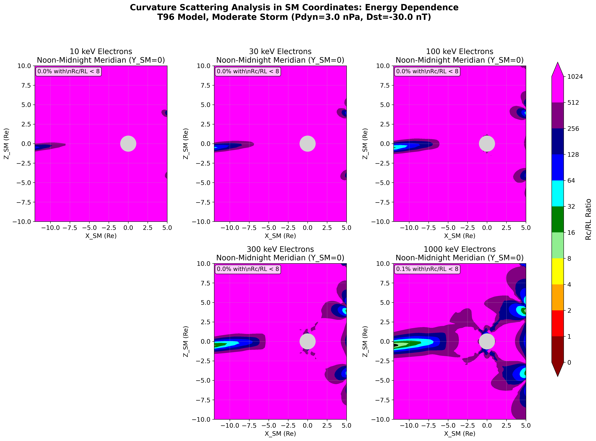
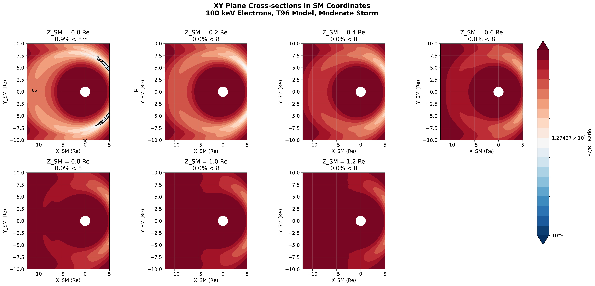
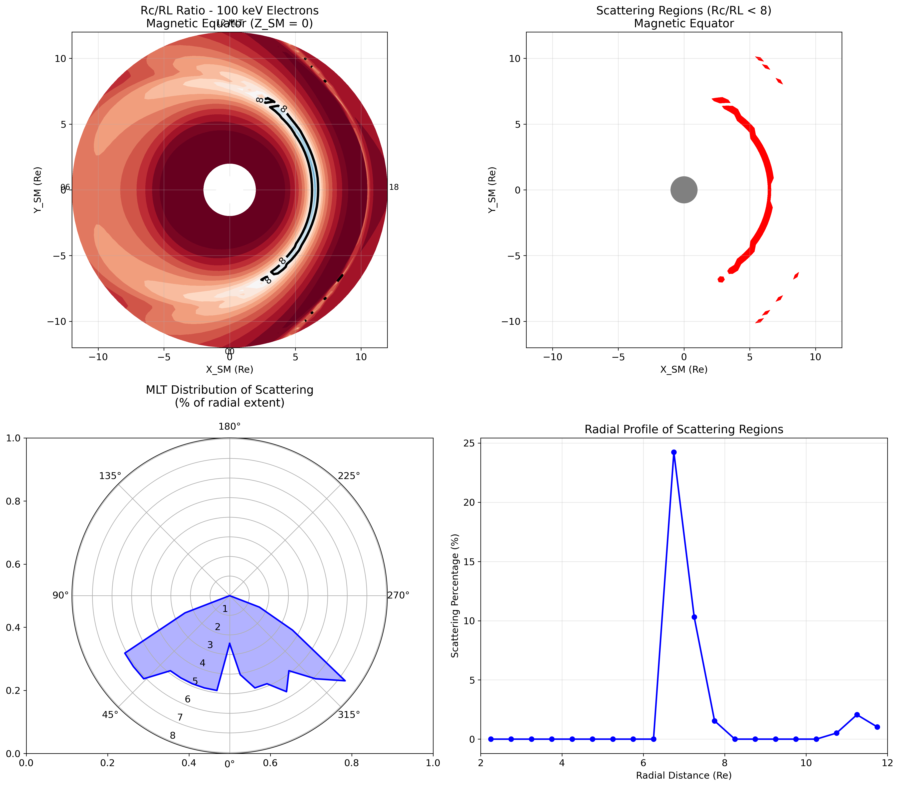
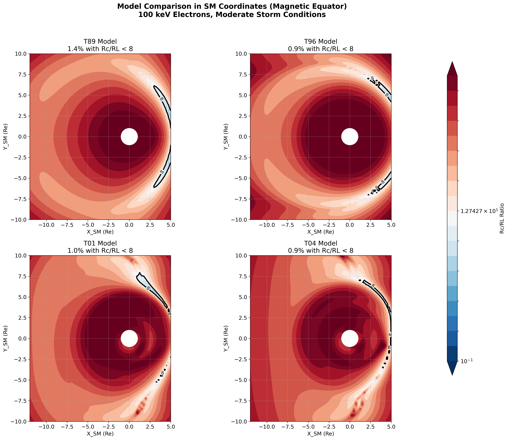
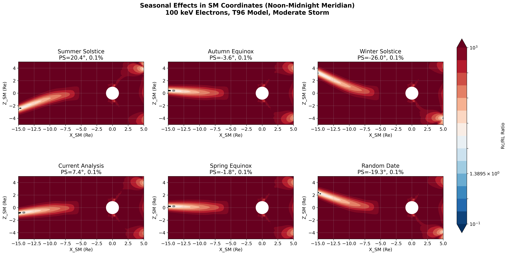

# Magnetic Field Line Curvature Scattering Analysis: SM Coordinate System

## Overview

This document presents the same curvature scattering analysis (Rc/RL = 8 threshold) but using the **Solar Magnetic (SM)** coordinate system instead of GSM. The SM coordinate system is particularly useful for studying magnetic latitude effects and phenomena aligned with Earth's dipole.

## Coordinate System Comparison

### GSM (Geocentric Solar Magnetospheric)
- **X-axis**: Points from Earth to Sun
- **Y-axis**: Perpendicular to Earth-Sun line, opposing planetary motion
- **Z-axis**: Northward, perpendicular to X-Y plane
- The magnetic equator is tilted with respect to Z=0 by the dipole tilt angle

### SM (Solar Magnetic)
- **X-axis**: Points from Earth to Sun (same as GSM)
- **Y-axis**: Perpendicular to X in the plane containing the dipole axis
- **Z-axis**: Along Earth's magnetic dipole axis (positive north)
- The magnetic equator is always at Z_SM = 0

## Key Differences in SM Coordinates

### 1. Magnetic Equator Alignment
- In SM, the magnetic equator is always at Z_SM = 0
- No seasonal tilt effects in the Z=0 plane
- Better for studying phenomena aligned with magnetic field

### 2. Seasonal Effects
- Seasonal variations are minimized in SM coordinates
- The dipole axis doesn't change orientation relative to SM axes
- Solar wind still enters along X_SM (same as X_GSM)

### 3. Current Sheet Location
- In GSM: Current sheet tilts with seasons
- In SM: Current sheet always near Z_SM = 0
- Makes it easier to study current sheet dynamics

## Analysis Results in SM Coordinates

### Figure 1: Energy Dependence (SM)

Shows scattering regions for different electron energies in the noon-midnight meridian (Y_SM = 0):
- Lower energy electrons show larger scattering regions
- Scattering concentrated near the current sheet (Z_SM ≈ 0)
- Pattern is symmetric about the magnetic equator

### Figure 2: XY Plane Cross-sections at Different Z_SM Heights

Cross-sections parallel to the magnetic equator at different heights:
- Z_SM = 0: Maximum scattering (magnetic equatorial plane)
- Higher |Z_SM|: Rapid decrease in scattering regions
- Dawn-dusk asymmetry preserved

### Figure 3: Magnetic Equatorial Plane Analysis

Detailed analysis of the magnetic equatorial plane (Z_SM = 0):
- MLT distribution shows dawn-dusk asymmetry
- Radial profile indicates peak scattering at specific L-shells
- Different pattern than GSM equatorial plane due to dipole tilt

### Figure 9: Model Comparison (SM)

Comparison of T89, T96, T01, and T04 models in SM coordinates:
- All models show scattering concentrated near magnetic equator
- T01 and T04 show enhanced storm-time effects
- Asymmetries are preserved but patterns differ from GSM

### Figure 19: Seasonal Effects (SM)

Seasonal variations in SM coordinates:
- Much less variation than in GSM
- Small differences due to changing solar wind conditions
- Current sheet remains near Z_SM = 0 throughout the year

## Physical Implications of SM Coordinate Analysis

### Advantages of SM Coordinates

1. **Magnetic Latitude Studies**
   - Clear separation by magnetic latitude
   - No seasonal contamination of latitude effects
   - Better for particle drift studies

2. **Current Sheet Analysis**
   - Current sheet always near Z_SM = 0
   - Easier to study current sheet thickness variations
   - Cleaner separation of spatial and temporal effects

3. **Radiation Belt Mapping**
   - Natural coordinate system for trapped particles
   - L-shell structures more apparent
   - Drift shell splitting effects clearer

### When to Use SM vs GSM

**Use SM Coordinates for:**
- Magnetic latitude dependence studies
- Radiation belt physics
- Particle drift analysis
- Magnetic storm effects on trapped populations

**Use GSM Coordinates for:**
- Solar wind interaction studies
- Magnetopause and bow shock analysis
- Seasonal variation studies
- Magnetotail dynamics

## Summary

The SM coordinate analysis reveals that:

1. **Scattering regions are always centered on the magnetic equator** (Z_SM = 0) regardless of season

2. **Seasonal effects are minimized** but not eliminated - solar wind conditions still vary

3. **Model differences remain apparent** with storm-time models showing enhanced scattering

4. **Dawn-dusk asymmetries persist** due to magnetospheric configuration

5. **The analysis is cleaner for magnetic phenomena** but may obscure some solar wind interaction effects

This complementary analysis in SM coordinates provides insights into the magnetic organization of curvature scattering regions, particularly useful for understanding particle dynamics in the inner magnetosphere and radiation belts.

---

*Analysis performed using geopack-vectorize Python implementation*  
*SM coordinate system transformation included*