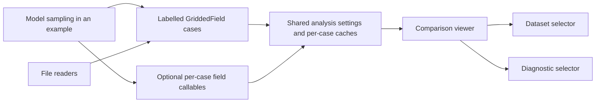
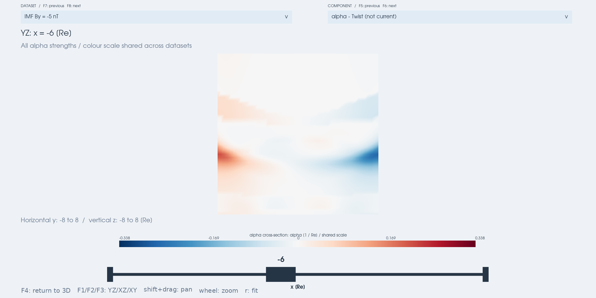
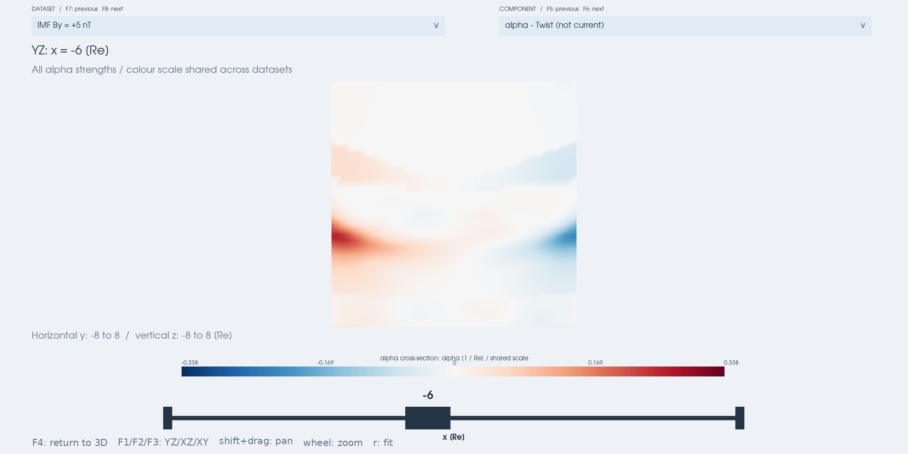

# Compare magnetic datasets

[Documentation index](README.md) · [Viewer controls](viewer.md)
· [Input formats](simulation_data_formats.md)

`viz3d.compare_geometry` switches between labelled magnetic snapshots while
preserving viewing and analysis conditions. It accepts an ordered mapping
of labels to `GriddedField` objects, optionally accompanied by per-case
magnetic field callables for direct evaluation. Dataset generation, model
state management and file loading remain outside the viewer.

## Start with six IMF By cases

From the repository root, after installing the optional viewer dependency:

```bash
python -m pip install -e '.[viz3d]'
python examples/compare_t96_by.py
```

The example generates six T96 + dipole snapshots in memory for IMF By
`[-5, -3, -1, 1, 3, 5]` nT. It reads no simulation files and writes no
intermediate datasets. **DATASET** selects the case; **COMPONENT** selects
the diagnostic independently. The default is `alpha` with a YZ slice at
`x = -6 Re`. F7/F8 select the previous/next dataset; F5/F6 select the
previous/next diagnostic. Both dropdowns work in the F4 enlarged slice.
By default, magnetic derivatives and field-line tracing evaluate the model
directly. The display grid and derivative step match the single-snapshot
model example: 65 × 49 × 49 input nodes and 0.002 Re, with the same 120000-node
preview budget. Colour scales and trace seeds remain shared across cases.

```bash
python examples/compare_t96_by.py --by -10 -5 0 5 10 --component gamma
python examples/compare_t96_by.py --initial-by 5 --slice-only
python examples/compare_t96_by.py --delta 0.001
python examples/compare_t96_by.py --evaluation grid
python examples/compare_t96_by.py --shape 81 65 65 --max-points 350000
python examples/compare_t96_by.py --color-limit 0.2 --screenshot comparison.png
```

`--initial-by` must occur in `--by`. `--color-limit` and `--threshold`
set shared values for the initial diagnostic only. See `--help` for slice,
derivative-step, preview-budget, and cache options. `--evaluation direct`
is the default; `--evaluation grid` opts into linear grid interpolation.
`--delta` controls the direct-model Cartesian FAC difference step (default
0.002 Re), and supplies the default geometry step. `--geometry-delta`
overrides the geometry step alone. Grid mode rejects `--delta` and uses
preview-axis differences for FAC; its default geometry step is the smallest
preview spacing. The earlier coarse-grid example can be reproduced with
`--evaluation grid --shape 41 33 33`.

| Fixed example condition | Value |
| --- | --- |
| External / internal field | T96 / dipole |
| Epoch | 100 Unix seconds (matching the single-snapshot model example) |
| Dynamic pressure / Dst | 2 nPa / -20 nT |
| IMF Bz | -5 nT |
| Coordinates / field | GSM, Re / nT |
| Default display grid | 65 × 49 × 49 nodes, x: -15 to 5, y/z: -8 to 8 Re |
| Default evaluation / difference step | Direct model / 0.002 Re |
| Inner excluded region | r < 2.5 Re |
| Current display conversion | 0.125 × native nT/Re, approximately nA/m² |
| Geometry rate units | 1/Re; unaffected by current scaling |
| Eta | Dimensionless; fixed [−1, 1] scale by default, unaffected by current scaling |

The on-screen source information follows the selected case in both viewing
modes, showing the model, parameters and their units. This uses the same
generic [metadata display](viewer.md#source-information) as simulation data.

IMF By is the model input `parmod[2]`, not the resulting `grid.by` field
component. Each case uses a separate read-only parameter array. Direct
callables re-establish the fixed epoch before every evaluation, including
tracing, so another `geopack.recalc` call cannot silently change the internal
field of a retained case. Evaluation is serial; these wrappers do not make
geopack's shared state safe for concurrent threads. In grid mode only the
sampled arrays are passed to the viewer, and interpolation can differ
numerically from direct model evaluation.

## Direct model evaluation in Python

From the repository root, the same T96 helpers can be used directly:

```python
from examples.compare_t96_by import make_cases, make_fields, inner_mask
from mageometry import viz3d

by_values = (-5., 0., 5.)
viz3d.compare_geometry(
    make_cases(by_values), fields=make_fields(by_values), delta=0.002,
    mask=inner_mask, component='alpha', length_unit='Re',
    current_scale=0.125, current_unit='nA/m^2', slice_panel=True)
```

`fields` is a mapping with exactly the same labels as `cases`. Each value
accepts broadcast coordinates and returns `(bx, by, bz)` in the corresponding
grid's coordinates and units. All cases must supply a callable, and an
explicit positive shared `delta` is required (a scalar or three Cartesian
steps). The default geometry step is `min(delta)`; `geometry_delta` can
override it. A single shared `field` is rejected to avoid assigning the
wrong model to a case. Omitting `fields` keeps the grid-data workflow.

The callables supply field values at derivative stencil points and along
traces. Input grids still define the display coordinates and base validity
mask: a NaN input node stays blank even when its callable is defined there.
Callables must represent the same magnetic field as their grids and remain
reproducible after evaluating another case. The viewer does not interpret
model names, parameters, or epochs. Stateful models need an adapter such as
the example's T96 wrapper.

## Supply model grids or file data

This small standalone example requires no files:

```python
import numpy as np
from mageometry import GriddedField, viz3d

axis = np.linspace(-2, 2, 25)
x, y, z = np.meshgrid(axis, axis, axis, indexing='ij')
cases = {}
for strength in (0.5, 1.0, 1.5):
    cases[f'Twist = {strength:g}'] = GriddedField(
        axis, axis, axis, -strength*y, strength*x, np.ones_like(x),
        metadata={'coordinate_system': 'Cartesian',
                  'length_unit': 'm', 'field_unit': 'T'})

viz3d.compare_geometry(cases, component='alpha', length_unit='m',
                       slice_panel=True, slice_normal='z',
                       color_limits={'alpha': 3.0}, cache_size=2)
```

For files, construct the mapping with the existing readers:

```python
from mageometry import load_xdmf, viz3d

# Replace these placeholders with your files; use identical reader settings.
cases = {'Run A': load_xdmf('run_a.xmf', stride=4),
         'Run B': load_xdmf('run_b.xmf', stride=4)}
viz3d.compare_geometry(cases, component='fac', slice_panel=True)
```

The first mapping entry is the **reference case**, supplying default
thresholds and automatic magnetic-line seeds. `initial_case='Run B'` changes
only the initially displayed case. For reproducible tracing independent
of the initial diagnostic, supply explicit `seeds` in grid coordinates.
The T96 example does this.

## Comparison contract

- All cases must have exactly identical x/y/z axes with at least three
  nodes per axis. Different grids must be resampled before calling the
  viewer; it does not silently align them.
- Coordinates, units, and preprocessing must agree. Conflicting declared
  `coordinate_system`, `length_unit`, or `field_unit` metadata are rejected.
  Missing declarations are allowed; the caller remains responsible for
  consistency. Neither metadata nor labels convert units.
- `max_points`, `mask`, `delta`, `geometry_delta`, `current_scale`, and display unit
  labels apply to every case. Do not mutate the input arrays while viewing.
- All cases use the same evaluation mode. Without `fields`, FAC uses
  Cartesian grid differences and other diagnostics/traces use the linear
  preview interpolant. With `fields`, all magnetic derivatives and traces
  use the selected callable and the shared explicit difference steps.
- NaN stays blank and validity is specific to each diagnostic. A case with
  no valid results keeps its label and reports that the quantity is
  unavailable. Numerical preparation failures retain the previous scene
  and selected labels, and raise an error.

| State | Dataset selection |
| --- | --- |
| Camera, pan, zoom, projection | Preserved in every panel |
| Slice normal/origin and F4 mode | Preserved |
| Diagnostic | Preserved |
| Colour range | Shared across all cases for that diagnostic |
| Absolute threshold | Shared across cases, remembered per diagnostic |
| Magnetic-line seeds | Fixed physical coordinates |
| Magnetic lines | Retraced through the selected direct or interpolated field |
| Volume, projections, regions, current arrows | Replaced together |

Threshold defaults use the reference case's absolute-value percentile
(`percentile=90`). The slider then sets an absolute cutoff; it is never
lowered automatically for a weaker case. Thresholds affect regions,
arrows, and peak maps. Slices show all finite strengths.

The automatic colour limit is the largest per-case 98th percentile of
finite absolute values. If that is zero, it falls back to the global peak
or 1 for entirely zero/invalid data. Colours are symmetric about zero;
nonnegative `gamma` occupies the positive half. Percentile limits can
saturate extremes. `color_limits={'alpha': 0.2, 'fac': 0.05}` overrides
limits in each diagnostic's displayed units. Legends identify the shared
scale. Different diagnostics still have separate scales and units.

## Preparation, memory, and numerical resolution

The first use of each diagnostic makes a synchronous pass over all cases
to establish its common colour limit, slider bounds, and reference
threshold. The CLI announces initial preparation; later diagnostic
switches show progress in the window. Even explicit colour limits require
this pass to set the remaining shared controls. Selection is synchronous
and can pause the interface while computing or tracing.

`cache_size=2` bounds retained case previews and their derived results.
Revisiting an evicted case recomputes it. Small scale summaries remain
cached. During preparation the current scene/selection remains available
until the replacement is ready. Input grids are all held in memory
separately; this is not a streaming file loader or a total process memory
cap. The six default magnetic arrays occupy about 21.4 MiB; derived arrays,
VTK meshes and tracing require additional memory. One scene is reused.

In grid mode preview coarsening changes the field used for numerical
derivatives and tracing. In direct mode the model is evaluated at the
requested coordinates, independently of display-grid spacing. Derivatives
are still finite differences; direct mode does not mean exact derivatives.
Both modes render diagnostics sampled on the preview grid, including
interpolated slices, so display resolution still limits visible detail
and affects automatic scale/threshold statistics.

For resolution studies increase both `--shape` and `--max-points`;
increasing the input grid alone may still leave a coarsened preview. Check
grid and derivative-step convergence before interpreting fine structure.
The default 0.002 Re reproduces the earlier model-example setting; it is
not a universal accuracy guarantee. Direct evaluation can cost more during
initial preparation, cache recomputation and tracing.

## Responsibility and future extensions



`mageometry.geometry` stays the primary analysis API and does not depend
on selectors, model names, or parameter scans. `FieldSeries` keeps its
time-series meaning; By values are not stored as times. The internal
`_OverviewData` prepares cases and maintains shared statistics; the
existing overview and slice renderer handles the display for both single
and multiple snapshots.

Difference maps, side-by-side cases, asynchronous preparation, automatic
grid alignment, and lazy file loading are outside this implementation.

## Example views

These images use direct T96 + dipole evaluation with a 0.002 Re difference
step, at the same YZ slice and shared automatic colour range:

| IMF By = -5 nT | IMF By = +5 nT |
| --- | --- |
|  |  |

Regenerate from the repository root:

```bash
python examples/compare_t96_by.py --slice-only --screenshot docs/images/comparison-by-negative.png
python examples/compare_t96_by.py --initial-by 5 --slice-only --screenshot docs/images/comparison-by-positive.png
```
