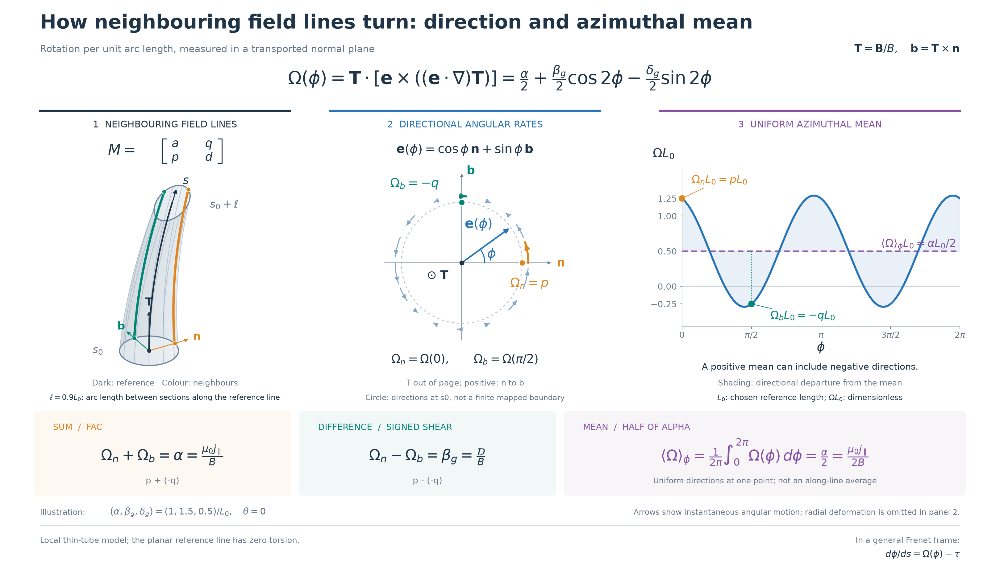

# Directional rotation and azimuthal-mean concept figure

[Documentation index](README.md) · [Companion flux-tube figure](transverse_decomposition_figure.md)
· [Baseline theory](fac_anisotropy_theory.md#3-rotation-strain-and-the-role-of-the-frame)
· [Image sources](images/README.md)

This original mathematical illustration connects neighbouring magnetic field
lines, their direction-dependent local angular rate, and the uniform
azimuthal mean constrained by field-aligned current. It uses the same style
and canonical β_g, δ_g notation as the companion decomposition figure.



| Language | Editable vector | Vector PDF | Slide PNG |
| --- | --- | --- | --- |
| English | [SVG](images/directional-rotation.svg) | [PDF](images/directional-rotation.pdf) | [PNG](images/directional-rotation.png) |
| Japanese | [SVG](images/directional-rotation-ja.svg) | [PDF](images/directional-rotation-ja.pdf) | [PNG](images/directional-rotation-ja.png) |

Both versions have a 16:9 canvas. SVG retains editable text and requires a
CJK font for Japanese labels. PDF embeds the fonts; PNG does not depend on
locally installed fonts.

## Reading the figure

The figure uses s for arc length along the reference field line and ℓ for
the arc length between the sections at s₀ and s₀ + ℓ. The separate symbol
L₀ is an arbitrarily chosen reference length used to make the rates
dimensionless: Ω has inverse-length units, so ΩL₀ is dimensionless.
In this example L₀ = 3 and ℓ = 2.7 in the same arbitrary length units,
hence ℓ = 0.9L₀. These definitions also appear inside the figure.

1. **Neighbouring field lines:** the dark curve is the reference line. The
   orange and green curves follow neighbours initially separated in the
   **n** and **b** directions at s₀. Coloured endpoint dots retain their
   identities along the illustrated segment. The tube can deform as these
   neighbours change angle.
2. **Normal-plane directions:** **n** points right, **b** up, and **T**
   towards the reader. Positive angular motion runs from **n** towards
   **b**. Orange marks Ω_n = p; green marks Ω_b = −q. The other arrows show
   angular motion at other azimuths. This unit circle enumerates directions
   at s₀; it is not the tube's finite-distance mapped boundary. Radial
   changes are omitted in this panel.
3. **Azimuthal dependence:** the solid curve plots Ω(φ)L₀. The dashed purple
   line is its uniform angular mean, αL₀/2. The shaded band shows deviations
   caused by the symmetric strain. The orange and green samples match the
   two labelled neighbours in the preceding panels.

The bottom row collects the sum, difference and mean identities. The
example deliberately has a positive mean and a negative Ω_b: positive FAC
does not require every separation direction to turn in the same sense.

## Equations and sign convention

At a point with B = |**B**| > 0, choose the right-handed frame
**T** = **B**/B and **b** = **T** × **n**. For a small perpendicular separation
ξ = r **e**, let

$$
\mathbf e(\phi)=\cos\phi\,\mathbf n+\sin\phi\,\mathbf b,
\qquad M=\begin{pmatrix}a&q\\p&d\end{pmatrix}.
$$

The transverse directional derivative has components
(a cosφ + q sinφ, p cosφ + d sinφ). Its angular component is

$$
\begin{aligned}
\Omega(\phi)
&=\mathbf T\cdot[\mathbf e\times((\mathbf e\cdot\nabla)\mathbf T)]\\
&=p\cos^2\phi-q\sin^2\phi+(d-a)\cos\phi\sin\phi\\
&=\frac{\alpha}{2}+\frac{\beta_g}{2}\cos2\phi
  -\frac{\delta_g}{2}\sin2\phi,
\end{aligned}
$$

where α = p − q, β_g = p + q and δ_g = a − d. The isotropic trace
θ = a + d contributes only radial change, so it does not appear in Ω.
In particular,

$$
\Omega_n=\Omega(0)=p,\qquad
\Omega_b=\Omega(\pi/2)=-q.
$$

Under the quasistatic Ampère relation μ₀**J** = ∇ × **B**,

$$
\Omega_n+\Omega_b=\alpha=\frac{\mu_0j_\parallel}{B},\qquad
\Omega_n-\Omega_b=\beta_g=\frac{\mathcal D}{B}.
$$

Uniformly averaging the *directions at the same point* cancels both
double-angle terms:

$$
\langle\Omega\rangle_\phi
=\frac{1}{2\pi}\int_0^{2\pi}\Omega(\phi)\,d\phi
=\frac{\alpha}{2}=\frac{\mu_0j_\parallel}{2B}.
$$

This is not a distance average along one neighbour, a time average, or a
flux-weighted average. In particular, a neighbour's changing φ generally
makes its own angular rate vary along the segment even for constant M.

## Local construction and scope

The 3D curves use ξ(s) = exp(sM)ξ(0), embedded along the same planar reference
arc as the companion figure:

$$
\mathbf X(s;\boldsymbol\xi_0)=\mathbf C(s)
+[e^{sM}\boldsymbol\xi_0]_n\mathbf n(s)
+[e^{sM}\boldsymbol\xi_0]_b\mathbf b(s).
$$

The reference arc has a defined Frenet frame and zero torsion. The
transverse unit-direction gradient on that reference line is M. This is a
local thin-tube construction, not a finite-volume magnetic simulation.
It shows spatial variation along arc length, not fluid motion in time.

For a general Frenet frame, ∂_s **n** = −κ**T** + τ**b**, so the coordinate
angle obeys **dφ/ds = Ω(φ) − τ**. The rates plotted here use τ = 0. Their
interpretation and the distinction between local directional rotation and
finite-distance coiling follow the [baseline theory](fac_anisotropy_theory.md#3-rotation-strain-and-the-role-of-the-frame),
which provides the literature references. These figures are newly drawn
from the equations and reproduce no external illustration or data.

## Reproduce or edit

With `.[viz]` installed, run from the repository root:

```bash
python benchmark/directional_rotation_figure.py --language both
python benchmark/directional_rotation_figure.py --check-only
```

The [source script](../benchmark/directional_rotation_figure.py) writes SVG,
PDF and PNG. `--output-dir /tmp/mageometry-directional-rotation` writes a
separate preview set. Japanese defaults to Droid Sans Fallback;
`--cjk-font /path/to/font.ttf` selects another CJK font.

| Illustration parameter | Value |
| --- | --- |
| (α, β_g, δ_g) L₀ / θ | (1, 1.5, 0.5) / 0 |
| M L₀ | (0.25, 0.25; 1.25, −0.25) |
| Ω_n L₀ / Ω_b L₀ / mean ΩL₀ | 1.25 / −0.25 / 0.5 |
| L₀ / segment length ℓ / initial radius | 3 / 2.7 / 0.48 in arbitrary length units |
| Reference curvature κ / torsion τ | 0.12 in inverse length units / 0 |
| Blue separation direction in panel 2 | φ = π/5 (36 degrees) |
| Angular-arrow span | 0.25 ΩL₀ radians, a signed display scale for instantaneous rates |
| PNG dimensions | 3240 × 1822 pixels |

The amplitudes are illustrative. Generation checks the matrix and 3D
cross-product definitions, the angle derivative of the exact finite map,
the signs at **n** and **b**, π periodicity, uniform angular averages,
trace-independent rotation, and area evolution, including pure modes and
random combinations of coefficients.
