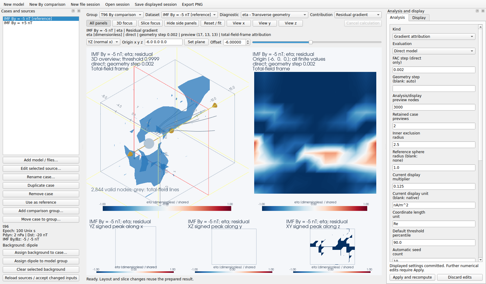
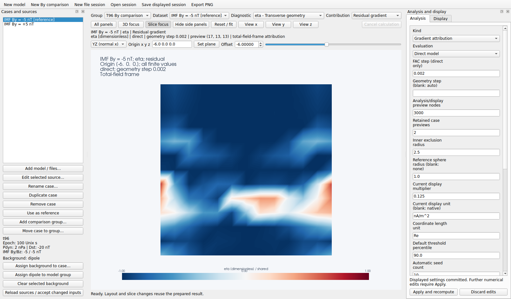

# Desktop geometry workspace

[Documentation index](README.md) · [Scientific definitions](fac_anisotropy_theory.md)
· [Standalone viewers](viewer.md) · [Design reference](gui_design.md)

The desktop workspace brings model generation, simulation input, all 18
viewer diagnostics, dataset comparison, background-gradient attribution,
and session persistence into one Qt window. The numerical geometry APIs and
the existing example scripts remain available without Qt.

## Install and launch

From an activated Python environment in the repository:

```bash
python -m pip install -e '.[gui]'
python -m mageometry.gui
```

The extra installs PySide6, PyVistaQt, PyVista and h5py. A working desktop
OpenGL display is needed for the Qt window. `examples/geometry_gui.py` and
the installed `mageometry-gui` command launch the same application.

```bash
python -m mageometry.gui --by -5 -3 -1 1 3 5
python -m mageometry.gui --empty
python -m mageometry.gui --session saved-session.json
```

Python 3.9+ remains the package target. GUI dependency resolution was checked
for Python 3.9; runtime and desktop rendering were exercised on Python 3.14.
Importing `mageometry.gui` does not import Qt or create a window/process.

## Model and file workflows

**New model** and **New By comparison** start the T96 + dipole presets.
**Edit selected source** edits epoch, Pdyn, Dst, IMF By/Bz, domain bounds and
grid shape. Tilt follows the epoch. **Add model / files** can create several
cases from a list of By values. Use duplicate/rename/remove and the reference
button to organize comparisons. Removing a case never deletes an input file.

**New file session** starts with an empty comparison group. Add an XDMF,
HDF5 or VTK source and set its reader options in the source dialog. Plain
HDF5 requires origin and spacing; its axis-order checkbox defaults to
`(nz, ny, nx)`. XDMF permits a heavy-file override. Array names and reader
stride are editable. Paths are resolved when the source is accepted.

Each group requires identical loaded axes and compatible declared coordinate
systems and units. Use **Add comparison group** and **Move case to group**
for datasets that should not share those conditions. The group selector
restores that group's plane, cameras and layout. No automatic grid alignment
or data-unit conversion is performed. Unit declarations alone do not change
arrays; the current multiplier is an explicit display conversion.

Press **Apply and recompute** after editing sources or numerical conditions.
Dataset, diagnostic and contribution selection reuse prepared settings and
start any missing calculations automatically. The result header describes
the committed result until the requested replacement succeeds. Hover over
the header to inspect its full source metadata.

## Background contributions across cases

For the T96 group, **Assign dipole to model group** assigns a dipole at each
case's epoch. That assignment follows subsequent epoch edits through the
source editor. Alternatively, **Assign background to case** opens the same
source form for an explicit model or file background; file backgrounds must
have matching loaded axes and compatible declared units.

Set **Kind: Gradient attribution** in Analysis, choose a transverse diagnostic,
and Apply. When a current component is selected, the form announces that
Apply will select `eta`. Every participating case needs a background.
Dataset and contribution are independent selectors, so residual-gradient
eta or gamma can be compared across By values or simulation snapshots.

Attribution uses the total-field direction, magnitude and frame. Total,
background and residual are gradient contributions in that common frame.
Residual gamma and eta are not scalar subtraction or the geometry of a
standalone residual magnetic field. The context lines follow the total
field in every branch. See the [theory](fac_anisotropy_theory.md#background-attribution-in-the-total-field-frame).

An automatic colour range covers every case and, in attribution, all three
branches. Eta defaults to [-1, 1]. Thresholds are absolute values shared
across cases/branches and remembered per diagnostic and analysis kind.
Defaults use the marked reference case's total branch. Choosing another
displayed case does not change the reference. Undefined values remain blank.

## Layout and display

| Control | Behavior |
| --- | --- |
| All panels | 3D overview, face-on slice and three signed peak projections |
| 3D focus | Enlarge the 3D renderer |
| Slice focus | Enlarge the face-on slice |
| Hide / Show side panels | Expand plot space; dataset, diagnostic, contribution and plane controls remain accessible |
| F4 | Toggle Slice focus and the previous non-slice layout |
| Escape | Restore All panels and side panels when plot navigation has focus |
| F1/F2/F3 | YZ/XZ/XY planes |
| F5/F6 | Previous/next eligible diagnostic |
| F7/F8 | Previous/next dataset |
| Alt+Left/Alt+Right | Previous/next contribution |
| `x`/`y`/`z`, `r` | 3D axis views and reset/fit |
| `l`/`a`/`s`/`c` | Lines/arrows/regions/3D slice visibility |

Keyboard shortcuts belong to the plot widget and do not intercept typing
in forms. The layout buttons do not perform magnetic calculations. Each
renderer retains its camera; the plane is shared between the 3D widget and
the face-on panel. Change orientation, enter an origin, move the offset
slider, or drag the plane. Use **Oblique** to enter a normal vector.

Display controls provide thresholds, automatic/manual colour limits, and
layer visibility. Thresholds affect regions, arrows and peak maps; slices
show all finite strengths. Peak maps select the signed sample of greatest
absolute magnitude along each sightline, not an integral. Changes to the
display conversion or unit labels reset remembered numeric thresholds and
manual limits to avoid reusing values in a different display convention.





These are actual desktop renders of a small T96 comparison used for UI
verification, with residual-gradient eta. Their coarse preview is not a
resolution-converged scientific result. Regenerate all three layouts with:

```bash
python benchmark/render_gui.py --output /tmp/mageometry-gui
```

## Numerical work and cancellation

Analysis settings include direct/grid evaluation, FAC and geometry steps,
preview node budget, exclusion radius, reference sphere, current display
conversion, tracing seeds/options, and retained preview count. Blank geometry
step uses the direct step or minimum preview spacing. In grid mode FAC uses
axis spacing and preview coarsening changes the field used for derivatives
and tracing. In direct mode the callable supplies stencil and trace values;
the display still samples diagnostics on a finite grid.

Trace seeds accept one `x y z` row per line. Blank means automatic; `none`
disables tracing. Automatic seeds are resolved once from the reference case
and saved as coordinates. The model presets use fixed physical seeds.

A single spawned numerical process evaluates geopack cases serially and
restores their epochs. Qt/VTK rendering stays on the GUI thread. Progress and
Cancel remain accessible above the plot even with side panels hidden.
Cancellation is cooperative between model chunks, case calculations and
trace seeds. A long library call may finish before cancellation takes effect.
Late results from superseded requests are ignored. Failures retain the old
result and report the affected calculation or input.

Numerical Apply currently rebuilds the group's preparation conservatively;
display changes reuse existing arrays. The cache count bounds retained case
previews, not total RAM. Input grids, attribution arrays, rendered data and
worker-transfer copies require additional memory. Long-series streaming,
side-by-side dataset scenes and difference maps are not included.

## Save, restore and export

**Save displayed session** stores the committed recipes and current views as
versioned JSON. Unapplied edits are not attached to already displayed results.
Groups that have not been prepared can be saved as source recipes without
resolved results. The session includes model parameters or reader options,
per-case backgrounds, reference/selection, numerical settings, resolved seeds
and steps, preview shapes, scales, thresholds, cameras, layout and dock
visibility. It stores paths relative to the session where possible; source
arrays and executable callables are not embedded.

File preparation records SHA-256 identities, sizes and timestamps, including
the heavy data referenced by XDMF. A restored recipe checks content identity;
retained cached inputs check size/mtime before use. **Reload sources / accept
changed inputs** explicitly starts a new input revision. Missing paths can
be relocated through the source editor. Package/dependency versions are
recorded when saving; exact equality across changed software versions is not
guaranteed. Coefficient asset files are those installed with the package;
the current format does not separately fingerprint those packaged assets.

**Export PNG** saves the selected plot layout and a matching `.session.json`
file. Pending settings never label the older image. Screenshots contain the
case, diagnostic, contribution, units and scale. Detailed input metadata is
retained in the accompanying recipe.

For scripted preparation without Qt, use a validated session group with
`mageometry.session.SessionEngine`, then pass its prepared result and view
to `viz3d.scene.GeometryScene` on a PyVista plotter with `shape='1|4'`.
`SessionEngine` is serial; use the desktop's worker to keep interactive work
responsive. These session/scene interfaces are new development APIs; existing
`mageometry.geometry` functions remain the primary scientific API.
