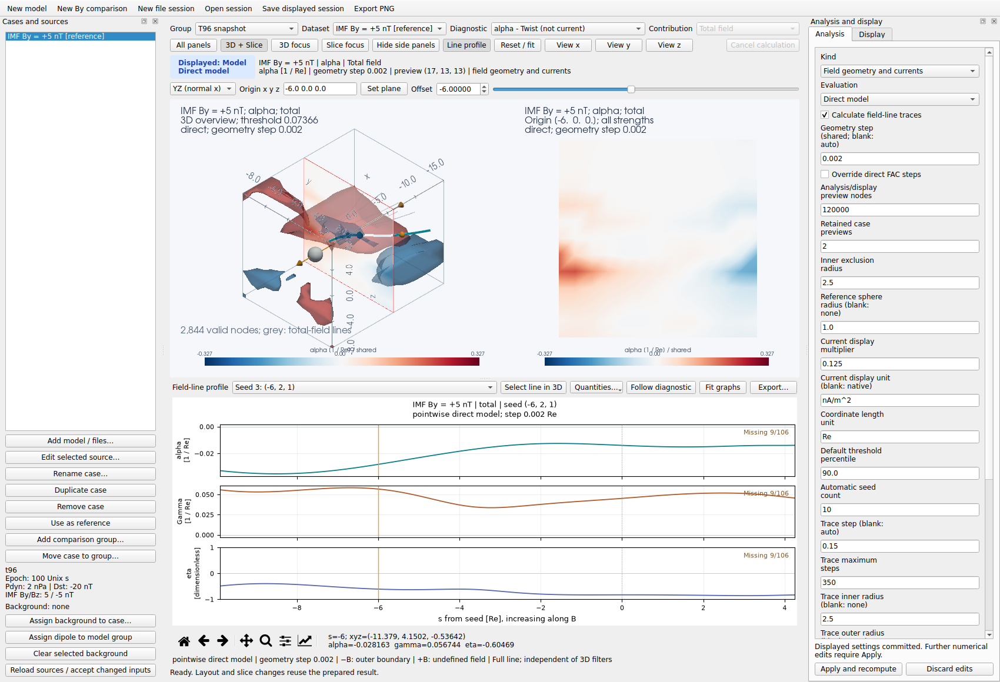
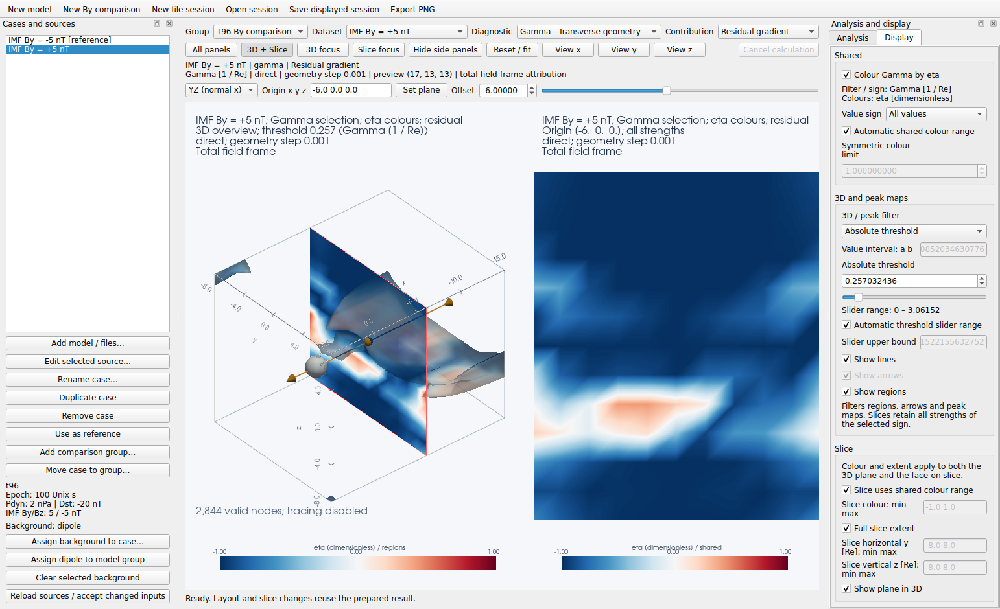
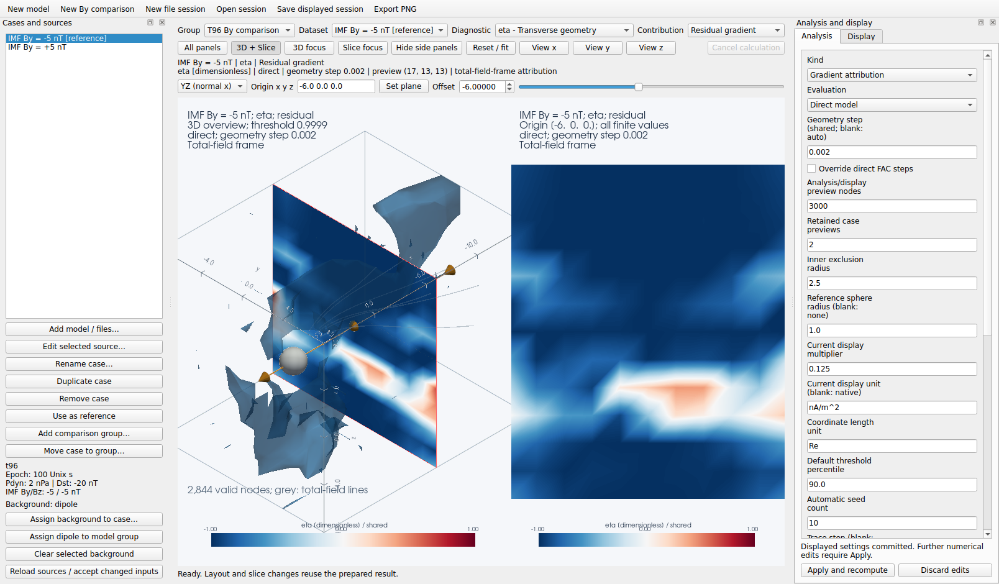

# Desktop geometry workspace

[Documentation index](README.md) · [Scientific definitions](fac_anisotropy_theory.md)
· [Standalone viewers](viewer.md) · [Developer architecture](gui_architecture.md)
· [日本語詳細ガイド](gui_ja.md)

The desktop workspace brings model generation, simulation input, all 22
viewer diagnostics, dataset comparison, background-gradient attribution,
and session persistence into one Qt window. The numerical geometry APIs and
the standalone PyVista entry point remain available without Qt.

## Install and launch

From an activated Python environment in the repository:

```bash
python -m pip install -e '.[gui]'
python -m mageometry.gui  # one T96 + dipole case, alpha, total field
```

The extra installs PySide6, PyVistaQt, PyVista, Matplotlib and h5py. A working desktop
OpenGL display is needed for the Qt window. `examples/geometry_gui.py` and
the installed `mageometry-gui` command launch the same application.

New sessions start in **3D + Slice**, with the 3D overview and face-on slice
side by side. Saved sessions retain their layout unless overridden with `--layout`.

```bash
python -m mageometry.gui --by -10 -5 0 5 10 --layout three_d_slice
python -m mageometry.gui --xmf snapshot.xmf --stride 4
python -m mageometry.gui --by -5 5 --background dipole --contribution residual
python -m mageometry.gui --empty
python -m mageometry.gui --session saved-session.json
```

The three interactive examples launch this workspace: `geometry_gui.py`
starts a single model, `compare_t96_by.py` starts five IMF By cases
(−10, −5, 0, +5, +10 nT) at Dst = −30 nT and IMF Bz = −10 nT, and
`geometry_viewer_simulation.py` requires an explicit file or saved session.
Start on FAC with `python examples/geometry_gui.py --component fac`, or
choose **fac** from **Diagnostic**. See the [examples index](../examples/README.md)
for replacements for the removed duplicate launchers.
Use `--help` for shared source, derivative and display options. Existing
`--slice-only` is equivalent to `--layout slice`. `--session` and `--empty`
accept layout overrides, but cannot be combined with source/analysis options.
For the standalone PyVista interface, use `python -m mageometry.viz3d`.

Python 3.9+ remains the package target. GUI dependency resolution was checked
for Python 3.9; runtime and desktop rendering were exercised on Python 3.14.
Importing `mageometry.gui` does not import Qt or create a window/process.
The `gui` extra includes the file-reader and 3D dependencies; `dev` alone
does not install Qt. Use `.[dev,gui]` to run the optional GUI tests.

## Rendering performance and WSL

The desktop renders through VTK/OpenGL. Hardware acceleration depends on the
active graphics driver, not on CUDA or the presence of an NVIDIA GPU. Colour
and visibility edits update existing actors and legends without rebuilding
meshes. Changing a threshold, sign selection or slice geometry still requires
the corresponding geometry work. Field evaluation remains on the CPU.

To inspect the actual Qt rendering backend and time display operations without
file loading or field evaluation, run:

```bash
python benchmark/profile_gui.py --output /tmp/mageometry-profile
```

The script uses a fixed 49³-node synthetic field and writes `opengl.txt`,
`timings.json` and two PNGs. It measures synchronous VTK rendering and control
callbacks, excluding desktop compositor/input latency. Keep the window size
and backend equal when comparing code revisions.

On WSLg, `llvmpipe` in the OpenGL renderer string means software rendering.
If the Windows GPU and WSL graphics driver are available but Mesa's automatic
selection falls back to software, compare an explicit D3D12 selection in a
separate diagnostic run:

```bash
GALLIUM_DRIVER=d3d12 python benchmark/profile_gui.py --output /tmp/mageometry-profile-gpu
```

Check that `opengl.txt` identifies the intended hardware, for example
`D3D12 (Intel(R) Graphics)`, and compare the captures and timings. The driver
name alone does not prove successful rendering: Qt/OpenGL driver combinations
can produce black images even when standalone VTK renders correctly on the
same GPU. The benchmark rejects a uniform blank capture. If rendering fails,
remove the prefix and retain the working default backend while investigating
the Qt/Mesa/Windows graphics stack.

Only after a successful comparison, use the same prefix with
`python -m mageometry.gui` or `python examples/compare_t96_by.py`. Driver
selection is specific to the environment; the application does not force
D3D12 or change the user's graphics configuration.
See [Mesa's D3D12 driver](https://docs.mesa3d.org/drivers/d3d12.html) and
[WSLg GPU selection](https://github.com/microsoft/wslg/wiki/GPU-selection-in-WSLg).

In an isolated comparison on 2026-10-05 (Python 3.14.4, Mesa 26.0.3,
WSLg and Intel Graphics), both PySide6/Qt 6.11.2 and 6.10.3 rendered a minimal
`QOpenGLWidget` correctly with llvmpipe but returned a black framebuffer with
D3D12. Neither environment contained PyVista or Mageometry. This reproduces
the problem outside the viewer and shows that switching to Qt 6.10.3 alone
does not resolve it on that stack; it does not identify which lower-level
component is responsible. Keep experimental driver selections confined to
the diagnostic process until actual rendering has been verified.

## Model and file workflows

**New model** and **New By comparison** start the T96 + dipole presets.
**New By comparison** and `examples/compare_t96_by.py` use the same five cases:
By = −10, −5, 0, +5, +10 nT, Dst = −30 nT and Bz = −10 nT. The desktop and
standalone `--by` launchers and the shared `make_cases` / `make_fields` helpers
use these same Dst/Bz defaults. Explicit `--dst` and `--bz` override them.
Both presets use epoch 100 Unix seconds, Pdyn = 2 nPa, the same grid, mask,
derivative step and fixed trace seeds. A new comparison selects its first case
(By = −10 nT), also used as the reference. **New model** starts By = 0 nT,
Dst = −20 nT and Bz = −5 nT. Saved sessions keep their recorded conditions.
In **Edit selected source** or **Add model / files**, choose **Source type**
`t89`, `t96`, `t01`, or `t04`. Each combines the selected external field with
the internal dipole. All use GSM coordinates in Re and magnetic fields in nT.
Tilt follows the epoch. The form displays only the selected model's inputs:

| Model | Inputs in addition to epoch, bounds and grid shape |
| --- | --- |
| [T89 input form](images/gui-source-t89.png) | `iopt`, an integer activity bin from 1 to 7; default 2. No Pdyn, Dst or IMF inputs. |
| T96 | Pdyn [nPa], Dst [nT], IMF By/Bz [nT] |
| [T01 input form](images/gui-source-t01.png) | T96's input quantities plus the G1 and G2 driving indices |
| [T04 input form](images/gui-source-t04.png) | T96's input quantities plus six driving indices W1 through W6 |

T89 `iopt` is a bin number: 1 corresponds to Kp 0/0+, 2 to 1−/1/1+,
through 6 for 5−/5/5+, and 7 for Kp ≥ 6−. The G1/G2 and W1–W6 defaults
are zero for demonstration. Enter indices appropriate to your event; the
application does not calculate driving histories from the epoch or from
instantaneous IMF values. T01/T04 are calibrated sunward of x = −15 Re;
keep their model limits in mind when choosing a domain.
The application's T01/T04 sources return NaN at x < −15 Re, including
derivative stencil samples, instead of using the underlying API's clipped
coordinates. Grid samples or diagnostics requiring that region remain blank.

**Add model / files** can create several T96/T01/T04 cases from a list of By
values. For a T89 activity comparison, duplicate cases and edit `iopt`.
Use duplicate/rename/remove and the reference
button to organize comparisons. Removing a case never deletes an input file.

```bash
python -m mageometry.gui --model t89 --iopt 4
python -m mageometry.gui --model t01 --dst -30 --bz -10 --g1 1.2 --g2 0.7
python -m mageometry.gui --model t04 --dst -30 --bz -10 --w 0.1 0.2 0.3 0.4 0.5 0.6
```

These are example inputs. The same model arguments work with
`python -m mageometry.viz3d`; `--by -10 -5 0 5 10` adds a By comparison for
T96/T01/T04. Models, inputs and assigned backgrounds survive session save/restore.

**New file session** starts with an empty comparison group. Add an XDMF,
HDF5 or VTK source and set its reader options in the source dialog. Plain
HDF5 requires origin and spacing; its axis-order checkbox defaults to
`(nz, ny, nx)`. XDMF permits a heavy-file override. Array names and reader
stride are editable. Paths are resolved when the source is accepted.

When **Add model / files…** adds a file to a model-only group, it creates
and selects a separate **File snapshots** group. The existing model group
and its analysis draft remain available. The file group uses grid evaluation,
native units and automatic trace seeds; press **Apply and recompute** to
display it. Adding models to a file-only group similarly creates a model
group. Additional files can be added to the current file group.

Each group requires identical loaded axes and compatible declared coordinate
systems and units. Use **Add comparison group** and **Move case to group**
for datasets that should not share those conditions. The group selector
restores that group's plane, cameras and layout. No automatic grid alignment
or data-unit conversion is performed. Unit declarations alone do not change
arrays; the current multiplier is an explicit display conversion.

**Default multiplier 0.125:** T96 and the other built-in models use magnetic
fields in nT and distances in Re (Earth radii). The calculated current
quantity is μ₀J in nT/Re. Multiplying its numerical value by approximately
`0.125` converts it to **current density in nA/m²**; for example,
`2 nT/Re → approximately 0.25 nA/m²`. This factor includes division by μ₀
and the unit conversions. Enter it as **Current display multiplier** and
use **Current display unit** `nA/m^2`. Changing the unit label alone does
not convert values. The positive multiplier preserves signs.

File sessions default to multiplier `1`, retaining native numerical values
until a conversion appropriate to the input units is supplied. Alpha and
its two along-field derivatives remain unscaled. The multiplier also applies
to `dfac_ds`, whose model display unit is `(nA/m²)/Re`.

Press **Apply and recompute** after editing sources or numerical conditions.
Dataset, diagnostic and contribution selection reuse prepared settings and
start any missing calculations automatically. The result header describes
the committed result until the requested replacement succeeds. Hover over
the header to inspect its full source metadata.

A coloured label beside the result header makes the displayed source and
evaluation method visible even when side panels are hidden. **Displayed:
Model** is blue and shows **Direct model** or **Grid interpolation**;
**Displayed: File data** is green and shows **Grid interpolation**. A model
evaluated on a grid is still labelled Model. Before the first result, the
label reads **Displayed: None / Awaiting calculation**. The label follows
the displayed result, so draft edits, pending requests and failed calculations
do not relabel an older plot. **Analysis → Evaluation** edits the method
to use on the next Apply.

## Profiles along a magnetic field line

Open **Line profile** for a resizable panel below the spatial views. Select
a seed from the list, or enable **Select line in 3D** and **right-click a
visible grey line in the 3D panel**. Left-drag still rotates. The selected
line and seed are teal; the orange marker follows the nearest evaluated
sample under the graph cursor without changing the seed, plane or camera.

The default graphs show the selected diagnostic and |B|. **Quantities…** pins
up to four diagnostics in separate rows with a shared distance axis;
**Follow diagnostic** restores the default. Use the graph toolbar to pan/zoom
and **Fit graphs** to restore automatic ranges (eta uses [-1, 1]). Manual
ranges report samples outside the visible y range. The 3D threshold, sign
and visibility filters do not remove profile samples.

Distance s is zero at the seed and increases along **B**, also for
against-B-only traces. Both endpoint termination reasons are shown; a step
limit or domain boundary is not an inferred magnetic footpoint. Missing
diagnostics remain gaps, and completely undefined rows are labelled.
Undefined Frenet components do not hide finite alpha, Gamma or |B|.

Profiles evaluate diagnostics **at adaptive trace points**, using the same
effective field as tracing: the model in direct mode, or the masked and
possibly coarsened preview interpolant in grid mode. They do not interpolate
displayed diagnostic arrays. Values can therefore differ from slice colours,
especially grid FAC and along-B derivatives. Geometry uses the committed
Geometry step. Pointwise FAC uses the committed FAC override in direct mode
and Geometry step in grid mode; its derivative uses the same inner FAC step.
This differs from the viewer's grid-node FAC and outer-derivative stencils.
The panel identifies the method; its tooltip records preview spacing/shape
and FAC step. Trace step, nonuniform sample spacing and derivative step have
different roles. Check trace-step and derivative/grid convergence; accurate
tracing alone does not guarantee resolution of every scalar feature.

In **Gradient attribution**, profiles support the seven transverse diagnostics
and total |B|. The selected contribution uses the total-field path, frame and
normalization. This version shows one line and case/contribution at a time.
Changing cases retains the physical seed when it exists.

**Export…** writes PNG/SVG/PDF or CSV plus matching `.profile.json` metadata:
source conditions, input fingerprints, numerical settings, units, multipliers,
termination reasons and plot settings. CSV includes **every** evaluation point,
also outside the zoomed range, with s/x/y/z, native/displayed values and validity.
Session save/restore retains visibility, seed, pinned diagnostics, axis limits
and cursor; arrays are recomputed. Unapplied edits never enter a displayed profile.

If tracing is disabled or unfinished, the panel explains the state. Enter
positions in **Trace seeds**, enable tracing and Apply. If a saved seed is
removed, select a replacement explicitly. Slice-based seed creation and
multi-line/case overlays are reserved for later work.



Regenerate and exercise real Qt selection, export and restore with
`python benchmark/profile_line_screenshot.py --output /tmp/mageometry-profiles`.

## Background contributions across cases

For a group of T89/T96/T01/T04 cases, **Assign dipole to model group** assigns a dipole at each
case's epoch. That assignment follows subsequent epoch edits through the
source editor. Alternatively, **Assign background to case** opens the same
source form for an explicit model or file background; file backgrounds must
have matching loaded axes and compatible declared units.

Set **Kind: Gradient attribution** in Analysis, choose a transverse diagnostic,
and Apply. When a current component is selected, the form announces that
Apply will select `eta`. Every participating case needs a background.
Dataset and contribution are independent selectors, so residual-gradient
eta or gamma can be compared across By values or simulation snapshots.

Attribution uses the total-field direction, magnitude and frame. Total,
background and residual are gradient contributions in that common frame.
Residual gamma, gamma_over_abs_alpha and eta are not scalar subtraction or
the geometry of a standalone residual magnetic field. The context lines follow the total
field in every branch. See the [theory](fac_anisotropy_theory.md#background-attribution-in-the-total-field-frame).

An automatic colour range covers every case and, in attribution, all three
branches. Eta defaults to [-1, 1]. Thresholds are absolute values shared
across cases/branches and remembered per diagnostic and analysis kind.
Defaults use the marked reference case's total branch. Choosing another
displayed case does not change the reference. Undefined values remain blank.

## Layout and display

Select **Gamma/|alpha| - Transverse geometry** to display the dimensionless
ratio of anisotropy to rotation magnitude. Its API/CLI key is
`gamma_over_abs_alpha`; it is available for model and file inputs and each
background contribution. Values below/above 1 indicate the local
rotation/anisotropic-strain sides. Alpha = 0 and nonfinite ratios are blank;
small finite alpha can produce a large, noise-sensitive ratio. There is no
denominator floor, fixed upper colour bound or current-unit conversion.
See the [transverse definitions](transverse_geometry.md#definitions-and-units).

Display controls are enabled once a prepared result is available.

| Control | Behavior |
| --- | --- |
| All panels | 3D overview, face-on slice and three signed peak projections |
| 3D + Slice | 3D overview and synchronized face-on slice side by side, using the full plot height |
| 3D focus | Enlarge the 3D renderer; left-drag rotates the visible scene |
| Slice focus | Enlarge the face-on slice |
| Hide / Show side panels | Expand plot space; dataset, diagnostic, contribution and plane controls remain accessible |
| F4 | Toggle Slice focus and the previous non-slice layout |
| Escape | Restore All panels and side panels when plot navigation has focus |
| F1/F2/F3 | YZ/XZ/XY planes |
| F5/F6 | Previous/next eligible diagnostic |
| F7/F8 | Previous/next dataset |
| Alt+Left/Alt+Right | Previous/next contribution |
| `x`/`y`/`z`, `r` | 3D axis views and reset/fit |
| `l`/`a`/`s`/`c` | Lines/arrows/regions/3D slice visibility |

Keyboard shortcuts belong to the plot widget and do not intercept typing
in forms. The layout buttons do not perform magnetic calculations. Each
renderer retains its camera; the plane is shared between the 3D widget and
the face-on panel. Change orientation, enter an origin, move the offset
slider, or drag the plane. Use **Oblique** to enter a normal vector.

In the 3D view, left-drag away from the slice handle to rotate using a
turntable: horizontal motion orbits around world Z, and vertical motion
changes elevation. Z stays upright, so repeated diagonal drags do not
accumulate roll. Ctrl+left-drag also rotates without roll. Elevation stops
short of the poles to prevent flipping upside down. **View z** still gives
an exact top view; starting an orbit moves slightly away from that pole.
Saved camera orientations are retained until you orbit; an old rolled view
then returns upright. Use middle-drag or Shift+left-drag to pan, and the
wheel to zoom. These controls work
in All panels, 3D + Slice and 3D focus, including after returning from Slice focus.
Dragging the plane handle moves the plane; press `c` to hide it when you
want unobstructed camera navigation.

The face-on slice and peak projections keep their orientation: left-drag,
middle-drag or Shift+left-drag pans, and the wheel zooms. Ctrl+left-drag also
pans there instead of spinning the image. Moving the pointer without holding
a button does not change the camera. These controls apply in All panels,
3D + Slice and Slice focus; only the 3D panel uses left-drag rotation.

The desktop retains its lighting across result updates. It and the
standalone viewer both use parallel projection, smooth shading on the
region surfaces, and translucent context lines. Their
viewport proportions and initial zoom differ. Compare the same source,
diagnostic, contribution, grid, threshold and colour range when checking
their appearance. Trace seeds also matter: the desktop model preset uses
six fixed seeds, while the standalone single-model preset selects seeds
automatically from the displayed diagnostic.

**Analysis and display → Display** groups its controls into three bordered
sections:

| Section | Controls and scope |
| --- | --- |
| **Shared** | **Colour Gamma by eta**; **Value sign** for every panel; the shared colour range for coloured regions, arrows, peak maps and linked slices. |
| **3D and peak maps** | Absolute threshold or value interval, slider range, and visibility of 3D lines, arrows and regions. |
| **Slice** | Colour range and horizontal/vertical extent for both slice views; **Show plane in 3D** controls the 3D plane and handle. |

In **Shared**, **Value sign** selects **All values**
(the default), **Positive only (> 0)**, or **Negative only (< 0)**. This
filters the 3D regions, current arrows, both slices, and peak maps immediately,
without **Apply and recompute**. Zero is excluded in either single-sign mode.
The plane, cameras, context field lines, thresholds and shared colour range
are preserved. The selection applies across diagnostics, cases and
contributions in the group and is saved with the session. Older sessions
default to **All values**.

To select strong anisotropic regions and inspect their rotational balance,
choose **Diagnostic → Gamma**, then enable **Display → Shared → Colour Gamma
by eta**. The 3D threshold (or value interval) selects **Gamma**, in inverse
length units, while the region surface is coloured by **eta**, dimensionless
with an automatic range of [−1, 1]. Both quantities come from the selected
case and **Contribution**; for example, **Residual gradient** selects residual
Gamma and colours it with residual eta in the total-field frame. The checkbox
reuses prepared arrays and does not recompute the field or traces.

In this mode, peak maps show **eta at the location of the largest eligible
Gamma**, not the largest eta along the sightline. Both slices display eta
without the Gamma threshold, retaining the surrounding context. **Value sign**
still acts on Gamma, so **All values** or **Positive only** includes both signs
of eta; **Negative only** is empty because Gamma is nonnegative. Undefined eta
remains transparent. The Display tab labels the filter and colour quantities
separately, as do the plot titles and colour bars. The 3D bar labels the region
colours when a region exists; an independent slice range is shown in the
face-on slice's bar.

Gamma thresholds retain their own settings; colour limits and slice colour
ranges use the eta settings for the analysis kind, shared with the eta
diagnostic. The checkbox is saved with the session, retained when changing
cases or contributions, and only applies to Gamma. It defaults to off,
including when loading older sessions. Under the default symmetric colour
range, red indicates positive eta (rotation-dominated transverse geometry),
blue negative eta (anisotropy-dominated), and the midpoint eta = 0 indicates
balance. Gamma selection can omit strong rotation with weak anisotropy; it is
not a selector for every kind of transverse deformation.



Display controls also provide thresholds, automatic/manual colour limits, and
layer visibility. Gamma, Gamma/|alpha| and the curvature term |B| kappa use a
sequential light-to-dark red scale from zero to the **Colour upper limit**.
Signed diagnostics retain a diverging scale from minus to plus that limit,
even if the displayed samples happen to be positive. Gamma coloured by eta
uses eta's signed scale. This applies to automatic and manual upper limits;
explicit slice min/max overrides remain unchanged.

**3D / peak filter** selects **Absolute threshold** (the
default) or **Value interval [a, b]**. In interval mode, enter two finite
signed bounds with `a < b`, for example `-0.5 0.2`. Scientific notation is
accepted. Regions and arrows use `a <= value <= b`; peak maps select the
largest absolute sample *within that interval*. **Value sign** further
restricts this selection. Bounds are in the displayed diagnostic's units,
after any current conversion. Slices remain independent of this filter.
The interval and filter mode are saved per diagnostic and analysis kind,
shared across cases and contributions.

In absolute mode, **Absolute threshold**
has both a numeric input and a slider directly below it. They stay synchronized;
press Enter or leave the numeric field to commit typed values. Both controls
update the display immediately without **Apply and recompute**.

**Automatic threshold slider range** spans zero to just above the shared
absolute peak across cases and contributions, with a fallback upper bound
of 1 for zero or entirely invalid data. Uncheck it to edit **Slider upper bound**;
positive values and scientific notation such as `1e-3` are accepted. Press
Enter or leave the field to apply. The lower bound stays at zero. A smaller
upper bound also lowers the threshold if it would otherwise lie outside
the range. Entering a threshold above the upper bound expands the range,
including a manual range. Moving the slider retains the chosen range.

Manual upper bounds and thresholds are saved per diagnostic and analysis
kind, shared across cases and contributions, and restored with the session.
Re-enable the automatic option to return to the data-derived range, expanded
to include the current threshold if necessary. Existing sessions without
manual ranges use automatic ranges.

For a manual slice colour range, uncheck **Slice uses shared colour range**
and enter **Slice colour: min max**, for example `-0.2 0.8`. Both the 3D
plane and the face-on slice use those colour-bar limits. Values outside
the range saturate at the endpoint colours; they are not removed. Arrows
and peak maps retain their shared colour range. For signed diagnostics with asymmetric bounds,
the neutral colour lies at the interval midpoint, not necessarily zero;
read the colour bar. Recheck the box to restore the shared range. Manual
slice colours are saved per diagnostic and analysis kind.

To crop the slice's spatial area, uncheck **Full slice extent**, then enter
the horizontal and vertical **min max** pairs. The labels show coordinate
axes and units: a YZ slice uses horizontal y and vertical z, XZ uses x and z,
and XY uses x and y. Oblique planes use u/v coordinates projected onto the
face-on horizontal/vertical unit vectors, measured from the world origin.
Both slice panels are cropped and the face-on camera fits the requested
rectangle. Subsequent colour/filter edits retain pan and zoom. The extent
is shared across diagnostics and cases; changing plane orientation reuses
the same numeric intervals on the new axes. Recheck **Full slice extent**
to restore the full cross-section. Display ranges take effect on Enter or
leaving the input, without numerical **Apply**, and are saved in the session.

Thresholds affect regions, arrows and peak maps; slices show all finite
strengths of the selected sign. Peak maps select the sample of greatest
absolute magnitude **among values of the selected sign** along each
sightline, not an integral. A stronger sample of the hidden sign therefore
does not hide a weaker sample of the selected sign. A slice or sightline
with no matching values remains blank. Changes to the
display conversion or unit labels reset remembered numeric thresholds,
value intervals, manual slider ranges and colour limits to avoid reusing
values in a different display convention.


This example uses a residual eta interval of [−0.5, 0.5], a slice colour
range of [−0.6, 0.9], y ∈ [−5, 5] Re and z ∈ [−4, 4] Re at x = −6 Re.

## Screenshots and regeneration


All panels: the selected case is IMF By = −5 nT; the second case is +5 nT.
The slice, 3D regions, and signed peak projections share the eta scale.


Slice focus: the same committed result and YZ plane enlarged. These are
actual Qt window captures; the [standalone viewer](viewer.md) has its own controls.



3D + Slice: the same result with the three peak projections hidden. The
plane, selections and cameras are preserved when switching layouts.


Display tab: select **Value sign**, and adjust **Absolute threshold** with
either the numeric field or the slider. Uncheck **Automatic threshold slider
range** to edit its upper bound. Compare the same scene with
[positive values only](images/gui-display-positive.png) and
[negative values only](images/gui-display-negative.png).

All captures come from [`benchmark/render_gui.py`](../benchmark/render_gui.py):

| Capture condition | Value |
| --- | --- |
| Total sources / background | T96 + dipole / dipole at the same epoch |
| Cases / selected case | IMF By = −5 and +5 nT / −5 nT |
| Epoch, Pdyn, Dst, IMF Bz | 100 Unix seconds, 2 nPa, −20 nT, −5 nT |
| Grid / preview budget | 17 × 13 × 13 nodes / 3,000 nodes (no coarsening) |
| Domain | x: −15 to 5, y/z: −8 to 8 Re; r < 2.5 Re excluded |
| Evaluation / geometry step | Direct model / 0.002 Re |
| Diagnostic / contribution | Dimensionless eta / residual gradient in the total-field frame |
| Plane / colour range | YZ at x = −6 Re / [−1, 1] shared across cases and contributions |
| Context lines | Six fixed seeds; at most 50 steps per tracing direction |

This small grid and shortened tracing are for UI verification; these are
not resolution-converged scientific results or the default launch settings.
From the repository root, with `.[gui]` and a working desktop/OpenGL display,
regenerate all four layouts and the Display-tab captures into a separate directory:

```bash
python benchmark/render_gui.py --output /tmp/mageometry-gui
```

The script also checks upright Qt mouse rotation in All panels, 3D + Slice
and 3D focus, including repeated drags, axis views, Ctrl-drag, Shift-pan and
a round trip through Slice focus. It checks face-on panning and zoom before
restoring the cameras for the captures.
It also checks numeric threshold entry, manual slider ranges, slider
keyboard input, positive/negative value selection, signed intervals and
manual slice ranges through Qt. The final Apply/restore check disables tracing.
The capture and restore sequence has a 300-second timeout; use
`--timeout 600` on slower machines if needed.

| Generated full-window capture | Documentation asset |
| --- | --- |
| `workspace-all.png` | `docs/images/gui-workspace.png` |
| `workspace-three_d_slice.png` | `docs/images/gui-three-d-slice.png` |
| `workspace-display.png` | `docs/images/gui-display.png` |
| `workspace-display-positive.png` | `docs/images/gui-display-positive.png` |
| `workspace-display-negative.png` | `docs/images/gui-display-negative.png` |
| `workspace-display-ranges.png` | `docs/images/gui-display-ranges.png` |
| `workspace-no-trace.png` | `docs/images/gui-no-trace.png` |
| `workspace-slice.png` | `docs/images/gui-slice.png` |
| `workspace-three_d.png` | Additional 3D-focus check; not embedded in the guides |

Inspect the generated images, then update the referenced assets:

```bash
cp /tmp/mageometry-gui/workspace-all.png docs/images/gui-workspace.png
cp /tmp/mageometry-gui/workspace-slice.png docs/images/gui-slice.png
cp /tmp/mageometry-gui/workspace-three_d_slice.png docs/images/gui-three-d-slice.png
cp /tmp/mageometry-gui/workspace-display.png docs/images/gui-display.png
cp /tmp/mageometry-gui/workspace-display-positive.png docs/images/gui-display-positive.png
cp /tmp/mageometry-gui/workspace-display-negative.png docs/images/gui-display-negative.png
```

The `plot-*.png` files show only the plots, as **Export PNG** does; they do
not include the Qt forms. Each `workspace-*.png` and `plot-*.png` has a
matching `.session.json` recipe. The script then checks dataset switching,
numerical Apply, and restore. Its final `session.json` contains By = +5 nT
with a shared 0.001 Re geometry/FAC step and belongs to that check, not these captures.
Keep that distinction when reproducing an image. Other image sources are
listed in the [image index](images/README.md).

## Numerical work and cancellation

**Geometry step** is the shared spatial finite-difference displacement for
geometry diagnostics and direct FAC. The model preset uses `0.002 Re`.
Blank means `0.002` coordinate units in direct mode, or the smallest preview
axis spacing in grid mode. For example,
`dB/dx ≈ [B(x+h, y, z) − B(x−h, y, z)] / (2h)` uses this setting as `h`.

Normally this is the only derivative step to set. To give the directly
computed FAC diagnostic its own step, enable **Override direct FAC steps**.
The **FAC steps** field then appears and accepts one value or three x/y/z
values in coordinate units. A blank field, or disabling the override,
makes FAC follow Geometry step. Changing the FAC override does not change
`alpha`, `beta_g`, `delta_g`, `gamma`, `eta`, or Frenet current components.
The FAC result header and plot titles show the effective FAC steps.

The **Diagnostic** selector also includes `dalpha/ds - Along B`,
`(dalpha/ds) / |B| - Along B`, and `dFAC/ds - Along B`. These use the unit
tangent T = B/|B|. Their units are inverse length squared, inverse magnetic
field / length squared, and FAC units / length, respectively. Only the FAC
derivative uses the current display multiplier. They are scalar field
diagnostics, without arrows or background-gradient attribution.

In direct evaluation, Geometry step sets the displacement along T and the
inner alpha curl step. The FAC override also applies to the inner FAC curl
used by `dfac_ds`, without changing either alpha derivative. In grid mode,
the outer derivatives use central differences of the preview alpha/FAC
arrays and the actual axis spacings. Invalid stencils and boundaries remain
blank. These second derivatives of B require resolution and step-convergence
checks; see the [definitions and CLI example](viewer.md#read-the-colours-arrows-and-projections).

FAC is `(curl B) · T = μ₀ J_parallel`, before the explicit current display
conversion. Grid evaluation always obtains FAC from preview axis spacing;
the override is disabled in that mode. Geometry step still controls the
geometry calculations on the interpolated grid field. **Trace step** controls
integration along field lines and is independent of both derivative settings.

```bash
# Shared step for geometry and direct FAC:
python -m mageometry.gui --geometry-delta 0.001
# Override only the directly computed FAC:
python -m mageometry.gui --geometry-delta 0.001 --fac-delta 0.003 --component fac
```

In the desktop CLI, `--delta` is an alias for the FAC-only `--fac-delta`
override. The standalone `mageometry.viz3d` CLI and scientific Python APIs
retain their existing step conventions.

Neither derivative step changes the display grid resolution, which is set
by the source grid and preview node budget. Smaller difference steps are
not automatically more accurate: check that results are stable as the step
and resolution vary. Hover over the step labels or fields for an explanation.

Analysis settings also include direct/grid evaluation, preview node budget,
exclusion radius, reference sphere, current display conversion, tracing
seeds/options, and retained preview count. In grid mode preview coarsening
changes the field used for derivatives and tracing. In direct mode the
callable supplies stencil and trace values; the display still samples
diagnostics on a finite grid.

Trace seeds accept one `x y z` row per line. Blank means automatic; `none`
disables tracing. Automatic seeds are resolved once from the reference case
and saved as coordinates. The model presets use fixed physical seeds.

Uncheck **Calculate field-line traces** in **Analysis**, then press
**Apply and recompute**, to skip both seed selection and field-line
integration. Diagnostic fields and slices are still computed. The seed
coordinates/automatic choice and integration settings are retained for
re-enabling. This calculation setting is saved with the session; older
sessions default to enabled. **Display → Show lines** only changes the
visibility of already calculated paths. Both viewer CLIs also accept
`--no-trace`, for example `python -m mageometry.gui --no-trace`.


A single spawned numerical process evaluates geopack cases serially and
restores their epochs. Qt/VTK rendering stays on the GUI thread. Progress and
Cancel remain accessible above the plot even with side panels hidden.
Cancellation is cooperative between model chunks, case calculations and
field evaluations inside trace integration. Seeds are traced in batches with
unchanged integration settings. A long library call may finish before
cancellation takes effect. Late results from superseded requests are ignored.

The desktop first prepares all group inputs and common colour ranges, then
shows the field and slices while missing field lines are computed. You can
rotate, adjust colours or move the slice during tracing. Completed paths are
added without moving cameras or rebuilding the field. If tracing is cancelled
or fails, the displayed field remains usable and the 3D view marks its field
lines as unfinished. A failure before field publication retains the older view.

Numerical Apply reuses compatible work: trace-only edits keep loaded inputs
and diagnostic arrays; derivative-step edits keep inputs and compatible paths.
Unchanged files retain their fingerprints, with size/mtime checks before reuse.
Reload sources starts fresh preparation. Display changes reuse existing arrays.
The cache count bounds retained case previews and trace configurations, not
total RAM. Input grids, attribution arrays, rendered data and
worker-transfer copies require additional memory. Long-series streaming,
side-by-side dataset scenes and difference maps are not included.

## Save, restore and export

**Save displayed session** stores the committed recipes and current views as
versioned JSON. Unapplied edits are not attached to already displayed results.
New recipes use schema version 2: `geometry_delta` is the base step and
`delta` is an optional direct-FAC override. Version-1 recipes are migrated
on load: geometry that previously inherited the FAC step is made explicit,
and the FAC step is retained, preserving the previous calculation.

Groups that have not been prepared can be saved as source recipes without
resolved results. The session includes model parameters or reader options,
per-case backgrounds, reference/selection, numerical settings, resolved seeds
and steps, preview shapes, scales, thresholds, value-sign selection, manual
slider ranges, interval filters, Gamma/eta colouring, slice colour/spatial ranges, trace enablement,
cameras, layout and dock visibility. It stores paths relative
to the session where possible; source
arrays and executable callables are not embedded.

You can save after the field appears, even while tracing is pending or after
it is cancelled. The recipe stores the displayed field's conditions, resolved
seeds and requested trace settings; reopening calculates enabled traces again.
An exported 3D plot retains the unfinished-tracing annotation when applicable.

File preparation records SHA-256 identities, sizes and timestamps, including
the heavy data referenced by XDMF. A restored recipe checks content identity;
retained cached inputs check size/mtime before use. **Reload sources / accept
changed inputs** explicitly starts a new input revision. Missing paths can
be relocated through the source editor. Package/dependency versions are
recorded when saving; exact equality across changed software versions is not
guaranteed. Coefficient asset files are those installed with the package;
the current format does not separately fingerprint those packaged assets.

**Export PNG** saves the selected plot layout (without the Qt forms) and a matching `.session.json`
file. Pending settings never label the older image. Screenshots contain the
case, diagnostic, contribution, units and scale. Detailed input metadata is
retained in the accompanying recipe.

The CLI can also export the desktop plot layout without opening Qt:

```bash
python -m mageometry.gui --by -5 5 --layout three_d_slice --screenshot comparison.png
python -m mageometry.gui --session saved-session.json --screenshot restored.png
```

These commands write a PNG and matching `.session.json`. Plot layout and
numerical preparation follow the desktop session, including combined
case/background comparisons.

For scripted preparation without Qt, use a validated session group with
`mageometry.session.SessionEngine`, then pass its prepared result and view
to `viz3d.scene.GeometryScene` on a PyVista plotter with `shape='1|4'`.
`SessionEngine` is serial; use the desktop's worker to keep interactive work
responsive. These session/scene interfaces are new development APIs; existing
`mageometry.geometry` functions remain the primary scientific API.
