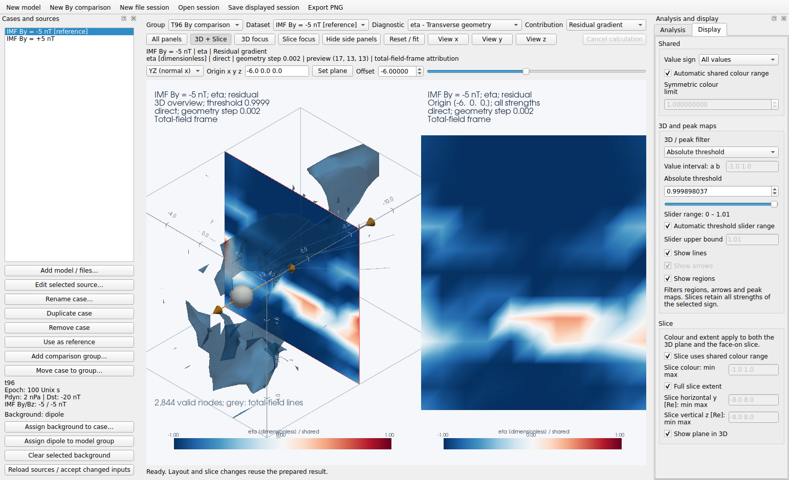
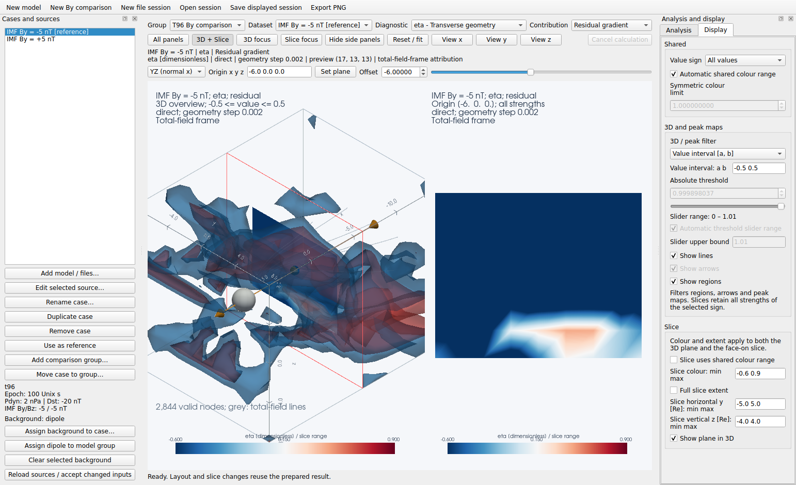
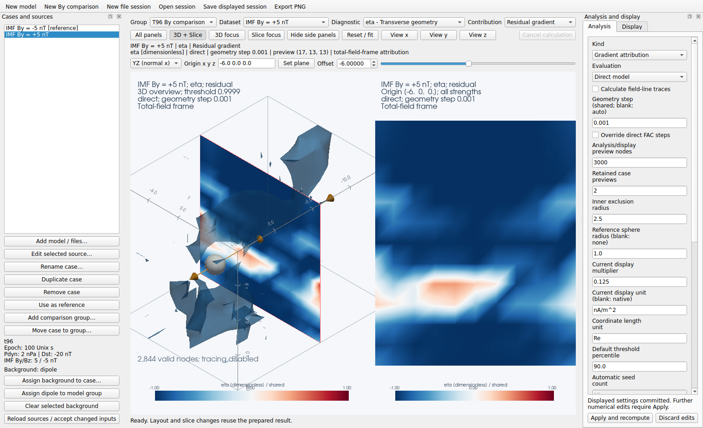
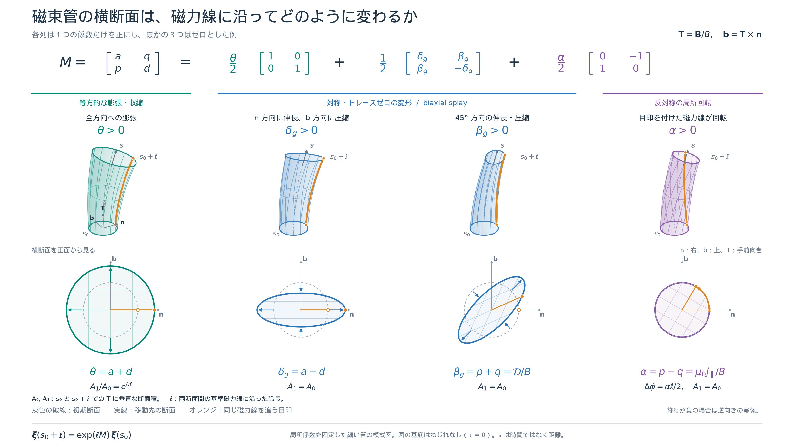
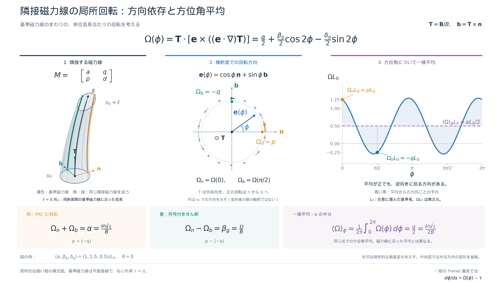
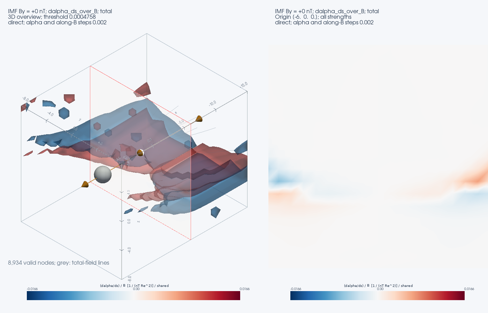

# 3D viewer 日本語詳細ガイド

[ドキュメント一覧](README.md) · [英語版 GUI ガイド](gui.md) · [理論と記号の基準（日本語）](fac_anisotropy_theory_ja.md)

Mageometry の 3D viewer で、各設定が何を変えるか、表示された量をどう読むかを説明します。
対象は `python -m mageometry.gui` で起動する Qt デスクトップ画面です。
**Display・Analysis・データソース・画面操作の全項目**と、**Diagnostic の21項目**を扱います。
画面上の英語ラベルを併記しているので、ラベル名をこのページ内で検索できます。

`python -m mageometry.viz3d` は別のスタンドアロン画面です。
診断量の定義は共通ですが、Qt の Display タブやセッション操作はありません。
そちらの操作は [Standalone viewer guide](viewer.md) を参照してください。

本書の式は局所的な磁場の幾何を表します。磁力線に沿う距離の変化と時間変化を区別し、
電流や磁束管の形状について、何が直接計算された値で、何が解釈なのかを明示します。

## 目次

- [起動と最初の操作](#起動と最初の操作)
- [画面構成と設定の反映](#画面構成と設定の反映)
- [上部のセッション操作](#上部のセッション操作)
- [表示するデータの選択](#表示するデータの選択)
- [画面配置とカメラ](#画面配置とカメラ)
- [断面の向きと位置](#断面の向きと位置)
- [Display の全項目](#display-の全項目)
- [Analysis の全項目](#analysis-の全項目)
- [Cases and sources の全項目](#cases-and-sources-の全項目)
- [データソースの全項目](#データソースの全項目)
- [診断量に共通する記号と単位](#診断量に共通する記号と単位)
- [Diagnostic の21項目](#diagnostic-の21項目)
- [Contribution と背景勾配の分解](#contribution-と背景勾配の分解)
- [目的別の操作例](#目的別の操作例)
- [値が見えない場合の確認](#値が見えない場合の確認)
- [保存と再現](#保存と再現)
- [キーボード操作](#キーボード操作)
- [関連資料](#関連資料)

## 起動と最初の操作

リポジトリのディレクトリで、使用する Python 環境を有効にして実行します。

```bash
python -m pip install -e '.[gui]'
python -m mageometry.gui
```

通常起動では T96 外部磁場と内部双極子磁場の和を読み込み、`alpha` を表示します。
内部磁場はこのプリセットでは双極子であり、IGRF ではありません。
モデル座標は GSM、長さは Re、磁場は nT です。

比較専用の `python examples/compare_t96_by.py` は、Dst = −30 nT、IMF Bz = −10 nT、
IMF By = −10・−5・0・+5・+10 nT の5ケースで起動します。
`--by` で By の並びを変更でき、Dst と Bz は同じ比較条件を使います。
通常起動や上部の New By comparison の初期条件とは区別してください。

1. **Diagnostic** で見たい量を選びます。電流そのものを見たい場合は `FAC - Along B (Cartesian curl)` を選びます。
2. **3D + Slice** で立体表示と断面を並べます。
3. **Display → Value sign** で全表示・正のみ・負のみを選びます。
4. **Absolute threshold** で、3D 領域・矢印・ピーク投影に残す値の大きさを調整します。
5. **Offset** を動かして、断面がどの位置を通っているかを確認します。
6. **Save displayed session…** で条件を保存します。



既存の図は低解像度の動作確認用条件で撮影されています。
通常起動の格子数や追跡条件とは異なり、科学的な解像度収束を示す図ではありません。
[撮影条件](gui.md#screenshots-and-regeneration)も参照してください。

## 画面構成と設定の反映

左の **Cases and sources** は入力データ、上部は表示対象と断面、
右の **Analysis and display** は計算条件と表示条件、中央は計算結果です。
上部の結果ヘッダーにケース・診断量・寄与・単位・評価方法・微分幅・プレビュー格子数が表示されます。
ヘッダーにマウスを置くと、入力モデルやファイルの詳細を確認できます。

| 操作の種類 | 反映の仕方 |
| --- | --- |
| Display、画面配置、カメラ、断面の移動 | 準備済みの結果を使って即時更新します。磁場や微分の再評価は不要です。 |
| Dataset、Diagnostic、Contribution | 適用済みの計算条件で選択を変更します。必要な結果がなければ自動計算します。 |
| Analysis、入力ソース、背景の編集 | **Apply and recompute** で適用します。編集中の値が、そのまま現在の図の条件になるわけではありません。 |
| Group | そのグループの条件で準備し、記憶している表示設定を使います。 |

準備済みの結果がない間は Display の操作は無効です。
計算中は直前の結果が残ります。新しい計算が成功するまで、結果ヘッダーは直前の図の条件を示します。
画面最下部の進捗・エラー表示と、Analysis の未適用編集の表示を併せて確認してください。

## 上部のセッション操作

| 画面の項目 | 意味と使い方 |
| --- | --- |
| New model | T96＋双極子の単一ケースで新しいセッションを開始します。既定の IMF By は 0 nT です。 |
| New By comparison | IMF By が −5、−3、−1、+1、+3、+5 nT の6ケースを作ります。その他の初期条件は共通です。 |
| New file session | ファイルを追加するための空のセッションを作ります。 |
| Open session… | 保存した JSON の入力条件・計算条件・表示設定を読み込み、結果を再計算します。 |
| Save displayed session… | 現在表示している結果の条件と表示設定を JSON に保存します。表示済み結果に未適用の編集内容を混ぜません。 |
| Export PNG… | 現在のプロット配置を PNG に保存し、対応する `.session.json` も保存します。左右の入力フォームは画像に含まれません。 |
| Cancel calculation | 計算要求を取り消し、直前の結果を保ちます。入力欄の未適用編集も残ります。 |

新規セッションや別セッションへ切り替える前に、残したい条件を保存してください。
キャンセルは計算の区切りで処理されるため、実行中の長い処理が直ちに停止するとは限りません。

## 表示するデータの選択

| 画面の項目 | 意味と使い方 |
| --- | --- |
| Group | 比較条件を共有するケースのまとまりです。異なる格子・座標系・単位のデータは別グループに分けます。 |
| Dataset | 実際に表示するケースです。左のケース一覧を選んでも同じ選択が変わります。 |
| Diagnostic | 表示する物理量または幾何診断量です。[21項目の詳細](#diagnostic-の21項目)を参照してください。 |
| Contribution | **Total field**、**Background gradient**、**Residual gradient** を選びます。背景寄与の選択には Analysis の **Gradient attribution** が必要です。 |

`[reference]` が付いたケースは、既定のしきい値や自動追跡シードを決める基準です。
Dataset を切り替えるだけでは基準ケースは変わりません。
基準を変更するには左側の **Use as reference** を使います。

同じグループ内の比較には、読み込み後の x・y・z 軸が同一で、宣言された座標系・単位が整合している必要があります。
座標の自動変換、別格子への自動補間、宣言された単位に応じたデータ変換は行いません。

## 画面配置とカメラ

| 画面の項目 | 意味と使い方 |
| --- | --- |
| All panels | 3D、断面、YZ・XZ・XY の3つのピーク投影を表示します。合計5パネルです。 |
| 3D + Slice | 3D と断面を横に並べ、プロット領域の高さを使って表示します。 |
| 3D focus | 3D を拡大します。 |
| Slice focus | 正面から見た断面を拡大します。 |
| Hide side panels / Show side panels | 左右の設定パネルを隠す、または戻します。上部の選択・断面操作は残ります。 |
| Reset / fit | 3D では等角方向から全体が入るように戻します。Slice focus では断面の表示を合わせ直します。 |
| View x / View y / View z | 3D を各座標軸方向から見ます。切断面の向きは変更しません。Slice focus 中の断面カメラには適用しません。 |

3D の何もない場所を左ドラッグすると回転、中央ボタンドラッグまたは Shift＋左ドラッグで平行移動、
ホイールで拡大・縮小します。断面ハンドルをつかむと、カメラではなく断面が動きます。
回転操作がしにくい場合は **Slice → Show plane in 3D** をオフにします。
配置の変更は、各パネルのカメラ・断面位置・選択を保ちます。

## 断面の向きと位置

| 画面の項目 | 意味と使い方 |
| --- | --- |
| YZ (normal x) | 法線が x 軸の断面です。x を固定して y・z の分布を見ます。 |
| XZ (normal y) | y を固定して x・z の分布を見ます。 |
| XY (normal z) | z を固定して x・y の分布を見ます。 |
| Oblique… | **Normal vector: nx ny nz** に任意の非ゼロ法線を入力します。例 `1 1 0`。内部で単位長に正規化します。 |
| Origin x y z | 平面が通る点を3成分で入力します。モデルでは Re 単位です。 |
| Set plane | Origin に入力した点を断面に反映します。 |
| Offset | 正規化した平面法線を **u**、Origin を **o** としたときの **u**·**o** です。法線方向に断面を平行移動します。 |
| Offset 右のスライダー | Offset と同期し、格子領域に対応する範囲で断面を移動します。 |

斜め断面では Offset は x・y・z のいずれか1座標ではありません。
平面内で Origin を動かしても、幾何学的に同じ平面を指定する場合があります。
ここでいう平面法線 **u** は、後述の磁力線の Frenet 法線 **n** とは別です。

3D 内の断面と正面表示の断面は同じ切断結果です。
値は準備済みの格子結果から補間され、断面の移動ごとにモデルを直接評価するわけではありません。
一方、YZ・XZ・XY のピーク投影は各軸に沿う領域全体を集約するので、断面の移動とは連動しません。

## Display の全項目

Display タブは、適用先ごとに枠と見出しで3つに分けています。

| GUI の区画 | 設定内容と適用先 |
| --- | --- |
| **Shared（共通）** | 全パネルに効く Value sign と共通カラーレンジです。カラーレンジは矢印・ピーク投影、および共通色範囲に連動している断面に適用します。 |
| **3D and peak maps（3D・ピーク投影）** | 絶対値しきい値・値の区間・スライダー範囲と、3D の磁力線・矢印・領域の表示設定です。 |
| **Slice（スライス）** | 断面の色範囲と横・縦の座標範囲です。3D 内の断面と正面断面の両方に適用します。Show plane in 3D は3D 内の断面・ハンドルの表示を切り替えます。 |

### 符号の選択

**Value sign** は選んだ診断量の数値の符号を指定します。

| 選択肢 | 表示する値 |
| --- | --- |
| All values | 正・負・ゼロを含む有限値です。ただし領域・矢印・ピーク投影には別途しきい値が適用されます。 |
| Positive only (> 0) | 厳密に正の値だけです。ゼロと負値は除外します。 |
| Negative only (< 0) | 厳密に負の値だけです。ゼロと正値は除外します。 |

3D 領域・電流矢印・3D 内の断面・正面断面・ピーク投影に即時反映します。
磁場の再計算は不要で、磁力線・カメラ・断面位置・色範囲・しきい値は保たれます。
選択はグループ内のケース・診断量・寄与をまたいで使われ、セッションにも保存されます。

正負の物理的な意味は Diagnostic によって異なります。
例えば、正の `fac` は磁場に沿う電流ですが、正の `eta` は回転側の局所幾何です。
**Positive only は「磁場に沿う電流だけ」の共通スイッチではありません。**

[正の値だけの表示例](images/gui-display-positive.png) · [負の値だけの表示例](images/gui-display-negative.png)

### しきい値と色範囲

| 画面の項目 | 意味と使い方 |
| --- | --- |
| 3D / peak filter | **Absolute threshold**（絶対値のしきい値）と **Value interval [a, b]**（符号付きの値の範囲）を切り替えます。 |
| Value interval: a b | `a ≤ 表示値 ≤ b` の範囲を残します。`a < b` の有限値を2つ入力します。例：`-0.5 0.2`、`1e-3 2e-3`。区間モードでは絶対値しきい値の操作欄は無効になります。 |
| Absolute threshold | 表示値の絶対値に対するしきい値です。非負の値を入力し、Enter または入力欄からの移動で確定します。 |
| しきい値のスライダー | Absolute threshold と同期します。数値欄で細かく指定し、スライダーで連続的に調整できます。 |
| Slider range | 現在のスライダー範囲を表示します。下限はゼロです。 |
| Automatic threshold slider range | オンでは全ケース・対象寄与の共通の最大絶対値を基準に上限を決めます。通常は最大値の1.01倍で、全ゼロ・全無効の場合は1を使います。 |
| Slider upper bound | 自動範囲をオフにして上限を指定します。正の有限値で、`1e-3` のような指数表記も使えます。 |
| Automatic shared colour range | オンでは比較対象全体で共通の対称色範囲を使います。各ケース・対象寄与の絶対値98パーセンタイルの最大値が基本です。`eta` は既定で [−1, 1] です。 |
| Symmetric colour limit | 自動色範囲をオフにして正の上限 C を入力し、範囲を [−C, C] にします。範囲外の値は端の色に飽和し、データから削除されるわけではありません。 |
| Slice uses shared colour range | オンでは断面も共通の色範囲を使います。オフにすると断面だけの最小・最大値を指定できます。 |
| Slice colour: min max | 断面のカラーバーの最小値・最大値です。例：`-0.2 0.8`。3D 内の断面と正面の断面に適用します。範囲外の値は端の色になり、削除されません。矢印とピーク投影の色範囲は変わりません。 |
| Full slice extent | オンでは断面の全領域を表示します。オフにすると断面内の横・縦の座標範囲を指定できます。 |
| Slice horizontal …: min max | 断面内の横方向の座標範囲です。YZ 断面なら y、XZ・XY 断面なら x です。軸名と座標単位をラベルに表示します。 |
| Slice vertical …: min max | 断面内の縦方向の座標範囲です。YZ・XZ 断面なら z、XY 断面なら y です。横・縦とも最小値 < 最大値にします。 |

絶対値モードでは、表示する値を v、しきい値を t とすると、正の領域は v ≥ t、負の領域は v ≤ −t が基本です。
領域・矢印・ピーク投影では t = 0 でもゼロそのものを除外します。
区間モードでは、正の値だけ・負の値だけ・ゼロをまたぐ区間のいずれも指定できます。
3D 領域・矢印・ピーク投影に適用し、Value sign も指定した場合は両方の条件を満たす値を選びます。
**断面には強度のしきい値や値の区間フィルターをかけず、選択した符号の弱い値も表示します。**
例えば `fac` が nA/m² 表示なら、しきい値も nA/m² です。
`alpha` なら逆長さ、`eta` なら無次元です。

スライダー上限を現在のしきい値より小さくすると、しきい値もその上限まで下がります。
逆に数値欄に上限より大きいしきい値を入れると、手動範囲でも上限が拡張されます。
しきい値・フィルターモード・値の区間・手動スライダー範囲・断面を含む手動色範囲は、診断量と解析種類ごとに記憶します。
ケースと寄与の比較では同じ設定を使います。
電流の表示倍率や単位ラベルを変更して適用すると、古い数値設定を流用しないよう、これらの記憶値はリセットされます。

既定の対称色範囲では赤が正、青が負です。断面に非対称な色範囲を指定すると中間色はその範囲の中央に対応し、ゼロとは一致しない場合があります。カラーバーの数値で読み取ってください。
正のみ・負のみへ切り替えても色範囲を片側に伸縮しないので、
切り替え前後で同じ色が同じ数値を表します。
しきい値も色範囲も可視化の設定であり、物理的な有意性や誤差限界を自動判定する値ではありません。

断面の横・縦の範囲を設定すると、3D 内の断面と正面の断面をその範囲で切り取り、正面のカメラを合わせます。
斜めの断面では横 u・縦 v の軸を使い、座標は世界座標の原点から各軸へ投影した値です。
範囲は診断量・ケースに共通で、断面の向きを変えると同じ数値範囲を新しい軸に適用します。
以後の色やフィルターの変更では拡大率とパン位置を保ちます。Full slice extent をオンに戻すと全断面へ戻ります。
これらの範囲入力は Enter または入力欄からの移動で即時反映され、Apply は不要です。セッションにも保存します。



この例は residual の eta を [−0.5, 0.5] に絞り、断面の色範囲を [−0.6, 0.9]、
x = −6 Re の断面内で y を [−5, 5] Re、z を [−4, 4] Re に設定しています。

### 表示レイヤー

| 画面の項目 | 意味と使い方 |
| --- | --- |
| Show lines | 灰色の磁力線を表示します。全磁場を追跡した形状の参考線で、電流の流線ではありません。 |
| Show arrows | 選択した電流成分やその項の符号付き方向を、代表点に矢印で表示します。幾何診断量と `B_twist_diff` では無効です。 |
| Show regions | しきい値を満たす3D 領域の半透明表面を表示します。赤と青の表面で正負を区別します。 |
| Show plane in 3D | Slice 区画にあります。3D 内の断面と操作ハンドルを表示します。オフにしても正面の断面パネルは残ります。 |

矢印は固定長の代表表示で、長さを電流強度として読まないでください。
向きは選択した成分の基底と符号、色は表示値を表します。
領域の表面は格子上の値を補間して作られるので、格子解像度以上の細部が計算されたことを意味しません。
無効な格子点に接するセルは除外され、欠損部をまたぐ領域を作らないようにしています。

### ピーク投影の読み方

YZ は x 方向、XZ は y 方向、XY は z 方向に並ぶサンプルから、
絶対値が最大のものを、その符号付きで表示します。積分や平均ではありません。
Value sign を指定した場合は、**その符号に合う値を先に選んでから**ピークを求めます。

例えば同じ視線上に −10 と +3 があるとき、All values のピークは −10、Positive only のピークは +3 です。
ただししきい値が4なら、後者は表示されません。該当する値がない視線は空白になります。
Value interval を指定した場合は、**区間内の値だけから**絶対値最大のサンプルを選びます。
例えば −10 と +3 がある視線で区間を [2, 4] にすると +3 が表示されます。

## Analysis の全項目

このタブを編集したら **Apply and recompute** で適用します。
以下の「モデル初期値」は、CLI で上書きせず **New model** を選んだ場合です。
保存済みセッションやファイル入力では値が異なります。

### 解析方法と微分

| 画面の項目 | 意味と入力 |
| --- | --- |
| Kind | **Field geometry and currents** は全磁場の電流・幾何を計算します。**Gradient attribution** は全磁場の基底で背景・残差の勾配寄与を分解します。 |
| Evaluation | **Direct model** はモデル関数を微分点・追跡点で評価します。全ケースがモデルソースである必要があります。**Grid interpolation** はプレビュー格子を線形補間した磁場を使います。 |
| Geometry step (shared; blank: auto) | 幾何診断量と Frenet 電流の差分幅です。Direct model では直接計算する FAC の既定幅も兼ねます。正の1値で、モデル初期値は `0.002` Re。空欄なら direct で `0.002`、grid でプレビュー格子の最小間隔です。 |
| Override direct FAC steps | オンにすると、直接 curl(B) から求める `fac` と `dfac_ds` の内側の curl 計算に別の差分幅を指定できます。Grid interpolation では無効です。 |
| FAC steps (blank: Geometry step) | FAC 専用の正の差分幅を1値、または x・y・z の3値で指定します。例 `0.002`、`0.002 0.003 0.004`。空欄なら Geometry step を使います。 |

差分幅 h は、例えば `[B(x+h) − B(x−h)] / (2h)` の h に相当する空間距離です。
`delta_g` という診断量とは別で、磁力線追跡の刻み幅でもありません。
FAC 専用幅を変更しても `mu0J_T`、`alpha`、`beta_g` などの幅は変わりません。
Grid interpolation の `fac` はプレビューの各軸間隔で微分し、FAC 専用幅を使いません。

Geometry step を小さくしても、表示する格子の点数は増えません。
小さすぎる幅は丸め誤差や補間の影響を受けるため、幅と格子を変えて結果の安定性を確認します。
適用後の有効な幅は結果ヘッダーにも表示されます。

### 計算格子と表示単位

| 画面の項目 | 意味と入力 |
| --- | --- |
| Analysis/display preview nodes | 解析・表示用プレビューの最大点数です。27以上の整数で、初期値は `120000`。総点数の予算であり各軸の点数ではありません。 |
| Retained case previews | 再利用のため保持するケースプレビュー数です。1以上の整数で、初期値は `2`。プロセス全体のメモリ上限ではありません。 |
| Inner exclusion radius | 原点からこの半径より内側を解析対象から除きます。非負で、モデル初期値は `2.5` Re、ファイル用の初期値は `0` です。 |
| Reference sphere radius (blank: none) | 3D に置く参考球の半径です。モデル初期値は `1` Re、空欄なら表示しません。解析の除外半径とは独立です。 |
| Current display multiplier | 電流系の計算値を表示単位へ換算する係数で、表示値 = 計算値 × この値です。`dfac_ds` を含む13項目に適用します。モデル初期値 `0.125` は nT/Re から nA/m² への換算、ファイル用の初期値 `1` は数値を変えずに表示する設定です。係数は正なので値の符号は保たれます。[単位の説明](#表示単位の変換)を参照してください。 |
| Current display unit (blank: native) | 電流系の単位ラベルです。モデル初期値は `nA/m^2`。文字列の変更だけで数値変換はしません。 |
| Coordinate length unit | 座標および逆長さの診断量に使う単位ラベルです。モデルでは `Re`、未指定では `grid unit`。文字列を `km` に変えても座標配列は変換されません。 |
| Default threshold percentile | 基準ケースの全磁場における有限な絶対値から、既定しきい値を決める百分位です。0～100で、初期値は `90`。既に記憶された手動しきい値を置き換える操作ではありません。 |

プレビュー点数を減らすと表示・計算負荷は下がります。
Grid interpolation では微分・追跡に使う磁場自体が粗くなるため、表示だけの軽量化ではありません。
Direct model でも診断量を表示するサンプリング格子は有限です。
入力格子、背景の配列、描画データなどにもメモリを使うため、Retained case previews だけでは総使用量を制限できません。

### 磁力線の追跡

| 画面の項目 | 意味と入力 |
| --- | --- |
| Calculate field-line traces | オフにして **Apply and recompute** を押すと、自動シード選択と磁力線の追跡計算を省きます。診断量と断面は引き続き計算します。シードと積分条件は保持され、再びオンにできます。初期値はオンです。 |
| Automatic seed count | 自動選択する開始点の数です。0以上の整数で初期値は `10`。Trace seeds に明示座標がある場合は使いません。 |
| Trace step (blank: auto) | 磁力線を積分する空間刻みです。正の値で、モデル初期値は `0.15` Re。空欄ならプレビュー最小間隔の半分を使います。誤差判定に応じて実際の刻みを小さくします。 |
| Trace maximum steps | 1開始点・1方向あたりの最大ステップ数です。正の整数で、モデル初期値は `350`。空欄ならこの GUI の準備処理では `600` です。 |
| Trace inner radius (blank: none) | この半径へ入ると追跡を止めます。モデル初期値は `2.5` Re。空欄ならこの停止条件を使いませんが、磁場の除外マスクは別途有効です。 |
| Trace outer radius (blank: none) | この半径に達すると追跡を止めます。空欄なら外側球面による停止を使いません。 |
| Trace error tolerance | 適応積分の誤差係数です。正の値で、空欄時は `0.001`。内部の局所誤差判定には、この値と指定 Trace step の積を使います。小さくすると刻みが細かくなり得ます。 |
| Trace bounds: xmin xmax ymin ymax zmin zmax (blank: grid) | 追跡を止める直方体領域です。6値を入力します。空欄ならプレビュー格子の境界です。ファイルの有効範囲外まで広げても、未知の磁場を補うことはできません。 |
| Trace direction | **Both** は磁場の正逆両方向、**Along B** は磁場方向、**Against B** は逆方向を追跡します。電流の正負とは別です。 |
| Trace seeds | 1行に1点の `x y z` を入力します。空欄は自動、`none` は追跡なしです。 |

モデルプリセットの Trace seeds には、x = −6 または −10、y = −2・0・2、z = 1 Re の6点が入っています。
したがって通常起動では Automatic seed count の10本ではなく、この6点から追跡します。
自動シードは、最初の準備時に基準ケースの全磁場側の選択診断量から、符号と空間的な分離を考慮して決め、
座標として保持・保存します。後から Display のしきい値や符号を動かしても開始点は変わりません。
自動選択をやり直す場合は Trace seeds を空欄にして Apply します。

**Display → Show lines** は計算済みの線の表示・非表示だけを切り替えます。
追跡計算を省くには **Calculate field-line traces** をオフにしてください。
この設定はセッションに保存されます。従来のセッションではオンになります。
起動時に指定する場合は `python -m mageometry.gui --no-trace` を使えます。
スタンドアロンの `python -m mageometry.viz3d` でも `--no-trace` に対応しています。



### 適用と取り消し

| 画面の項目 | 意味と使い方 |
| --- | --- |
| Apply and recompute | 編集した入力・解析条件を検証して計算し直します。失敗時は直前の表示を残します。 |
| Discard edits | 進行中の要求を取り消し、適用済みの条件がある場合は、そのグループの未適用編集を戻します。 |

Gradient attribution は6種類の横断面診断量だけに対応します。
電流系の診断量を選んだ状態でこの Kind を適用すると、Diagnostic は `eta` に切り替わります。

## Cases and sources の全項目

| 画面の項目 | 意味と使い方 |
| --- | --- |
| ケース一覧 | 上部の Dataset と同じ選択です。`[reference]` は基準ケースを示します。 |
| Add model / files… | モデルまたはファイルを追加します。モデルの IMF By に複数値を指定すると複数ケースを作れます。 |
| Edit selected source… | 選択中の入力条件を編集します。既存ケースの編集では IMF By は1値にします。 |
| Rename case… | Case label ダイアログの **Label** でケースの表示名を変更します。 |
| Duplicate case | 入力条件と背景設定を複製します。同じファイルを参照する場合も、ファイル自体は複製しません。 |
| Remove case | セッションからケースを取り除きます。入力ファイルを削除する操作ではありません。 |
| Use as reference | 選択したケースをしきい値などの基準にします。再計算して反映します。明示された追跡シードは保持されます。 |
| Add comparison group… | 別の比較グループを作り、**Group label** で名前を指定します。 |
| Move case to group… | **Destination group** で既存の移動先グループを指定します。移動先の格子・単位の整合性も必要です。 |
| 入力情報と Background 表示 | 選択ケースのファイル名・モデル条件・割り当て背景を確認します。 |
| Assign background to case… | そのケースにモデルまたはファイルの背景を割り当てます。割り当てだけでは表示解析を背景分解へ切り替えません。 |
| Assign dipole to model group | 全ケースが T89・T96・T01・T04 のいずれかであるグループに、それぞれの Epoch に対応する双極子背景を割り当てます。以後のケースの Epoch 編集にも追従します。 |
| Clear selected background | 選択したケースの背景を外します。全磁場の入力は残ります。 |
| Reload sources / accept changed inputs | ファイル変更を新しい入力として受け入れ、再計算します。保存時と入力が異なるというエラーを確認した後などに使います。 |

## データソースの全項目

入力ダイアログは **Magnetic source**、背景の場合は **Background source** です。
Source type によって該当する入力欄だけが表示されます。
数値の並びは空白またはカンマで区切れますが、Array name(s) は空白区切りです。

### モデル入力

| 画面の項目 | 意味と入力 |
| --- | --- |
| Source type | `t89`・`t96`・`t01`・`t04` は選択した外部磁場モデル＋内部双極子です。`xdmf`・`hdf5`・`vtk` はファイルです。背景設定では `dipole` も選べます。 |
| Epoch [Unix s] | Unix 秒の時刻です。双極子の傾きなどのモデル状態を決めます。既定は `100`。現在時刻を自動取得する項目ではありません。 |
| Pdyn [nPa] | 太陽風動圧。正の値で、既定は `2` nPa です。 |
| Dst [nT] | モデルへ与える Dst 指数。既定は `-20` nT です。 |
| IMF By [nT] (list creates cases) | IMF の GSM y 成分です。既定は `0`。追加時は `-5 0 5` のような重複のない複数値でケースを作れます。背景には1値だけを指定します。 |
| IMF Bz [nT] | IMF の GSM z 成分です。既定は `-5` nT です。 |
| T89 activity bin iopt [1-7] | T89 専用の活動度区分。1〜7の整数で、既定は `2`。Kp の数値をそのまま入力する欄ではありません。 |
| G1 (T01) / G2 (T01) | T01 専用の駆動指数。非負の値です。既定は両方 `0` ですが例示用の入力なので、解析する条件の指数を指定してください。 |
| W1 W2 W3 W4 W5 W6 (T04) | T04 専用の駆動指数。6つの非負の値を順番に入力します。既定はすべて `0` で例示用です。 |
| Bounds: xmin xmax ymin ymax zmin zmax | サンプリング領域。既定は `-15 5 -8 8 -8 8` Re。各軸で最小値を最大値より小さくします。 |
| Grid nodes: nx ny nz | 各軸のサンプリング点数です。各3以上の整数で、既定は `65 49 49`。さらにプレビュー点数制限が適用されます。 |

これらは与えた条件で静的な磁場を評価する入力です。
ケース間で IMF By や Pdyn を変えても、それだけで時間発展を計算したことにはなりません。

**Edit selected source…** または **Add model / files…** を開き、**Source type** でモデルを切り替えます。
4モデルとも GSM 座標・距離 Re・磁場 nT を使い、内部双極子を加えた全磁場を解析します。
T89 では Pdyn・Dst・IMF の欄を使いません。活動度区分 `iopt = 1, 2, …, 6, 7` は、
それぞれ Kp が `0/0+`、`1−/1/1+`、…、`5−/5/5+`、`6−以上` に対応します。
T89 の条件比較はケースを複製して iopt を変更します。
By のリストによる比較は T96・T01・T04 で利用できます。

G1・G2・W1〜W6 を Epoch や瞬間的な IMF から自動計算する機能はありません。
解析する現象に対応する指数を入力してください。T01・T04 は x = −15 Re より太陽側の
データに基づくモデルなので、領域を選ぶ際はモデルの適用範囲にも注意してください。
アプリでは T01・T04 の x < −15 Re の磁場を `NaN` にします。
既存の計算関数が行う境界への座標丸めを使わず、差分点が範囲外に出た診断値も空白として扱います。

起動例（数値は入力例です）：

```bash
python -m mageometry.gui --model t89 --iopt 4
python -m mageometry.gui --model t01 --dst -30 --bz -10 --g1 1.2 --g2 0.7
python -m mageometry.gui --model t04 --dst -30 --bz -10 --w 0.1 0.2 0.3 0.4 0.5 0.6
```

同じモデル引数は `python -m mageometry.viz3d` でも使えます。
モデルと各入力値、背景の割り当てはセッションに保存・復元されます。

入力画面の例：[T89](images/gui-source-t89.png)、[T01](images/gui-source-t01.png)、[T04](images/gui-source-t04.png)。

### ファイル入力

| 画面の項目 | 意味と入力 |
| --- | --- |
| File | 読み込むファイルのパスです。 |
| Browse file… | ファイル選択を開きます。拡張子に応じて Source type も切り替わります。 |
| Reader stride | 各軸で何点おきに読み込むかを指定します。1以上の整数で既定は `1`。解析・表示プレビュー制限より前に適用されます。 |
| Array name(s) | XDMF/HDF5 は x・y・z の磁場成分名を3つ、既定 `BX BY BZ`。VTK はベクトル配列名を1つ、既定 `B` です。 |
| HDF5 origin: x y z | 規則格子の原点座標です。ファイル内容に対応する3値が必要です。 |
| HDF5 spacing: dx dy dz | x・y・z 方向の格子間隔です。正の3値を指定します。 |
| HDF5 arrays stored as (nz, ny, nx) | HDF5 の配列軸順が z・y・x ならオン。既定はオンです。オフでは x・y・z 順として読みます。 |
| XDMF heavy-file override | XDMF が参照する実データの HDF5 ファイルを明示的に置き換えます。空欄なら XDMF の参照先を使います。 |
| Coordinate system (declaration) | GSM などの座標系の宣言です。宣言による座標変換は行いません。 |
| Length unit (declaration) | 入力座標の単位の宣言です。配列の倍率は変更しません。 |
| Field unit (declaration) | 入力磁場の単位の宣言です。nT などの文字列を入れても数値は変換されません。 |
| OK / Cancel | OK は入力を検証してケース設定に反映し、Cancel はダイアログの編集を取り消します。計算への反映には通常 Apply が必要です。 |

対応する基本構造は、XDMF の Uniform grid、HDF5 の規則格子、VTK の ImageData または RectilinearGrid です。
読み込み後に各軸3点以上を残してください。
ファイル用の通常評価は Grid interpolation で、GUI の Direct model はファイルに適用できません。
ファイル形式の詳細は [Simulation data formats](simulation_data_formats.md) にあります。

## 診断量に共通する記号と単位

### 磁力線の局所基底

磁場ベクトルを **B**、その大きさを B = |**B**| と書きます。
小文字の **b** は磁場ではなく、従法線という別の単位ベクトルです。

| 記号 | 意味 |
| --- | --- |
| **T** = **B**/B | 磁場に沿う単位接線。弧長 s はこの向きに増えます。 |
| κ = \|∂ₛ**T**\| | 曲率。値が大きいほど磁力線が短い距離で強く曲がります。単位は逆長さです。 |
| **n** = ∂ₛ**T**/κ | 曲率が正のときの主法線。局所的に曲がる方向です。 |
| **b** = **T** × **n** | 従法線。**T**・**n**・**b** は右手系です。 |
| ∂ₙ = **n**·∇、∂ᵦ = **b**·∇ | その方向へ少し移動したときの空間変化を調べる方向微分です。 |
| μ₀ | 真空の透磁率です。 |

電流の解釈には、変位電流を無視する磁気静的・準静的な関係
μ₀**J** = ∇×**B** を使います。診断量の定義自体は力のつり合いや force-free を仮定しません。

法線面での磁場方向の変化を、次の行列にまとめます。

$$
M=\begin{pmatrix}a&q\\p&d\end{pmatrix},\qquad
a=\mathbf n\cdot\partial_n\mathbf T,\quad
q=\mathbf n\cdot\partial_b\mathbf T,\quad
p=\mathbf b\cdot\partial_n\mathbf T,\quad
d=\mathbf b\cdot\partial_b\mathbf T.
$$

行は出力方向 n・b、列は微分方向 n・b です。
q はこの行列の成分だけを表し、別の診断量の名前には使いません。
θ = a+d は等方的な膨張・収縮を表す横断面のトレースですが、現在の Diagnostic にはありません。

$$
M=\frac{\theta}{2}I
+\frac12\begin{pmatrix}\delta_g&\beta_g\\\beta_g&-\delta_g\end{pmatrix}
+\frac{\alpha}{2}\begin{pmatrix}0&-1\\1&0\end{pmatrix}.
$$

右辺の3項は、等方的な膨張・収縮、方向による伸び縮みの差、局所回転です。
β_g と δ_g の添字 g は幾何の量を区別するもので、プラズマベータではありません。



図の A₀・A₁ は **T** に垂直な断面の面積、ℓ は両断面の間の基準磁力線に沿う弧長です。
時間変化を描いた図ではありません。
[図の前提と構成](transverse_decomposition_figure.md)も参照してください。

### 表示単位の変換

以下の電流系の式は、表示倍率をかける前の値を示します。
電流密度に対応する項は μ₀**J** の成分で、その単位は **磁場単位／長さ単位** です。
その沿磁場微分 `dfac_ds` の生の単位は **磁場単位／長さ単位²** です。

| 対象 | 表示倍率と単位 |
| --- | --- |
| `fac`、`mu0J_T`、`mu0J_n`、`mu0J_b`、`mu0J_x`、`mu0J_y`、`mu0J_z` | 生の値は μ₀J の成分。Current display multiplier をかけます。 |
| `B_dT_dn_b`、`B_dn_db_T`、`B_kappa`、`minus_dB_dn` | 生の値は μ₀J の分解項。同じ表示倍率をかけます。 |
| `B_twist_diff` | 生の値は 𝒟 = Bβ_g。同じ表示倍率が適用されますが、電流成分そのものではありません。 |
| `alpha`、`beta_g`、`delta_g`、`gamma`、`omega_c` | 逆長さ。Current display multiplier をかけません。 |
| `dalpha_ds` | 長さ⁻²。Current display multiplier をかけません。 |
| `dalpha_ds_over_B` | 磁場強度⁻¹ × 長さ⁻²。Current display multiplier をかけません。 |
| `dfac_ds` | 生の値は磁場単位／長さ単位²。FAC と同じ倍率で換算し、表示は電流密度／長さになります。 |
| `eta` | 無次元。Current display multiplier をかけません。 |

**デフォルト値 `0.125` の説明：** T96 などでは、磁場が nT、距離が Re（地球半径）です。
計算で得る μ₀J の値を **nA/m² の電流密度へ換算**するため、約 `0.125` をかけます。
例えば `2 nT/Re → 約0.25 nA/m²` です。T89・T01・T04 でも同じ単位と換算を使います。
このためモデルプリセットは倍率 `0.125`、ラベル `nA/m^2` を使います。
この係数には μ₀ で割る操作と磁場・長さ・電流密度の単位換算が含まれます。
係数は正なので、例えば生の FAC が `−2 nT/Re` なら表示も負の `−0.25 nA/m²` です。
ファイル用の初期値 `1` は、入力データの物理単位を自動判定せず、生の数値をそのまま表示する設定です。
独自データではその磁場・長さ単位に合う倍率を指定してください。
ラベル文字列から単位を推測して換算する処理はありません。

`B_twist_diff` は電流単位を指定するとラベルが `D / mu0` になります。
これは比較のために同じ単位へ換算したせん断量であって、独立した電流密度を測ったものではありません。

### ゼロと未定義値

有限なゼロは有効な結果、`NaN` は定義できないか数値評価できなかった結果です。
磁場がゼロの点では **T** が定義できません。
曲率がゼロの直線上では Frenet の **n**・**b** が定義できず、それらに依存する量が欠けます。
差分で参照する近傍がデータ範囲外や除外領域にある場合も、値が欠けます。

`fac`、`alpha`、`gamma`、`omega_c`、`eta` と3種類の沿磁場微分は Frenet 法線を必要としません。
ただし `eta` は α = Γ = 0 のとき別途未定義です。
`beta_g`、`delta_g` と Frenet 電流系には曲率法線が必要で、弱い曲率や近傍での法線の急変にも注意が必要です。
α²+Γ² が極めて小さい場所では、有限の `eta` でも微分誤差に敏感になります。

## Diagnostic の21項目

| キー | 画面の表示名 | 主に見る内容 |
| --- | --- | --- |
| [fac](#fac-沿磁場電流) | FAC - Along B (Cartesian curl) | curl(B) から直接求める沿磁場電流 |
| [mu0J_T](#mu0j_t-フレネ基底から求める沿磁場電流) | J_T - Parallel / twist | 局所基底の微分から組み立てる沿磁場電流 |
| [B_dT_dn_b](#b_dt_dn_b-沿磁場電流の第1項) | J_T term 1: B(dT/dn).b | n 方向へ離れた隣接磁力線の角度変化に対応する項 |
| [B_dn_db_T](#b_dn_db_t-沿磁場電流の第2項) | J_T term 2: B(dn/db).T | b 方向へ離れた隣接磁力線の角度変化に対応する項 |
| [B_twist_diff](#b_twist_diff-沿磁場2項の差) | D = B beta_g - Signed shear | 上の2項の差による符号付きせん断 |
| [mu0J_n](#mu0j_n-主法線方向の電流) | J_n - Normal current | 主法線 n 方向の電流 |
| [mu0J_b](#mu0j_b-従法線方向の電流) | J_b - Binormal current | 従法線 b 方向の電流 |
| [mu0J_x](#mu0j_x-座標系の-x-方向の電流) | J_x - Cartesian x | 入力座標系の x 成分 |
| [mu0J_y](#mu0j_y-座標系の-y-方向の電流) | J_y - Cartesian y | 入力座標系の y 成分 |
| [mu0J_z](#mu0j_z-座標系の-z-方向の電流) | J_z - Cartesian z | 入力座標系の z 成分 |
| [alpha](#alpha-平均角度変化と沿磁場電流) | alpha - Twist (not current) | 磁場強度で規格化した FAC と平均角度変化 |
| [dalpha_ds](#dalpha_ds-αの沿磁場微分) | dalpha/ds - Along B | 磁場に沿って進んだときの α の増減 |
| [dalpha_ds_over_B](#dalpha_ds_over_b-αの沿磁場微分を磁場強度で割った量) | (dalpha/ds) / \|B\| - Along B | 上の微分を局所磁場強度で規格化 |
| [dfac_ds](#dfac_ds-facの沿磁場微分) | dFAC/ds - Along B | 磁場に沿って進んだときの符号付き FAC の増減 |
| [B_kappa](#b_kappa-曲率による項) | Curvature term: +\|B\| kappa | 従法線電流の曲率項 |
| [minus_dB_dn](#minus_db_dn-磁場強度勾配による項) | Pressure term: -d\|B\|/dn | 従法線電流の磁場強度勾配項 |
| [beta_g](#beta_g-符号付き横断面せん断) | beta_g - Transverse geometry | Frenet 基底で見た非対角のひずみ |
| [delta_g](#delta_g-横断面の伸び縮みの差) | delta_g - Transverse geometry | n と b 方向の伸び縮みの差 |
| [gamma](#gamma-横断面異方性の大きさ) | Gamma - Transverse geometry | 基底の取り方に依存しないひずみの強さ |
| [omega_c](#omega_c-符号付き局所巻き付き率) | omega_c - Transverse geometry | 局所の回転とひずみから求める巻き付き指標 |
| [eta](#eta-回転とひずみの相対的な優勢) | eta - Transverse geometry | 回転側かひずみ側かを表す無次元指標 |

以下は全磁場の定義です。背景・残差寄与の読み方は次の [Contribution](#contribution-と背景勾配の分解) を参照してください。

### fac 沿磁場電流

$$
\mathrm{fac}=\mathbf T\cdot(\nabla\times\mathbf B)=\mu_0 j_\parallel.
$$

Cartesian 座標で磁場の curl を計算し、磁場方向へ射影した値です。
正は **B** に沿う電流、負は **B** に逆らう電流です。矢印もそれぞれ +**T**、−**T** を向きます。
「正＝上向き」「正＝地球から外向き」とは限りません。磁場の向きと位置を確認してください。

Frenet 法線が不要なので、直線状の非ゼロ磁場でも評価できます。
Direct model では Geometry step または FAC 専用幅、Grid interpolation ではプレビュー軸間隔を使います。
これは平行成分であり、全電流の大きさ |**J**| ではありません。

### mu0J_T フレネ基底から求める沿磁場電流

$$
\mu_0 J_T
=B\left[(\partial_n\mathbf T)\cdot\mathbf b
       +(\partial_b\mathbf n)\cdot\mathbf T\right]
=B(p-q).
$$

連続的な理論では `fac` と同じ沿磁場電流です。
こちらは Frenet 基底の近傍での変化から組み立てるため、有限差分の誤差と有効領域が異なります。
正負と矢印の向きは `fac` と同じです。

`B_dT_dn_b + B_dn_db_T` がこの値になります。
直線上や法線が安定しない場所では未定義になり得るので、`fac` が表示されていてもこちらが空白になる場合があります。
両者を比較するときは差分幅と格子解像度を確認します。

### B_dT_dn_b 沿磁場電流の第1項

$$
B(\partial_n\mathbf T)\cdot\mathbf b=Bp.
$$

主法線 **n** の向きへ離れたとき、磁場方向 **T** が従法線 **b** へどれだけ変化するかを測る項です。
対応する分離方向の局所角度変化は Ωₙ = p です。
正なら平行電流へ正の寄与、負なら負の寄与を与えます。
表示矢印は、その寄与を表す ±**T** 方向です。分離方向の **n** を向く矢印ではありません。

単独では全 FAC を表さず、第2項を足す必要があります。
Frenet 基底とその近傍評価が有効な領域で表示されます。

### B_dn_db_T 沿磁場電流の第2項

$$
B(\partial_b\mathbf n)\cdot\mathbf T=-Bq.
$$

従法線 **b** の向きへ離れたときの法線 **n** の変化を使う項です。
**n**·**T** = 0 を微分すると `(∂ᵦn)·T = −n·(∂ᵦT) = −q` となるので、符号のマイナスが付きます。
対応する局所角度変化は Ωᵦ = −q です。
正負は沿磁場電流への寄与の正負で、矢印は ±**T** 方向です。

第1項とこの項は、同符号で加算される場合も、逆符号で相殺する場合もあります。
片方の図だけで全 FAC の符号や強さを判断しないでください。

### B_twist_diff 沿磁場2項の差

$$
\mathcal D
=B(\partial_n\mathbf T)\cdot\mathbf b
-B(\partial_b\mathbf n)\cdot\mathbf T
=B(p+q)=B\beta_g.
$$

第1項と第2項の**差**です。その和である沿磁場電流とは異なります。
正なら Ωₙ > Ωᵦ、負なら Ωₙ < Ωᵦ に対応します。
Frenet 基底を基準とする符号付きせん断の診断量で、電流の方向として扱わないため矢印はありません。

この項は電流と同じ表示倍率がかかります。生の 𝒟/B と `beta_g` は理論上同じですが、
実装では前者が基底の差分、後者が磁場の一次勾配を使うので、有限幅では完全一致しない場合があります。
また 𝒟 = 0 でも `delta_g` が非ゼロなら異方性は残ります。

### mu0J_n 主法線方向の電流

$$
\mu_0 J_n=\partial_b B.
$$

磁場強度が従法線 **b** に沿ってどう変化するかに対応する電流の主法線成分です。
正なら電流のこの成分は +**n**、負なら −**n** を向き、矢印もその方向です。
微分方向は **b**、電流成分の方向は **n** であることに注意してください。

**n** は局所的に変わるので、正の値が座標系の一定方向を意味するわけではありません。
磁場強度勾配に由来する項であり、粒子圧力を入力して求めた電流ではありません。
基底・近傍の有効性によるマスクも受けます。

### mu0J_b 従法線方向の電流

$$
\mu_0 J_b=B\kappa-\partial_n B.
$$

曲率項と磁場強度勾配項を合わせた、従法線 **b** 方向の電流です。
正なら +**b**、負なら −**b** で、矢印も同じです。
小文字 b は **T** × **n** であり、「磁場 B 方向の電流」ではありません。

`B_kappa` と `minus_dB_dn` に分けて確認できます。
大きな2項が相殺して `mu0J_b` が小さくなる場合があります。
式としては2項の和ですが、各出力の有効性マスクは異なり得るため、比較は共通の有限領域で行います。

### mu0J_x 座標系の x 方向の電流

$$
\mu_0 J_x=(\mu_0J_T)T_x+(\mu_0J_n)n_x+(\mu_0J_b)b_x.
$$

Frenet 電流を入力座標系の x 成分へ戻した値です。
正は +x、負は −x 方向で、矢印も x 軸に沿います。モデルでは GSM x 成分です。
独自ファイルでは、そのファイルの座標系に従います。

Cartesian curl の x 成分を独立に計算した値ではありません。
再構成に必要な Frenet 基底が欠けると、この項も未定義になります。

### mu0J_y 座標系の y 方向の電流

$$
\mu_0 J_y=(\mu_0J_T)T_y+(\mu_0J_n)n_y+(\mu_0J_b)b_y.
$$

同じ再構成電流の y 成分です。正は +y、負は −y 方向で、矢印も y 軸に沿います。
モデルでは GSM y 成分ですが、独自データに対して GSM と推定しないでください。
`mu0J_x` と同様に、Frenet 基底が必要です。

### mu0J_z 座標系の z 方向の電流

$$
\mu_0 J_z=(\mu_0J_T)T_z+(\mu_0J_n)n_z+(\mu_0J_b)b_z.
$$

同じ再構成電流の z 成分です。正は +z、負は −z 方向で、矢印も z 軸に沿います。
`mu0J_z` の正負と `fac` の正負は、磁場が z 軸に平行でない限り同じ意味ではありません。
この項も Frenet 基底が必要です。

### alpha 平均角度変化と沿磁場電流

$$
\alpha=p-q=\frac{\mathbf T\cdot(\nabla\times\mathbf B)}{B}
=\frac{\mu_0j_\parallel}{B}.
$$

FAC を磁場強度で規格化した逆長さの量です。
正負は沿磁場電流の正負と対応しますが、電流密度そのものではありません。
同じ α でも B が違えば FAC は違います。Current display multiplier はかからず、矢印もありません。
GUI の `alpha` は磁場の一次勾配から独立に求め、Frenet 法線なしでも評価できます。

分離方向を **e**(φ) = cosφ **n** + sinφ **b** とすると、局所的な角度変化率は

$$
\Omega(\phi)=\frac\alpha2+\frac{\beta_g}{2}\cos2\phi
-\frac{\delta_g}{2}\sin2\phi,\qquad
\langle\Omega\rangle_\phi=\frac\alpha2.
$$

正の角度は **n** から **b** へ進む向きです。
α/2 は**同じ点で分離方向を一様に平均した値**であり、指定した1本の隣接磁力線の回転率ではありません。
正の α と負の Ω が同時に存在する場合もあります。
また Frenet 基底自身の回転を含む角度微分は `dφ/ds = Ω − τ` で、τ は磁力線のねじれ率です。
α と τ、平均角度変化と有限区間の巻き数を区別してください。



### dalpha_ds αの沿磁場微分

$$
\partial_s\alpha=\mathbf T\cdot\nabla\alpha,\qquad
\mathbf T=\frac{\mathbf B}{|\mathbf B|}.
$$

磁場の向きに弧長 s だけ進んだとき、α が単位長さあたりどれだけ変化するかを示します。
正なら符号付き α が増加し、負なら減少します。α 自体の正負や電流の向きとは別の符号です。
単位は **長さ⁻²**、モデルでは `1 / Re^2` です。電流表示倍率はかけません。
**B·∇α** とは磁場強度の因子が異なり、この項目では単位接線 **T** を使います。

3つの沿磁場微分はすべてスカラーなので電流矢印を描きません。
**Field geometry and currents / Total field** で選択でき、背景勾配の寄与分解には対応しません。
正だけ・負だけの表示、断面、ピーク投影、ケース比較は他のスカラー項目と同じように使えます。

**差分幅と欠損値（3項目共通）**

- **Direct model**：基準点の **T** に沿う `r ± hT` で α または FAC を評価し、差を `2h` で割ります。
  外側の h は **Geometry step** です。内側の α の curl も Geometry step、FAC の curl は **FAC steps** を使います。
  FAC 専用幅を変更しても `dalpha_ds` と `dalpha_ds_over_B` は変わりません。
- **Grid interpolation**：プレビュー格子上の α・FAC の値を座標方向に中心差分し、**T** へ射影します。
  外側の微分には実際の軸間隔を使うため、不等間隔格子にも対応します。α 自体の計算には Geometry step が残ります。
- いずれも非ゼロ磁場の直線上で評価でき、Frenet 法線は不要です。
  磁場ゼロ、欠損値、除外領域、必要な差分点が足りない境界は `NaN` として空白にします。
  格子では一次微分より広い領域が境界で欠けます。
- 磁場の二階微分に相当するので、一次微分より数値誤差や入力ノイズに敏感です。
  Direct model では Geometry step、Grid interpolation では読み込み stride とプレビュー格子数を変えて収束を確認してください。
  スカラー場を作ってから断面へ補間して表示します。

### dalpha_ds_over_B αの沿磁場微分を磁場強度で割った量

$$
\frac{\partial_s\alpha}{B}=\frac{\mathbf T\cdot\nabla\alpha}{|\mathbf B|}.
$$

`dalpha_ds` を基準点の **正の磁場強度 B = |B|** で割ります。
**α/B を微分した量ではありません。** 有限な値の符号は `dalpha_ds` と同じです。
単位は **磁場強度⁻¹ × 長さ⁻²**、モデルでは `1 / (nT Re^2)` です。
電流表示倍率をかけず、入力磁場の単位をそのまま使います。
磁場単位のメタデータがないファイルでは、凡例に `field unit` と表示します。
弱い磁場では割り算により値や誤差が大きくなりやすく、B = 0 では未定義です。

### dfac_ds FACの沿磁場微分

$$
\partial_s\mathrm{fac}
=\mathbf T\cdot\nabla(\mathbf T\cdot\nabla\times\mathbf B)
=\partial_s(\mu_0 j_\parallel).
$$

符号付き FAC が磁場方向へ進むにつれて増えるか減るかを示します。
正の値でも FAC 自体が正とは限りません。たとえば負の FAC がゼロへ近づく場合も正の微分です。
これは **電流の発散 ∇·J そのものではありません**。

生の単位は **磁場単位／長さ単位²** です。
FAC と同じ **Current display multiplier** をかけるため、モデルでは表示単位は **(nA/m²)/Re** です。
この換算で弧長の単位 Re まで m に変更するわけではありません。

連続場の定義では次の積の微分が成り立ちます。

$$
\partial_s\mathrm{fac}=B\,\partial_s\alpha+\alpha\,\partial_s B.
$$

したがって `dfac_ds` と `B*dalpha_ds` は、磁場強度の沿磁場変化がある場合には異なります。
有限差分では積の微分則に離散化誤差があり、別々の差分幅を指定した結果の厳密な一致も保証されません。

起動時に選ぶ例：

```bash
python examples/geometry_viewer_simulation.py --xmf ea01sw000.xmf \
  --stride 4 --component dalpha_ds_over_B --slice x --layout three_d_slice
```

`--component` を `dalpha_ds` または `dfac_ds` に変えると、他の2項目を初期表示できます。



この描画例は T96 + dipole、By = 0 nT、Dst = −20 nT、Bz = −5 nT、x = −6 Re の断面です。
[再生成手順](images/README.md#qt-desktop-workspace)を参照してください。

### B_kappa 曲率による項

$$
B\kappa.
$$

従法線電流 `mu0J_b` に現れる曲率項です。
B ≥ 0、κ ≥ 0 なので、有限な値は非負です。非ゼロの矢印は +**b** を向きます。
この量だけでは曲率を測ったことになりません。磁場強度 B の変化でも大きくなります。

**Negative only を選ぶと通常は空白になる項目**です。
現在のビューアでは矢印の基底と整合させるため、Frenet 法線がない場所は曲率項もマスクします。
電流全体を読むには磁場強度勾配項との和を確認します。

### minus_dB_dn 磁場強度勾配による項

$$
-\partial_n B.
$$

従法線電流 `mu0J_b` に現れる磁場強度勾配の項です。
磁場強度が +**n** 方向へ減少すると正、増加すると負になります。
矢印は電流への寄与として ±**b** を向きます。

画面の Pressure term は磁気圧に関係する項という意味です。
プラズマ圧力や圧力テンソルを直接測っているわけではありません。
曲率項と比較すると、その加算・相殺が `mu0J_b` にどう反映されるかを確認できます。

### beta_g 符号付き横断面せん断

$$
\beta_g=p+q=\frac{\mathcal D}{B}
=\Omega_n-\Omega_b.
$$

横断面の対称なひずみのうち、Frenet 基底での非対角成分を表します。
正なら Ωₙ > Ωᵦ、負なら Ωₙ < Ωᵦ です。単位は逆長さ、矢印はありません。
符号は電流の向きを示すのではなく、曲率法線を基準にした方向依存を示します。

β_g は基底に依存するので、変化の原因はひずみの強さの変化だけとは限りません。
ひずみの主軸が回転した場合も値が変わります。
全体の強さは `gamma`、もう一つの成分は `delta_g` と併せて確認します。
直線上では曲率法線がなく未定義になり、弱い曲率では数値的に不安定になり得ます。

### delta_g 横断面の伸び縮みの差

$$
\delta_g=a-d.
$$

n 方向と b 方向の伸び縮みの率の差です。単位は逆長さ、矢印はありません。
正なら n 方向の率が b 方向より大きく、負なら逆です。
等方的な膨張・収縮 θ/2 を除いて見ると、正の δ_g は n 側を伸ばし b 側を縮める成分になります。
ただし δ_g > 0 だけで、実際の n 方向の長さが増加していると断定することはできません。全体の収縮もあり得ます。

`beta_g` と同じく Frenet 法線が必要です。
`delta_g` は物理的な診断量の名前で、Geometry step やプログラムの差分幅 `delta` とは別です。

### gamma 横断面異方性の大きさ

$$
\Gamma=\sqrt{\beta_g^2+\delta_g^2}.
$$

方向によるひずみの総合的な強さです。単位は逆長さで、非負、矢印はありません。
法線面内で基底を回転しても Γ は変わりません。
その半分 Γ/2 は、局所角度変化 Ω の方位角平均 α/2 からの最大偏差にもなります。

上式は Frenet 基底が定義できるときの表現です。
実装は Cartesian の射影テンソルから計算するので、直線状の非ゼロ磁場でも Γ 自体を評価できます。
大きな Γ は粒子圧力の異方性を意味せず、磁場方向の空間勾配の異方性です。
電流のない双極子背景にも Γ はあり得るので、FAC だけの効果とは解釈できません。
Negative only では表示する負値がありません。

### omega_c 符号付き局所巻き付き率

$$
\omega_c=\frac{\operatorname{sgn}(\alpha)}{2}
\sqrt{\max(\alpha^2-\Gamma^2,0)}.
$$

局所係数を固定し、余分な回転を持たない横断面基底で考えたときの、
横断面行列の複素固有値に対応する回転の率です。単位は逆長さ、矢印はありません。
|α| > Γ で非ゼロになり、符号は α と同じです。
Γ = 0 の純回転なら ω_c = α/2 です。

|α| ≤ Γ の領域では、この実装は有効なゼロを返します。
このゼロは欠損値ではなく、局所行列がこの意味での巻き付きを示さないことを表します。
ゼロでも特定方向の Ω が非ゼロの場合があるため、「隣接磁力線が全方向で全く回転しない」とは限りません。
有限距離の巻き数や磁束ロープの存在を、この量だけで確定することはできません。

### eta 回転とひずみの相対的な優勢

$$
\eta=\frac{\alpha^2-\Gamma^2}{\alpha^2+\Gamma^2}.
$$

無次元で、有限値は −1～+1 です。矢印はなく、既定の色範囲も [−1, 1] です。

| 値 | 局所的な意味 |
| --- | --- |
| +1 | Γ = 0、α ≠ 0。等方成分を除くと純回転です。 |
| 0 < η < 1 | \|α\| > Γ。局所的に回転側です。 |
| 0 | \|α\| = Γ ≠ 0。回転とひずみの境界で、単純せん断も含みます。 |
| −1 < η < 0 | Γ > \|α\|。局所的に異方的な伸び縮みが優勢です。 |
| −1 | α = 0、Γ ≠ 0。等方成分を除くと純ひずみです。 |
| NaN | α = Γ = 0、または入力・差分が無効です。 |

η は二乗で構成されるので、**正負は電流の向きや回転の向きではありません**。
η > 0 に Positive only を使うと「回転側の領域」を取り出し、
Negative only は「ひずみ側の領域」を取り出します。
また η は比率なので、同じ η でも α と Γ の大きさは大きく異なり得ます。
強度を比較する場合は `alpha` と `gamma` も確認してください。

η < 0 だけで電流が作った変形だと決めることはできません。電流のない背景にもひずみはあります。
R1 は回転側、R2 はひずみ側という分類規則も、現在の理論や実装から確立されていません。
R1/R2 との対応づけは、独立の領域同定と検証を必要とする研究仮説です。

## Contribution と背景勾配の分解

背景を **B**₀、全磁場を **B**、残差を **B**ᵣ = **B** − **B**₀ とします。
Gradient attribution は **G** = ∇**B**、**G**₀ = ∇**B**₀、**G**ᵣ = **G** − **G**₀ を分け、
**全磁場の T・n・b と全磁場強度 B を共通に使って**横断面の量を作ります。

| 選択肢 | 表示するもの |
| --- | --- |
| Total field | 全磁場の勾配から求めた診断量です。 |
| Background gradient | 指定した背景の勾配を、全磁場の基底と強度で射影・規格化した寄与です。 |
| Residual gradient | 全勾配から背景勾配を引いたものを、同じ基底と強度で射影・規格化した寄与です。 |

この機能で選べるのは `alpha`、`beta_g`、`delta_g`、`gamma`、`omega_c`、`eta` の6項目です。
グループの全ケースに背景が必要で、背景ファイルは全磁場と同じ格子軸・互換な単位で用意します。
磁力線はどの寄与でも全磁場を追跡します。

α・β_g・δ_g は、共通の有効領域で「全体 = 背景 + 残差」の加算関係を満たします。
しかし Γ はノルム、η は比率、ω_c は固有値に関係する非線形量なので、
`gamma_residual = gamma_total − gamma_background` のような引き算にはなりません。
実際には共通基底のひずみテンソル S を使って

$$
\Gamma^2=\Gamma_0^2+\Gamma_r^2+4\operatorname{tr}(S_0S_r)
$$

となり、背景と残差が強め合う場合も相殺する場合もあります。

この Residual gradient は、残差磁場を単独で追跡し、その磁場自身の基底で求めた幾何ではありません。
背景・残差の η と ω_c は射影された演算子の性質で、背景・残差磁力線そのものの巻き付き率とは区別します。
残差勾配がゼロなら αᵣ = Γᵣ = 0 で、ηᵣ はゼロではなく未定義です。

双極子は解析的には電流を持たないため背景 α はゼロですが、Γ は一般にゼロではありません。
有限差分では小さな非ゼロの背景 α が残る場合もあります。
背景を差し引いたという事実だけで、特定の電流源の寄与を分離できたとは限りません。

## 目的別の操作例

### 沿磁場電流の正負を分ける

1. Diagnostic を **FAC - Along B (Cartesian curl)** にします。
2. **3D + Slice** を選び、表示単位を結果ヘッダーで確認します。
3. **Value sign → Positive only (> 0)** にして、磁場に沿う成分を表示します。
4. **Negative only (< 0)** に切り替え、磁場に逆らう成分と比較します。
5. Absolute threshold と色範囲を共通にしたまま比較します。断面には弱い値も残ります。

領域がなくなったときは、まずしきい値を下げます。
Show arrows を使う場合は、矢印が磁場の正逆方向を表していることを確認できます。

### 回転側とひずみ側を見分ける

1. Diagnostic を **eta - Transverse geometry** にします。
2. しきい値を `0` に近づけ、符号による領域の違いを見ます。
3. Positive only で |α| > Γ、Negative only で Γ > |α| の領域を確認します。
4. `alpha` と `gamma` にも切り替え、比率だけでなく絶対的な強さを調べます。

ここでしきい値を `0.8` にすると、|η| ≥ 0.8 の強く偏った比率だけが領域表示されます。
電流が `0.8 nA/m²` 以上という意味ではありません。
また Value sign は診断量を切り替えても残るので、`gamma` に移ったら All values または Positive only に戻します。

### IMF By と背景寄与を比較する

1. **New By comparison** で比較ケースを作ります。
2. **Assign dipole to model group** で各ケースへ双極子背景を割り当てます。
3. Analysis の Kind を **Gradient attribution** にして Apply します。
4. Diagnostic を `gamma` または `eta`、Contribution を **Residual gradient** にします。
5. Dataset を切り替え、同じ断面・しきい値・色範囲で比較します。
6. **Background gradient** と **Total field** も確認し、残差だけでは説明できない相殺・増強を調べます。

同じ操作は次の起動から始めることもできます。

```bash
python -m mageometry.gui --by -5 5 --background dipole --contribution residual --component eta --layout three_d_slice
```

### シミュレーションのファイルを開く

1. **New file session → Add model / files…** を選びます。
2. Source type、ファイル、磁場配列名、格子情報を指定します。
3. 座標系と単位の宣言を確認します。これらは変換指示ではありません。
4. Analysis の Evaluation が **Grid interpolation** であることを確認します。
5. Current display multiplier と単位ラベルを入力データに合わせます。
6. Apply し、粗いプレビューで位置・軸順・符号を確認してから、必要な格子解像度で再確認します。

ファイルモードには特定のシミュレーション名・保存先・格子サイズを前提とする設定はありません。
HDF5 では origin、spacing、配列軸順の誤指定が、位置や微分値の誤りに直結します。

## 値が見えない場合の確認

| 状況 | 確認すること |
| --- | --- |
| Positive only または Negative only で空白になる | 選択した診断量にその符号の値があるか確認します。`gamma` と `B_kappa` は非負です。 |
| 3D 領域やピーク投影はないが、断面には値がある | Absolute threshold が高すぎないか、Show regions がオフでないか確認します。 |
| 3D の断面だけ見えない | Slice → Show plane in 3D を確認します。正面断面の表示とは別です。 |
| Show arrows が選べない | 幾何診断量と `B_twist_diff` は矢印を持ちません。 |
| `fac` はあるが `mu0J_T` や `mu0J_x` が空白 | Frenet 法線や近傍の基底が定義・解像されているか確認します。Cartesian 成分でも再構成には基底が必要です。 |
| `gamma` はあるが `beta_g`・`delta_g` が空白 | 前者は基底不変、後者は曲率法線に依存します。直線上での違いは正常です。 |
| `omega_c` がゼロになる | \|α\| ≤ Γ では定義されたゼロです。α や Γ のゼロ、欠損と同一視しないでください。 |
| `eta` が空白または不安定になる | α = Γ = 0、無効な差分、極めて弱い勾配を確認します。比率だけでなく α・Γ の強さも調べます。 |
| 球の周囲やデータ境界で穴がある | Inner exclusion radius と、差分・セルが参照する近傍の有効性を確認します。球の表示半径は別設定です。 |
| 追跡線が短い、またはない | Trace seeds、方向、最大ステップ、内外半径、領域境界、無効な磁場を確認します。`none` は追跡しません。 |
| しきい値や符号を変えても灰色の線が変わらない | 線は固定したシードから追跡した全磁場です。Display のフィルターでは開始点を選び直しません。 |
| Analysis を変えたのに図が変わらない | Apply が必要です。計算中は直前の結果とそのヘッダーが残ります。 |
| ケース比較で格子や単位のエラーが出る | 読み込み後の軸と宣言をそろえるか、別グループに分けます。 |
| Gradient attribution を適用できない | 全ケースへの背景割り当てと、対応する6診断量を確認します。 |
| 色が端の赤・青ばかりになる | 色範囲の飽和を確認します。Symmetric colour limit を変えてもデータ値は変わりません。 |
| 入力ファイルが変わったというエラーが出る | 内容変更を確認し、意図した変更なら Reload sources / accept changed inputs で再計算します。 |
| GUI が起動しない、描画が失敗する | `.[gui]` の依存関係と、Qt・VTK が利用できるデスクトップ／OpenGL 環境を確認します。 |

## 保存と再現

**Save displayed session…** は、入力ソース、背景、ケースと基準、解析条件、解決済みのシードと微分幅、
表示範囲、しきい値、Value sign、カメラ、画面配置、ウィンドウ状態を JSON に保存します。
表示済みのグループは、その結果に適用された条件を保存します。未適用編集は混ぜません。
まだ準備していないグループは入力レシピとして保存できます。

磁場配列や計算済みの3D データを丸ごと埋め込む形式ではないため、
読み直すときには参照元ファイルと必要な依存パッケージが必要です。
ファイルのパスは可能な場合に相対化され、保存済みの入力内容との一致も確認します。
別環境ではパッケージや数値環境の違いが結果に影響する場合があります。

新しいレシピは schema version 2 です。旧 version 1 は、従来の差分幅の意味を保つように読み込み時に移行します。
Value sign が記録されていない以前のセッションは、All values で開きます。

**Export PNG…** ではプロットだけの PNG と、その図に対応する `.session.json` が作られます。
GUI 全体の操作説明用スクリーンショットとは異なります。
コマンドから同じセッションのプロットを出力することもできます。

```bash
python -m mageometry.gui --session saved-session.json --screenshot restored.png
```

## キーボード操作

入力欄に文字を入れる操作と衝突しないよう、ショートカットはプロットにフォーカスがあるときに働きます。

| キー | 動作 |
| --- | --- |
| F1 / F2 / F3 | 断面を YZ / XZ / XY に合わせます。 |
| F4 | Slice focus と直前の断面専用でない配置を切り替えます。 |
| Escape | All panels に戻し、左右の設定パネルを表示します。 |
| F5 / F6 | 選択可能な Diagnostic の前／次へ移ります。 |
| F7 / F8 | Dataset の前／次へ移ります。 |
| Alt+Left / Alt+Right | Contribution の前／次へ移ります。 |
| x / y / z | 3D を座標軸方向から見ます。 |
| r | Reset / fit。 |
| l | Show lines の切り替え。 |
| a | Show arrows の切り替え。 |
| s | Show regions の切り替え。 |
| c | Show plane in 3D の切り替え。 |

## 関連資料

- [GUI ガイド](gui.md)：英語の操作説明、撮影条件、再生成手順。
- [FAC と横断面異方性の基礎理論](fac_anisotropy_theory_ja.md)：記号・恒等式・仮定・R1/R2 研究仮説を区別した理論の基準。
- [Transverse geometry](transverse_geometry.md)：幾何診断量の Python API と有効性。
- [Geometry analysis](geometry_analysis.md)：曲率・基底・電流などの計算 API。
- [磁束管の分解図](transverse_decomposition_figure.md)：日本語・英語の SVG、PDF、PNG。
- [方向別回転の図](directional_rotation_figure.md)：Ωₙ、Ωᵦ、α/2 の関係と日本語・英語の図。
- [Simulation data formats](simulation_data_formats.md)：入力格子・配列・読み込みの詳細。
- [Notebook 10](../examples/notebooks/10_current_density_from_geometry.ipynb)：Frenet 基底による電流の分解例。

現在の UI 項目は [window.py](../mageometry/gui/window.py) と [forms.py](../mageometry/gui/forms.py)、
診断量の登録は [_current.py](../mageometry/viz3d/_current.py)、
初期設定は [session/specs.py](../mageometry/session/specs.py) に対応します。
図の解釈を伴う式は、上記の理論文書を基準にしています。
