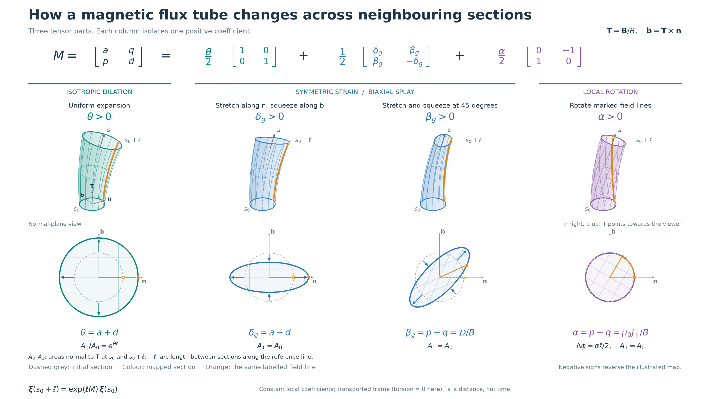

# Flux-tube cross-section concept figure

[Documentation index](README.md) · [Baseline theory](fac_anisotropy_theory.md#3-rotation-strain-and-the-role-of-the-frame)
· [Image sources](images/README.md)

This original mathematical illustration connects the transverse direction
gradient to the shape and orientation of a small magnetic flux tube. Each
column isolates one positive coefficient; all other transverse coefficients
are zero. The columns are independent examples, not successive operations.



| Language | Editable vector | Vector PDF | Slide PNG |
| --- | --- | --- | --- |
| English | [SVG](images/transverse-decomposition.svg) | [PDF](images/transverse-decomposition.pdf) | [PNG](images/transverse-decomposition.png) |
| Japanese | [SVG](images/transverse-decomposition-ja.svg) | [PDF](images/transverse-decomposition-ja.pdf) | [PNG](images/transverse-decomposition-ja.png) |

Both versions have a 16:9 canvas. SVG retains text objects for editing;
Japanese SVG text needs an installed CJK font. The PDF embeds the fonts,
and the PNG is independent of local font availability.

## Reading the figure

The upper row shows the same set of field lines intersecting perpendicular
planes at two positions along a gently curved reference field line. The
lower row compares those sections in a common transported normal basis:
**n** points right, **b** points up, and **T** points toward the reader.
The grey dashed circle is the initial section, the coloured outline is
its mapped image, and the orange line and dot identify the same neighbouring
field line. This marker reveals rotation even when a circular outline
does not change shape.

The figure defines A₀ and A₁ as the flux-tube cross-sectional areas
perpendicular to **T** at s₀ and s₀ + ℓ, respectively. Here s is arc length
along the reference field line, and ℓ is the arc length between these
sections, not their straight-line separation. These area symbols are
distinct from the dimensionless ratio A = Γ/|α| in the baseline theory.

| Isolated coefficient | What changes | What stays fixed |
| --- | --- | --- |
| θ > 0 | Both transverse lengths grow by exp(θℓ/2); area grows by exp(θℓ) | Circular shape and the marked radius's angle |
| δ_g > 0 | Stretch along **n**, compress along **b** | Area; α = 0 |
| β_g > 0 | Stretch along (**n** + **b**)/√2, compress along (**n** − **b**)/√2 | Area; α = 0 |
| α > 0 | The marked radius rotates from **n** toward **b** by αℓ/2 | Area, lengths, and circular shape |

Reversing a coefficient reverses its map. The symmetric β_g example is
pure strain: a simple shear such as M = (0, 0; k, 0) contains both
α = k and β_g = k. Calling that simple shear a pure β_g mode would hide
its antisymmetric part.

Even a symmetric strain can change the angle of a particular marked radius,
as the β_g panel shows. Here α/2 is the azimuthal mean angular rate; zero
α does not require every neighbouring field line to keep its initial angle.
The [directional-rotation companion figure](directional_rotation_figure.md)
shows Ω(φ), the signs Ω_n = p and Ω_b = −q, and their sum, difference and
uniform azimuthal mean in 3D, cross-section and graph views.

The middle two columns together represent the two degrees of freedom of
the symmetric, trace-free term. This is the part corresponding to Selinger's
**biaxial-splay tensor**, not a name for the entire decomposition. The
reference is [Selinger, Sec. II.1–II.2.4](https://arxiv.org/html/1901.06306v1);
the [bibliographic record](https://arxiv.org/abs/1901.06306) identifies the
2018 journal volume and the 2019 arXiv version. The figure is newly drawn
from the equations and does not reproduce a figure from that article.

## What the construction assumes

The local separation vector is ξ = ξ_n **n** + ξ_b **b**. With constant
coefficients over the illustrated segment and no added basis rotation,

$$
\frac{d\boldsymbol\xi}{ds}=M\boldsymbol\xi,\qquad
F(\ell)=e^{\ell M},\qquad
\boldsymbol\xi(s_0+\ell)=F(\ell)\boldsymbol\xi(s_0).
$$

These are **spatial** changes along a field line, not fluid velocities,
time evolution, or an MHD instability. All four coefficients have
inverse-length units. The sum of matrices in the figure is an identity
for the local generator M. Finite maps generally cannot be multiplied in
an arbitrary order to represent that sum. Varying M(s) requires solving
the corresponding ordered evolution.

The reference curve is a planar circular arc with curvature 0.12 in
arbitrary inverse-length units. Its Frenet frame is defined and has
τ = 0, so it introduces no extra rotation into the normal plane. The
same curvature is used in all columns; bending of the reference line
is not one of the three transverse terms. For a general Frenet frame,
the component evolution uses M − τR, where R = (0, −1; 1, 0).

The 3D curves embed the linear separation map as

$$
\mathbf X(s;\boldsymbol\xi_0)=\mathbf C(s)
+[F(s)\boldsymbol\xi_0]_n\mathbf n(s)
+[F(s)\boldsymbol\xi_0]_b\mathbf b(s).
$$

Their transverse unit-direction gradient on the reference line is M.
This illustrates local thin-tube geometry; it does not assert that a
single pure mode is uniform throughout a finite three-dimensional volume.
For a solenoidal magnetic field and infinitesimal perpendicular sections,
A₁/A₀ = B₀/B₁. Thus θ changes the field strength required by flux
conservation; the expanding tube is not a magnetic source.

The antisymmetric coefficient is α = μ₀j_∥/B under the quasistatic Ampère
relation. Its angular rate is **α/2**, not α. In a mixed strain/rotation
field, the angular rate depends on direction and FAC alone does not
establish finite-distance coiling. These distinctions follow the
[baseline theory](fac_anisotropy_theory.md#3-rotation-strain-and-the-role-of-the-frame).

## Reproduce or edit

With `.[viz]` installed, run from the repository root:

```bash
python benchmark/transverse_decomposition_figure.py --language both
python benchmark/transverse_decomposition_figure.py --check-only
```

The [source script](../benchmark/transverse_decomposition_figure.py) computes
every curve using the matrix exponential and outputs SVG, PDF, and PNG.
Use `--output-dir /tmp/mageometry-concept` to inspect a separate set.
Japanese rendering defaults to the local Droid Sans Fallback font;
`--cjk-font /path/to/font.ttf` selects another CJK font. English output
alone is the default and needs no CJK font.

| Illustration parameter | Value |
| --- | --- |
| Reference arc length ℓ / initial tube radius | 2.7 / 0.48 in arbitrary length units |
| θℓ/2, δ_gℓ/2, or β_gℓ/2 in the respective column | 0.48 |
| αℓ/2 in the rotation column | π/3 (60 degrees) |
| Cross-section axes | Initial radius normalized to one, common scale in all four panels |
| PNG dimensions | 3240 × 1822 pixels |

The larger angle makes the marked field line easy to follow; amplitudes
are illustrative and are not measurements. Generation checks determinant
and area evolution, inverse maps, strain principal axes, rotation angle,
frame handedness, and recovery of the requested transverse gradient on
the reference line.
