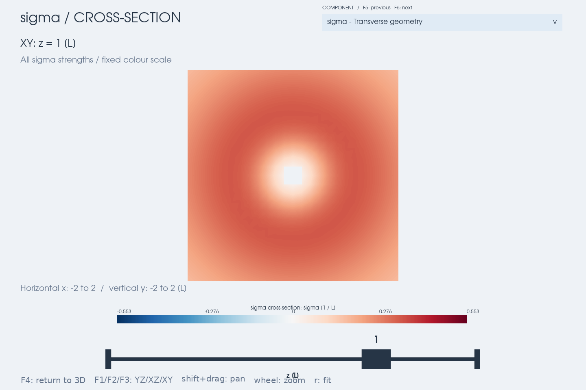

# Transverse magnetic geometry

Use the general viewer for current and transverse-geometry diagnostics:

```bash
python examples/geometry_viewer.py --component sigma --slice x --slice-origin -6 0 0 --slice-only
python examples/geometry_viewer.py --xmf run000.xmf --component gamma --stride 4
```

The dropdown or F5/F6 selects a quantity; F1/F2/F3 selects a plane and F4
switches to a face-on slice. Regions and signed peak projections use the
threshold slider; the slice shows all finite values. Each diagnostic has
its own colour limits, so compare numeric legends across diagnostics.
Gamma is nonnegative and uses the positive half of the common diverging scale.



`viz3d.geometry_view(grid, component='sigma', ...)` shares the renderer,
slice controls and loading code with `current_view` and `fac_view`.
The old functions and `examples/fac_viewer.py` remain available. The general
entry point starts with alpha; the legacy script still starts with FAC.
Calculation lives separately in `mageometry.geometry`:

```python
from mageometry.geometry import field_line_transverse_geometry

rates = field_line_transverse_geometry(field, x, y, z, delta=0.002,
                                      curvature_tol=1e-8)
alpha, sigma, q = (rates[key] for key in ('alpha', 'sigma', 'q'))
```

With T=B/|B|, curvature normal n, and b=T×n, define
`a=b·∂nT`, `c=n·∂bT`, `u=n·∂nT`, and `v=b·∂bT`.

| Key | Definition | Interpretation |
| --- | --- | --- |
| `alpha` | a−c = μ₀j∥/|B| | Twice the azimuthal mean winding rate |
| `sigma` | a+c | Signed off-diagonal shear in the Frenet frame |
| `q` | u−v | Difference of transverse normal strains |
| `gamma` | √(sigma²+q²) | Basis-independent anisotropy; gamma/2 is the maximum angular-rate deviation |
| `omega_c` | sign(alpha) √max(alpha²−gamma²,0)/2 | Signed local coiling rate |

All five quantities have inverse coordinate-length units, are unaffected by
`current_scale`, and have no current arrows. The eigenvalue-based coiling
rate is a local diagnostic, not an integrated winding number or proof of a
flux rope; see [Tassev & Savcheva (2019)](https://arxiv.org/abs/1901.00865).

The implementation uses seven B evaluations for Cartesian first derivatives,
then projects the gradient into the transverse plane. It never differentiates
n. Alpha and gamma do not require a Frenet normal: straight lines can retain
nonzero anisotropy. Sigma and q are NaN at zero curvature (or below the API's
`curvature_tol`), and all results are NaN at magnetic nulls or invalid stencils.
At weak curvature prefer gamma and examine derivative-step convergence.

Viewer alpha now uses this first-gradient estimate, so it remains available
on straight lines. The legacy `field_line_current_density()['alpha']` retains
its frame-difference method and stricter validity mask. The two estimates
agree in the converged limit where the frame is well defined, but need not
match to round-off. Likewise, legacy `B_twist_diff/|B|` estimates sigma using
the old discretization. `B_twist_diff` no longer draws current arrows because
it represents shear, even though it has current-like units.

For simulation grids the viewer differentiates the masked preview's linear
interpolant at the smallest preview spacing by default. Use
`--geometry-delta` and change `--stride` / `--max-points` to check convergence;
preview coarsening changes derivative estimates. Magnetic context lines,
camera and slice positions remain fixed when switching quantities.
