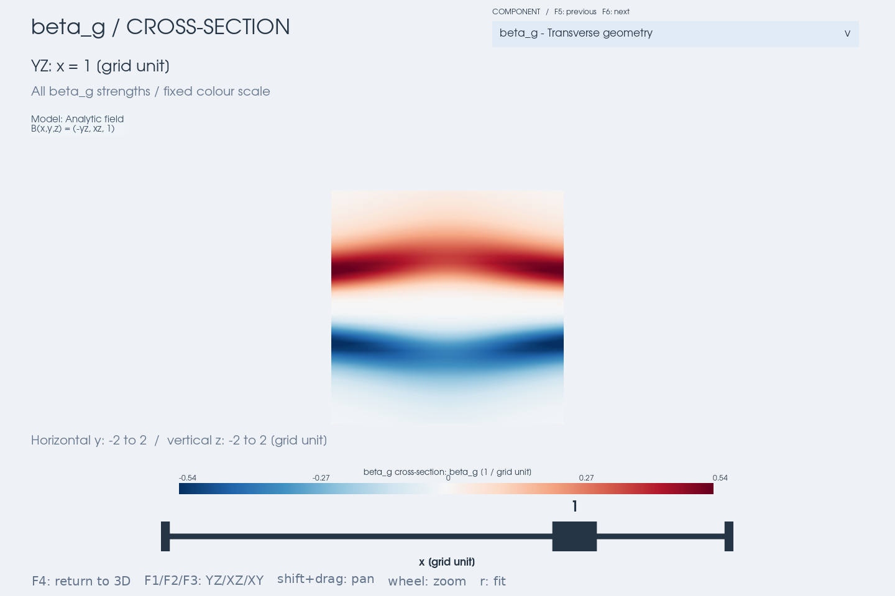

# Viewer guide

[Documentation index](README.md) · [Input formats](simulation_data_formats.md)
· [Geometry analysis](geometry_analysis.md) · [Transverse definitions](transverse_geometry.md)

The 3D overview displays magnetic geometry and current components on a
rectilinear grid. It combines spatial regions, magnetic context lines,
signed peak projections, and movable slices.

For model/file setup, combined case/contribution comparison, three display
layouts, and session save/restore in one window, use the optional
[desktop workspace](gui.md). The standalone viewers below remain available.

## Install and choose an entry point

Run commands from the repository root after installing PyVista. XDMF/HDF5
input also needs h5py:

```bash
python -m pip install -e '.[io,viz3d]'
python examples/geometry_viewer.py --component gamma
```

| Script | No input file supplied | Initial component |
| --- | --- | --- |
| `examples/geometry_viewer.py` | T96 + dipole demonstration | `alpha` |
| `examples/fac_viewer.py` | T96 + dipole demonstration | `fac` |
| `examples/geometry_viewer_simulation.py` | Usage error; a file is required | `alpha` |

All three scripts share the display controls and file options. Use `--help`
to list the current options. The model demonstration uses Re and nT and
converts displayed currents to nA/m². File inputs retain their native units.

For multiple snapshots, use `viz3d.compare_geometry(cases, ...)`. Its
**DATASET** dropdown (F7/F8) changes the selected grid while preserving
camera, slice, diagnostic, shared colour scale, and absolute threshold.
`python examples/compare_t96_by.py` generates six IMF By cases in memory.
It defaults to direct model derivatives/tracing with a 0.002 Re difference
step and the single-case example's 65 × 49 × 49 display grid. Add
`--evaluation grid` for grid interpolation. Python callers can supply
per-case `fields` and an explicit shared `delta` to `compare_geometry`.
See [dataset comparison](data_comparison.md) for data requirements,
shared-scale rules, fixed trace seeds, and cache controls.

## Supply your file

```bash
python examples/geometry_viewer_simulation.py --xmf snapshot.xmf --stride 4
python examples/geometry_viewer_simulation.py --xmf snapshot.xmf --h5 field.h5
python examples/geometry_viewer_simulation.py --vtk snapshot.vti
python examples/geometry_viewer_simulation.py --h5 field.h5 --origin 0 0 0 --spacing 1 1 1
```

Replace filenames, origin, and spacing with your own values. Relative CLI
paths are resolved from the working directory. HDF5 paths referenced inside
an XDMF file are resolved relative to that XDMF file. `--h5` with `--xmf`
overrides the heavy-data filename while keeping the metadata's dataset
paths. `--vtk` cannot be combined with `--xmf` or `--h5`.

| Input | Required layout in the CLI |
| --- | --- |
| XDMF | Uniform grid; scalar attributes `BX`, `BY`, `BZ`; HDF5 heavy data |
| HDF5 | Datasets `BX`, `BY`, `BZ` stored `(nz, ny, nx)`; explicit `--origin` and `--spacing` in x/y/z order |
| VTK | ImageData or RectilinearGrid (`.vti`/`.vtr`) with vector array `B` |

The CLI reads one snapshot. For a time series, load a step with
`load_xdmf_series` in Python and pass that grid to the viewer. For other
array names or HDF5 axis order, use the Python reader options:

```python
from mageometry import load_hdf5, viz3d

# Example layout: replace names, origin, and spacing with your file's values.
grid = load_hdf5('field.h5', datasets=('Bx', 'By', 'Bz'),
                 origin=(0, 0, 0), spacing=(1, 1, 1), zyx_order=False)
viz3d.geometry_view(grid, component='gamma', slice_panel=True)
```

This assumes `(nx, ny, nz)` arrays. `load_xdmf(..., components=(...))` and
`load_vtk(..., name=...)` provide the corresponding name overrides.
See [exact format requirements](simulation_data_formats.md#part-iii--bundled-readers-xdmf--hdf5).

## Select a diagnostic and a slice

```bash
python examples/geometry_viewer_simulation.py --xmf snapshot.xmf --component beta_g --slice x --slice-only
python examples/fac_viewer.py --component mu0J_b --slice x --slice-origin -6 0 0 --slice-only
```

`--slice x` means a plane **normal to x**, so it displays YZ. `--slice-origin`
specifies a point on the plane in grid coordinates, not a camera position.
With no slice direction specified, the CLI's face-on panel starts on XZ.

| Control | Action |
| --- | --- |
| Dropdown / F5 / F6 | Select / previous / next diagnostic |
| F1 / F2 / F3 | Align the slice with YZ / XZ / XY |
| F4 | Toggle the enlarged face-on slice; its slider moves the plane |
| `c` | Toggle the draggable slice in the main 3D view |
| `x` / `y` / `z` | View along a coordinate axis |
| `r` | Reset the overview camera, or fit the slice in enlarged mode |
| `l` / `a` / `s` | Toggle magnetic lines / current arrows / spatial regions |
| Shift+drag / wheel | Pan / zoom |

Component changes keep the camera, plane position, and magnetic context
lines fixed. Each component remembers its own threshold. Dropdown keyboard
selection uses Up/Down and Enter; Esc closes the menu.
The shear diagnostics are `beta_g` (β_g) and `delta_g` (δ_g), using the
same names as the numerical implementation and analysis API. Their
definitions and interpretation are in the [baseline theory](fac_anisotropy_theory.md).

### Source information

The header shows declared source information in both the overview and the
enlarged F4 view, and follows the selected comparison dataset. The bundled
T96 examples supply the model name, Pdyn, Dst, IMF By/Bz, dipole tilt (rad),
and epoch (Unix seconds). Text wraps and fits the available header space;
the fitted view leaves room for it above the plot.

This is a generic provenance display, separate from model evaluation. Supply
`GriddedField.metadata` with optional `model`, `source`, `time`,
`coordinate_system`, `length_unit`, `field_unit`, and a `parameters` mapping
whose labels include units. For example, a simulation can declare:

```python
grid.metadata.update(source='run/step.vti', time=120.,
                     parameters={'Resistivity [native]': 0.01, 'Step': 240})
```

No model inputs are inferred from a callable, and this information does not
alter calculations or convert units. Callers must keep metadata consistent
with their supplied grid/field. Missing metadata leaves the header empty.


[Enlarged slice with the same source information](images/viewer-eta-focus.png).



## Read the colours, arrows, and projections

| Component group | Meaning | Arrows |
| --- | --- | --- |
| `fac` | Independent Cartesian curl(B)·T | Along/against T |
| `mu0J_T`, `B_dT_dn_b`, `B_dn_db_T` | Parallel current and its two frame contributions | T |
| `mu0J_n`, `mu0J_b` | Normal and binormal current | n or b |
| `mu0J_x`, `mu0J_y`, `mu0J_z` | Cartesian components of the Frenet reconstruction | x, y, or z |
| `B_kappa`, `minus_dB_dn` | Curvature and magnitude-gradient terms of `mu0J_b` | b |
| `B_twist_diff` | D = Bβ_g, the signed difference of the two parallel terms | None |
| `alpha`, `beta_g`, `delta_g`, `gamma`, `omega_c` | Transverse rates; see [definitions](transverse_geometry.md) | None |
| `eta` | (alpha²−gamma²)/(alpha²+gamma²), dimensionless rotation/shear balance | None |

Red and blue indicate the sign in the selected basis. Only T-directed
components represent current along or against B. `B_twist_diff` is a
shear diagnostic with field/length units; it is not total parallel current.
When current conversion is enabled, its displayed label is `D / mu0`.

The overview maps select the signed value with the largest absolute
magnitude along each sightline. They are peak projections, not slices or
integrated currents. Thresholding affects regions, arrows, and peak-map
visibility; slices show all finite values. Undefined nodes and cells remain
blank. Slice dragging reuses cached values.

Colour limits use the 98th percentile of each component's absolute value
and stay fixed while adjusting its threshold. Compare legends across
components: identical colours need not represent identical amplitudes.
Nonnegative `gamma` uses the positive half of the diverging scale.
Eta uses a fixed [−1, 1] scale by default; alpha = gamma = 0 is undefined
and remains blank. Like the transverse rates, eta is never current-scaled.
The comparison viewer uses the largest per-case percentile to fix a common
range before displaying that diagnostic; it does not rescale on selection.

## Resolution, memory, and derivatives

| Option | Effect |
| --- | --- |
| `--stride N` | Keep every Nth input node; default 1 |
| `--max-points N` | Limit the displayed/analysed preview; default 120000, minimum 27 |
| `--geometry-delta H` | Derivative step for transverse rates and Frenet components, in coordinate units |
| `--threshold VALUE` | Initial absolute cutoff in the displayed component's units |

Retain at least three nodes on each axis. Reader stride changes which nodes
are loaded; preview coarsening happens afterwards and does not reduce the
initial file-loading cost. XDMF/HDF5 readers subset during loading, whereas
VTK is read in full before subsetting. Python also offers reader `region=`
and viewer `max_points=None` (the CLI expects an integer budget).

Grid-only `fac` uses Cartesian differences with the preview's axis spacing;
its boundary nodes are blank. Other components use the masked preview's
linear interpolant with `geometry_delta` equal to the smallest preview
spacing by default. With an explicit `field` and `delta`, it defaults to
`min(delta)`. `--geometry-delta` does not alter the independent `fac`
estimate. Compare multiple grid resolutions and steps when checking small
features; see [numerical guidance](geometry_analysis.md#undefined-geometry-and-step-size).
In comparisons, supplying per-case `fields` uses the direct-evaluation
path with an explicit shared `delta`. Display-grid coarsening then changes
the sampled diagnostic locations, without changing the magnetic field used
for derivatives or tracing. See [direct model evaluation](data_comparison.md#direct-model-evaluation-in-python).

## Python API, native units, and screenshots

This standalone synthetic example needs no simulation file:

```python
import numpy as np
from mageometry import GriddedField, viz3d

axes = (np.linspace(-2, 2, 17),) * 3
x, y, z = np.meshgrid(*axes, indexing='ij')
grid = GriddedField(*axes, -y, x, np.ones_like(z))
plotter = viz3d.geometry_view(grid, component='gamma', slice_normal='x',
                             slice_panel=True, n_lines=4, show=False)
plotter.show()
```

`geometry_view` starts with `alpha`, `current_view` with `mu0J_T`, and
`fac_view` with `fac`. `geometry_view` and `current_view` enable the
component selector; plain `fac_view` keeps FAC-only controls. In the Python
API, `slice_panel=False` is the default; the CLI enables it. An existing
`plotter=` supports a single scene, so omit the companion panels there.

Viewer labels and `GriddedField.metadata` do not convert data. Native current
values represent μ₀J in field/length units. If B is in nT and coordinates in
Re, `current_scale=0.125`, `current_unit='nA/m^2'`, and `length_unit='Re'`
label the approximately converted currents. The five transverse rates are
never current-scaled and retain inverse-length units; eta is dimensionless.
`planet_radius`
draws a reference sphere; use `mask=` to exclude its interior from analysis.

For an off-screen PNG:

```bash
python examples/geometry_viewer_simulation.py --xmf snapshot.xmf --component gamma --slice x --slice-only --screenshot geometry.png
```

For Python screenshots, set `pyvista.OFF_SCREEN = True` before constructing
the plotter, pass `show=False`, then call `plotter.screenshot(path)` and
`plotter.close()`.

## Free slice plane and Frenet frames

Use `slice_view(mode='plane')` and `add_frenet_frame` to compose a curvature
slice with tangent, normal, and binormal arrows. This standalone example
uses a synthetic helical field and needs only `.[viz3d]`:

```python
import numpy as np
from mageometry import GriddedField, viz3d

def field(x, y, z):
    x, y, z = np.broadcast_arrays(x, y, z)
    return -y, x, np.ones_like(z)

axes = (np.linspace(0.5, 2, 17), np.linspace(-1, 1, 17),
        np.linspace(-1, 1, 17))
coords = np.meshgrid(*axes, indexing='ij')
grid = GriddedField(*axes, *field(*coords))
plotter = viz3d.slice_view(grid, 'curvature', mode='plane', normal='y',
                          field=field, delta=1e-3, show=False)
viz3d.add_frenet_frame(plotter, field, [0.75, 1.25, 1.75], [0, 0, 0],
                       [0, 0, 0], delta=1e-3, length=0.3)
plotter.show()
```

Drag the plane's arrow to translate the slice and grab the plane to rotate
it. The companion panel follows the plane normal and shows the slice
face-on. Frenet arrows stay at their specified positions in the main 3D
view: T is red, n green, and b blue. Their length is in coordinate units;
the curvature colour scale has inverse coordinate-length units.

Pass `front_view=False` to `slice_view` for a single panel. The returned
plotter leaves the main 3D panel active, so additional `add_*` calls draw
there. To use your data, replace the synthetic grid with a loaded
`GriddedField`, use `field = grid.field()`, and choose arrow locations and
`delta` with room for derivative stencils inside the grid.

## Regenerate the README screenshots

From the repository root with `.[viz3d]` installed, run:

```bash
python benchmark/readme_screenshots.py
# Inspect a separate set before replacing documentation assets:
python benchmark/readme_screenshots.py --output-dir /tmp/mageometry-screenshots
```

The script renders ten PNGs directly from the current viewer using
`examples/fac_viewer.py`'s T96 + dipole snapshot and source metadata. It
uses the default 120,000-node preview budget, a 1920 × 960 window, the
companion slice panel, and a YZ plane at x = −6 Re. The screenshots in
the README were captured on 2026-09-25 with PyVista 0.49.0.

The capture sequence shows FAC with and without the draggable plane,
the enlarged FAC slice, normal-current overview, binormal-current slice,
first parallel-current term, signed shear difference, open component menu,
and eta in overview and enlarged modes. Current components are selected
through the actual dropdown, retaining the slice position and magnetic
lines. Eta starts in a fresh viewer with its own automatic context seeds.
The strength threshold and per-component colour limits are automatic;
eta retains its fixed [−1, 1] scale. Inspect the resulting images after
changes to layout, labels, or numerical sampling.

The analytic `beta_g` image and IMF By comparison images illustrate separate
examples; the latter have [their own regeneration commands](data_comparison.md#example-views).
The README's accuracy plots are generated by
[`benchmark/readme_validation.py`](../benchmark/readme_validation.py).

## Troubleshooting

| Symptom | Check |
| --- | --- |
| Missing magnetic arrays | Names and association; the CLI uses the defaults above |
| Unsupported topology | Convert/resample to a rectilinear grid, or write a reader |
| Fewer than three nodes per axis | Reduce stride or enlarge the selected region |
| Blank beta_g/delta_g or Frenet current | Curvature normal and neighbouring stencils; compare `gamma`, `alpha`, or `fac` |
| No regions above the threshold | Lower the threshold and inspect the slice; also check finite values |
| Out-of-domain error in custom Python code | Keep the interpolator's default NaN fill rather than `fill_value=None` |
| Display or OpenGL error | Check the available VTK rendering backend; off-screen rendering still requires a working backend |


## Background contribution comparison

`viz3d.transverse_contribution_view(total_grid, background, component='eta')`
opens with a selected background and adds a contribution dropdown (F7/F8) for total, background-gradient and
residual-gradient diagnostics. A single total-field frame, normalization and
set of magnetic lines is retained. Colour limits and per-diagnostic thresholds
are shared; all six transverse diagnostics are available through F5/F6.

```bash
python examples/geometry_viewer.py --background dipole --contribution residual --component gamma --slice x
python examples/geometry_viewer_simulation.py --vtk total.vti --background-vtk background.vti --component eta
```

For GUI selection, start `python examples/geometry_viewer.py` and use
**BACKGROUND → Dipole**, followed by **CONTRIBUTION → Residual gradient**.
The ordinary `geometry_view` also has this menu; Python callers register
presets via `background_choices={'Reference': background}`. **None (total
field)** restores the full diagnostic menu. A current diagnostic switches to
eta when a background is enabled.

**Load background file...** opens a folder browser within the same menu,
including parent, home/root, paging and Cancel. Escape or clicking another
menu cancels without changing data. Supported files are `.xmf`, `.xdmf`,
`.vti`, `.vtr`; simulation CLIs apply their total-input stride to backgrounds.
Python callers can configure `background_loader(path)` and
`background_directory`. Invalid files or incompatible grids display a
message while preserving the scene. Changing background recomputes shared
limits while retaining total magnetic lines, cameras, slices and thresholds.

Background grids must have matching axes, coordinates and units; callable
backgrounds are accepted by the Python API. The built-in dipole choice is
only available for the model demo. Contribution eta and omega_c describe
projected gradient operators, not residual-field winding. See the
[background attribution guide](transverse_geometry.md#background-gradient-contributions)
for the API, validity rules, shared-scale policy and interpretation.

Regenerate the background-menu image and six contribution comparison captures with
`python benchmark/transverse_contribution_screenshots.py`. The script selects the dipole background and switches
contributions through actual dropdowns while retaining one total-field trace, camera and x = −6 Re
slice. Inspect the generated images in `docs/images/contribution-*.png`.
